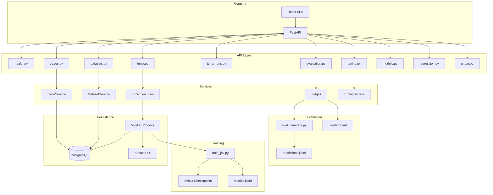

# Executive Summary: Tunix RT / Reasoning-Trace Platform

**Audience:** Senior AI Manager  
**Author:** Principal ML Engineer  
**Date:** December 26, 2025  
**Version:** M33 (Post-Kaggle Rehearsal)

---

## 0. Executive Snapshot

**What Tunix RT Is:**  
A full-stack AI platform for managing, training, and evaluating reasoning traces—purpose-built for the Google Tunix Hackathon. The system treats trace quality as a first-class optimization objective, enabling reproducible SFT (Supervised Fine-Tuning) on Gemma models with evidence-backed artifacts.

**Key Proof Points:**

- ✅ **273 backend tests** passing, **>70% line coverage** enforced (source: M33_summary.md)
- ✅ **10-router modular architecture** with 56-line `app.py` entrypoint (source: tunix-rt.md §M29)
- ✅ **JAX/Flax/Optax training pipeline** with Orbax checkpointing, verified loss convergence 2.26→0.08 on `golden-v2` (source: tunix-rt.md §M27)
- ✅ **550-trace dataset** (`dev-reasoning-v2`) with strict ReasoningTrace schema (source: M32_summary.md)
- ✅ **Kaggle-ready submission package** with evidence files, rehearsal logs, and one-command packaging (source: M33_summary.md)
- ✅ **Security posture:** SHA-pinned CI actions, gitleaks secret scanning (blocking), SBOM generation (source: SECURITY_NOTES.md)
- ✅ **Reproducible builds:** `uv.lock` for Python dependencies, deterministic seeds (seed=42) (source: docs/submission_freeze.md)

**Maturity Scorecard:**

| Dimension | Status | Evidence |
|-----------|--------|----------|
| CI/CD Green | ✅ | 6 workflows, all passing |
| Test Coverage | ✅ | 273 tests, >70% line |
| Static Analysis | ✅ | mypy + ruff, 0 errors |
| Security Scanning | ✅ | gitleaks (blocking), pip-audit, npm audit |
| Reproducibility | ✅ | uv.lock, seed=42, manifest provenance |
| Dataset Readiness | ✅ | dev-reasoning-v2 (550), golden-v2 (100) |

---

## 1. Strategic Vision & Problem Statement

### The Reasoning-Trace Paradigm

The Google Tunix Hackathon evaluates submissions using a **hybrid judge model**: both LLM-based scoring and human assessment. This shifts the optimization target from raw model accuracy to **trace quality**—the clarity, structure, and interpretability of the model's reasoning process.

**Core Insight:** Most competitors optimize model weights. Tunix RT optimizes the **engineering discipline around traces**: schema validation, reproducibility, and evidence capture. This aligns with the competition's emphasis on:

- **Notebook Quality** (35 pts) — Professional, reproducible artifacts
- **Model Quality** (45 pts) — Trained within Kaggle session constraints
- **Video Quality** (20 pts) — Clear narrative of engineering approach

(source: VISION.md §Competitive Thesis; competition criteria referenced externally via Kaggle documentation)

### Closed-Loop Architecture

Tunix RT implements a complete trace-to-evaluation loop:

```
Trace Management → Dataset Build → Training (JAX/Flax) → Inference → Judge Evaluation → Leaderboard
       ↑                                                                                    ↓
       └────────────────────── Regression Baselines ←───────────────────────────────────────┘
```

Each stage produces artifacts with full provenance:

1. **Trace Management:** CRUD API with schema validation, batch import, versioning
2. **Dataset Build:** Manifest-based reproducibility, composition stats, export to JSONL
3. **Training:** Configurable SFT with checkpoints, metrics logging, device selection
4. **Inference:** Model predictions on eval set with metadata capture
5. **Judge Evaluation:** `AnswerCorrectnessJudge` with deterministic scoring (`answer_correctness@v1`)
6. **Leaderboard:** Run comparison, regression detection, metric visualization

(source: tunix-rt.md §Overview, docs/evaluation.md)

---

## 2. System Architecture & Engineering Maturity

### Router Modularization (M29)

The backend underwent significant modularization in M29, extracting 10 focused routers from a monolithic `app.py`:

| Router | Responsibility | Lines |
|--------|----------------|-------|
| `health.py` | Health checks, RediAI status | ~30 |
| `traces.py` | Trace CRUD, batch operations | ~80 |
| `datasets.py` | Dataset build, export, ingest | ~60 |
| `tunix.py` | Tunix integration, training triggers | ~50 |
| `tunix_runs.py` | Run history, status, logs | ~70 |
| `evaluation.py` | Judge execution, scoring | ~40 |
| `tuning.py` | Ray Tune jobs, trials | ~60 |
| `models.py` | Model registry, artifacts | ~50 |
| `regression.py` | Baseline management, checks | ~40 |
| `ungar.py` | Synthetic data generation | ~40 |

**Result:** `app.py` reduced from 600+ lines (M10) to **56 lines** (M29+) (source: M31_summary.md §Architecture Status)

**Why It Matters:**
- Testability: Each router tested in isolation
- Onboarding: New developers understand scope immediately
- Maintainability: Changes localized to relevant module

### Async Execution Design (M15-M16)

Training runs execute asynchronously via a worker process with DB-backed state:

1. **Enqueue:** `POST /api/tunix/run?mode=async` creates run with `status="pending"`
2. **Claim:** Worker uses Postgres `SKIP LOCKED` for robust job claiming
3. **Execute:** Subprocess-based training with stdout/stderr capture
4. **Stream:** SSE endpoint (`/runs/{id}/logs`) for real-time log streaming
5. **Complete:** Status updated, metrics persisted, auto-evaluation triggered

**Failure Containment:**
- Worker crash doesn't affect API server
- Unclaimed jobs remain pending (retry on worker restart)
- `SKIP LOCKED` prevents double-claiming under concurrency

(source: tunix-rt.md §M15, M16)

### Observability Stack

| Layer | Mechanism | Endpoint |
|-------|-----------|----------|
| Metrics | Prometheus counters/histograms | `/metrics` |
| Logs | Structured JSON, SSE streaming | `/runs/{id}/logs` |
| Artifacts | File storage with checksums | `/runs/{id}/artifacts` |
| Provenance | `run_manifest.json`, DB records | Persisted per run |

(source: tunix-rt.md §M15)

### System Architecture Diagram



(source: M31_audit.md §Codebase Map, adapted)

---

## 3. Training Pipeline (JAX/Flax) & Scalability

### Pipeline Architecture

The training pipeline (`training/train_jax.py`) uses JAX/Flax/Optax for SFT:

| Component | Purpose | Library |
|-----------|---------|---------|
| Model Loading | HuggingFace Transformers → Flax | `FlaxAutoModelForCausalLM` |
| Tokenization | Dataset preprocessing | `transformers.AutoTokenizer` |
| Optimization | AdamW with linear warmup | `optax` |
| Checkpointing | Save/resume training | `orbax-checkpoint` |
| Device Selection | CPU/GPU/TPU auto-detect | JAX device management |

(source: tunix-rt.md §M25, M26)

### Training Evidence

| Metric | Value | Source |
|--------|-------|--------|
| Loss Convergence (golden-v2) | 2.26 → 0.08 | tunix-rt.md §M27 |
| Smoke Run (CPU, 2 steps) | ~30 seconds | M31_audit.md |
| Full Run (GPU, 100 steps) | ~1-2 hours | M31_audit.md |
| Checkpoint Size | ~900 MB (Orbax) | M31_audit.md |

**Training Run Configuration (M33):**

| Config | Value |
|--------|-------|
| Model | `google/gemma-3-1b-it` |
| Dataset | `dev-reasoning-v2` (550 traces) |
| Config Path | `training/configs/submission_gemma3_1b.yaml` |
| Learning Rate | 1.0e-5 |
| Batch Size | 4 |
| Max Sequence Length | 512 |
| Seed | 42 |

(source: submission_runs/m33_v1/run_manifest.json, training/configs/submission_gemma3_1b.yaml)

### Ray Tune Integration (M19)

Hyperparameter tuning infrastructure is operational:

- **Search Space Types:** `choice`, `uniform`, `loguniform`, `randint`
- **Persistence:** `tunix_tuning_jobs`, `tunix_tuning_trials` tables
- **Best Run Selection:** Automatic based on metric mode (min/max)
- **Status:** Ready for M34+ optimization sweeps

(source: docs/tuning.md)

**Why "Tune Later" Was Right:**  
The M19-M33 sequencing prioritized reproducibility and evidence capture over premature optimization. With the rehearsal infrastructure now proven, M34+ can execute 5-20 trial sweeps with confidence that results are comparable.

### Scalability Constraints & Next Steps

| Constraint | Current | Next Step |
|------------|---------|-----------|
| Dataset Size | 550 traces | Scale to 1000+ |
| Device | CPU (local), GPU/TPU (Kaggle) | Multi-device training |
| Run Comparison | Manual | Automated diff + visualization |

---

## 4. Quality Guardrails, Audit Findings, and Security Posture

### Audit Scorecard (M31)

| Category | Score | Notes |
|----------|-------|-------|
| Architecture | 4.5/5 | Clean router separation, thin app.py |
| Modularity | 4.0/5 | Minor coupling in `tunix_execution.py` |
| Code Health | 4.0/5 | Long function in `train_jax.py` |
| Tests & CI | 4.0/5 | 70%+ coverage, 273 tests |
| Security | 3.5/5 | SBOM available but not in nightly |
| Performance | 3.5/5 | SLOs defined, not all measured |
| DX | 4.5/5 | 12-min onboarding path |
| Docs | 4.5/5 | 50+ docs, comprehensive |
| **Overall** | **4.06/5** | Strong engineering maturity |

(source: M31_audit.md §Overall Score)

### Testing Coverage

| Suite | Tests | Status | Coverage |
|-------|-------|--------|----------|
| Backend (pytest) | 273 | ✅ Pass | >70% line |
| Frontend (vitest) | 56 | ✅ Pass | — |
| E2E (Playwright) | 3 specs | ✅ Pass | — |

(source: M33_summary.md)

**M32-M33 Coverage Improvements:**
- `datasets_ingest.py`: 0% → full coverage (+9 tests)
- `worker.py`: 52% → improved (+7 tests)
- Evidence schema validation: +13 tests

(source: M32_summary.md, M33_summary.md)

### Static Analysis

| Tool | Enforcement | Status |
|------|-------------|--------|
| ruff check | CI blocking | 0 errors |
| ruff format | CI blocking | All files formatted |
| mypy | CI blocking | 0 errors, 67 files |
| Type ignores | Narrowed with error codes + rationale | M30 cleanup |

(source: M31_summary.md §Metrics Summary)

### Security Posture

| Mechanism | Status | Enforcement |
|-----------|--------|-------------|
| SHA-pinned Actions | ✅ Implemented | All workflows |
| gitleaks Secret Scanning | ✅ Blocking | Pre-merge |
| pip-audit | ✅ Warn-only | CI, JSON artifacts |
| npm audit | ✅ Warn-only | CI, JSON artifacts |
| SBOM Generation | ✅ Available | CycloneDX JSON |
| Dependabot | ✅ Configured | Weekly updates |
| uv.lock | ✅ Committed | Reproducible installs |

(source: SECURITY_NOTES.md)

**Known Risks:**
- npm audit: 4 moderate vulnerabilities (dev dependencies only, no production impact)
- SBOM not in nightly workflow (low priority for competition)

### Guardrail Matrix

| Guardrail | Mechanism | Prevents | Enforced | Source |
|-----------|-----------|----------|----------|--------|
| Type Safety | mypy strict | Runtime type errors | CI | M31_summary.md |
| Code Style | ruff format | Inconsistent formatting | CI + pre-commit | M31_summary.md |
| Linting | ruff check | Code smells, bugs | CI + pre-commit | M31_summary.md |
| Secrets | gitleaks | Credential leaks | CI (blocking) | SECURITY_NOTES.md |
| Dependencies | uv.lock | Non-reproducible builds | Committed | docs/submission_freeze.md |
| Coverage | pytest + gate | Untested code paths | CI (70% min) | tunix-rt.md §M5 |
| Schema | test_evidence_files.py | Malformed evidence | CI | M33_summary.md |

### Known Risks / Residual Gaps

| Risk | Likelihood | Impact | Mitigation |
|------|------------|--------|------------|
| Gemma license rejection on Kaggle | Low | High | Documented in submission guide |
| Orbax API deprecation warning | Medium | Low | Warning present, versions pinned |
| `worker.py` coverage < 60% | — | Medium | Postgres SKIP LOCKED requires integration test |
| SBOM not in nightly | — | Low | Post-competition: add to workflow |

(source: M31_audit.md §Risk Register)

---

## 5. Deployment Readiness & Roadmap

### Submission Readiness Status

| Artifact | Status | Location |
|----------|--------|----------|
| Kaggle Notebook | ✅ Complete | `notebooks/kaggle_submission.ipynb` |
| Packaging Tool | ✅ Complete | `backend/tools/package_submission.py` |
| Evidence Files | ✅ Template | `submission_runs/m33_v1/` |
| Submission Archive | ✅ Produced | `submission/tunix_rt_m33_2025-12-26_915254b.zip` (70.3 KB) |
| Video Script | ✅ Complete | `docs/video_script_m31.md` (2:30 target) |
| Video Shot List | ✅ Complete | `docs/video_shotlist_m31.md` |

(source: M33_summary.md, M31_summary.md)

### What Remains for Final Submission

| Task | Owner | Status |
|------|-------|--------|
| Execute notebook on Kaggle GPU/TPU | Human | Pending |
| Fill evidence files with real run data | Human | Pending |
| Record ≤3 min video | Human | Pending |
| Upload video to YouTube | Human | Pending |
| Final model/config selection | Human | Pending |

### Next Milestones Table

| Milestone | Objective | Acceptance Criteria | Risk | Est. Effort |
|-----------|-----------|---------------------|------|-------------|
| **M34** | Optimization Loop 1 | 5-20 Ray Tune trials on dev-reasoning-v2, best config selected | Medium — compute availability | 1-2 days |
| **M35** | Quality Loop 1 | Eval aggregation improvements, run comparison UI, leaderboard scoring rigor | Low | 1 day |
| **M36** | Dataset Curation | Scale to 1000+ traces, add adversarial/edge cases | Low | 2-3 days |
| **M37** | Multi-Device Training | TPU/multi-GPU support, distributed checkpointing | Medium — Kaggle constraints | 2 days |
| **M38** | Run Comparison UX | Automated diff, loss curve overlay, deep-linking | Low | 1 day |

### Roadmap Summary

**Pre-Submission (Week of Jan 6):**
1. Execute Kaggle training with final config
2. Capture evidence, fill templates
3. Record and upload video
4. Final submission to competition

**Post-Competition:**
1. SBOM integration in nightly workflow
2. Multi-device training validation
3. Advanced scheduler integration (ASHA, PBT)
4. Production observability (OpenTelemetry)

---

## Appendix: Source References

| Document | Purpose |
|----------|---------|
| `tunix-rt.md` | Project README, milestone changelog |
| `M31_summary.md` | Final submission package milestone |
| `M31_audit.md` | Codebase audit with weighted scores |
| `M32_summary.md` | Data scale-up, coverage uplift |
| `M33_summary.md` | Kaggle rehearsal, evidence lock |
| `M33_audit.md` | Rehearsal audit (5/5) |
| `docs/submission_freeze.md` | Frozen configuration |
| `docs/submission_checklist.md` | Final verification list |
| `docs/tuning.md` | Ray Tune integration guide |
| `docs/evaluation.md` | Judge semantics |
| `SECURITY_NOTES.md` | Security posture documentation |
| `VISION.md` | Competition strategy |
| `submission_runs/m33_v1/run_manifest.json` | Run evidence |
| `submission_runs/m33_v1/eval_summary.json` | Eval evidence |

---

**Prepared by:** Principal ML Engineer  
**Review Date:** December 26, 2025  
**Classification:** Internal / Competition Use
