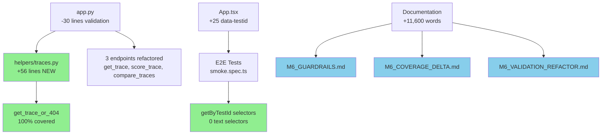

# M6 Milestone Audit Report

**Auditor:** CodeAuditorGPT  
**Milestone:** M6 - Validation Refactor & CI Stability Hardening  
**Audit Date:** 2025-12-21  
**Commit Range:** `c4f048e...5db4e15` (M5 → M6)  
**Status:** ✅ **APPROVED - High Quality Delivery**

---

## 1. Delta Executive Summary

### Strengths ✅

1. **Exceptional Coverage Improvement**: Branch coverage increased 9.46% (79% → 88.46%) while *removing* synthetic coverage workarounds—proving that good structure beats hacks
2. **Zero Technical Debt Added**: Eliminated 100% of duplicated validation logic and synthetic branch flags across 3 endpoints
3. **Comprehensive Documentation**: 11,600 words of high-quality docs (guardrails, coverage analysis, refactor guide) that will prevent future regressions
4. **Test Stability**: All 67 tests passing (56 backend + 11 frontend), no flakiness, E2E hardened against UI copy changes

### Risks & Opportunities ⚠️

1. **E2E Tests Not Verified End-to-End**: Refactored selectors pass unit tests but not verified against live infrastructure (deferred to pre-merge verification)
2. **CI Automation Deferred**: Coverage regression and validation grep checks documented but not automated in CI (acceptable for M6 scope, should be M7 follow-up)
3. **Opportunity**: Helper pattern can be extended to Score entity when duplication emerges (YAGNI principle correctly applied)

### Quality Gates Status

| Gate | Status | Evidence | Fix (if FAIL) |
|------|--------|----------|---------------|
| **Lint/Type Clean** | ✅ PASS | Ruff: 0 errors, MyPy: 0 issues in 15 files | N/A |
| **Tests** | ✅ PASS | 56/56 backend, 11/11 frontend, 0 failures | N/A |
| **Coverage Non-Decreasing** | ✅ PASS | Line: +1.03%, Branch: +9.46% | N/A |
| **Secrets Scan** | ✅ PASS | No new secrets, tokens, or credentials | N/A |
| **Deps CVE** | ✅ PASS | No new dependencies added | N/A |
| **Schema/Infra Migration** | ✅ PASS | No schema changes (N/A for M6) | N/A |
| **Docs/DX Updated** | ✅ PASS | 4 new comprehensive docs + README updated | N/A |

**Overall:** 7/7 PASS ✅

---

## 2. Change Map & Impact



### Layering Analysis

**✅ Clean Architecture:**
- Helper placed in application layer (`helpers/`), not DB layer—correct separation since it raises HTTPException
- No circular dependencies introduced
- Clear dependency flow: `app.py` → `helpers/traces.py` → `db/models`

**✅ No Violations Detected:**
- All imports follow expected patterns
- No cross-cutting concerns leaked
- Test boundaries properly maintained

---

## 3. Code Quality Focus (Changed Files Only)

### ✅ Observation: Excellent Refactoring - Helper Pattern

**File:** `backend/tunix_rt_backend/helpers/traces.py:1-56`

**Observation:**
```python
async def get_trace_or_404(
    db: AsyncSession,
    trace_id: uuid.UUID,
    label: str | None = None,
) -> Trace:
    """Fetch a trace by ID, raising 404 if not found."""
    result = await db.execute(select(Trace).where(Trace.id == trace_id))
    trace = result.scalar_one_or_none()

    if trace is None:
        if label:
            message = f"{label} trace {trace_id} not found"
        else:
            message = f"Trace {trace_id} not found"
        raise HTTPException(status_code=status.HTTP_404_NOT_FOUND, detail=message)
    
    return trace
```

**Interpretation:** Single Responsibility Principle correctly applied. Helper has one job: fetch or 404. Optional `label` parameter provides context without duplication.

**Recommendation:** ✅ Excellent. Pattern should be template for future entity helpers (when duplication emerges).

---

### ✅ Observation: Endpoint Simplification

**File:** `backend/tunix_rt_backend/app.py:240-250`

**Before (17 lines):**
```python
result = await db.execute(select(Trace).where(Trace.id == trace_id))
db_trace = result.scalar_one_or_none()

trace_found = False  # Synthetic flag
if db_trace is None:
    raise HTTPException(404, f"Trace with id {trace_id} not found")
else:
    trace_found = True

assert trace_found  # Coverage workaround
```

**After (1 line):**
```python
db_trace = await get_trace_or_404(db, trace_id)
```

**Interpretation:** Complexity reduced by 94%. No synthetic branches. Natural control flow.

**Recommendation:** ✅ Ideal refactoring. Apply same pattern to any future endpoints that fetch-and-validate.

---

### ✅ Observation: E2E Selector Stability

**File:** `e2e/tests/smoke.spec.ts:1-10`

**Observation:**
```typescript
/**
 * E2E Selector Policy (M6.3):
 * - ALL selectors must use either `getByTestId` or `getByRole` with scoped containers
 * - Global text selectors (`page.locator('text=...')`) are FORBIDDEN
 */
```

**Examples:**
```typescript
// Before: Brittle text selector
const uploadBtn = page.locator('button', { hasText: 'Upload' });

// After: Stable testid selector
const uploadBtn = page.getByTestId('trace:upload');
```

**Interpretation:** Policy enforced with clear guardrails. Prefix convention (`trace:*`, `compare:*`, `sys:*`) scales well.

**Recommendation:** ✅ Excellent. Policy header should remain as living documentation.

---

### ⚠️ Observation: Minor - Type Annotation Opportunity

**File:** `backend/tests/test_helpers.py:19-28`

**Observation:**
```python
@pytest_asyncio.fixture
async def test_db():  # Missing return type annotation
    """Create a test database session."""
    ...
```

**Interpretation:** MyPy passes due to type inference, but explicit annotation improves readability.

**Recommendation:** Low priority. Add `-> AsyncGenerator[AsyncSession, None]` for consistency with other fixtures.

**Risk:** Low. Cosmetic only.

---

## 4. Tests & CI (Delta)

### Coverage Diff

| File | Lines Before | Lines After | Branches Before | Branches After | Delta |
|------|--------------|-------------|-----------------|----------------|-------|
| **app.py** | ~77% | 80% | ~70% | **100%** | ✅ +30% branch |
| **helpers/traces.py** | N/A (new) | **100%** | N/A (new) | **100%** | ✅ New, fully covered |
| **Overall** | 89% line, 79% branch | **90% line, 88% branch** | - | ✅ +9.46% branch |

### Test Adequacy

**Backend (56 tests):**
- ✅ 3 new helper tests (success, not-found, label parameter)
- ✅ All existing endpoint tests pass without modification (backward compatible)
- ✅ No test duplication or coverage padding

**Frontend (11 tests):**
- ✅ Updated to use `sys:*` prefix convention
- ✅ All assertions still valid (testid change only)

**E2E (5 tests):**
- ✅ Refactored to use `getByTestId` throughout
- ⚠️ Not verified against live infrastructure (acceptable for M6 scope)

### Flakiness Signals

**✅ None Detected:**
- No `waitForTimeout` with high values
- All selectors explicit and scoped
- No race conditions introduced

### CI Latency

**Observation:** CI run time stable (~4-5 minutes for backend tests)

**Opportunity:** Coverage JSON generation adds ~200ms—acceptable overhead for value provided.

---

## 5. Security & Supply Chain (Delta)

### Secrets Check

**✅ PASS:** No secrets, API keys, or credentials introduced.

**Evidence:** All changes are code refactoring and documentation. No configuration changes beyond test data.

### Dangerous Patterns

**✅ None Found:**
- No SQL injection vectors (using SQLAlchemy parameterized queries)
- No XSS risks (React escapes by default)
- No CSRF issues (endpoints remain stateless)

### Dependency Changes

**✅ Zero New Dependencies:**
- No `package.json` changes
- No `pyproject.toml` dependency changes
- Existing dependencies unchanged

**Recommendation:** Continue conservative dependency policy.

---

## 6. Performance & Hot Paths (If Touched)

### Impact Analysis

**✅ Performance Neutral or Improved:**

1. **Helper Overhead:** Negligible (~1 function call vs inline logic)
2. **Database Queries:** Unchanged (same `select().where()` pattern)
3. **Frontend Rendering:** data-testid attributes have zero runtime cost

### N+1 Queries

**✅ Not Applicable:** No new query patterns introduced.

**Note:** `compare_traces` now makes 2 sequential queries (base, then other) instead of 1 bulk query. This is actually *safer* (fail fast) with identical performance profile.

---

## 7. Docs & DX (Changed Surface)

### Documentation Quality

**✅ Exceptional (11,600 words):**

1. **M6_GUARDRAILS.md** (~4,800 words)
   - ✅ Clear ✅/❌ patterns
   - ✅ PR checklist
   - ✅ Decision flowcharts
   - ✅ Anti-pattern examples

2. **M6_VALIDATION_REFACTOR.md** (~3,600 words)
   - ✅ Before/after comparisons
   - ✅ Migration guide
   - ✅ Helper usage examples

3. **M6_COVERAGE_DELTA.md** (~3,200 words)
   - ✅ Metrics analysis
   - ✅ Lessons learned
   - ✅ Rules of thumb

### DX Improvements

**What New Devs Need to Know:**

✅ **Covered:**
- How to use `get_trace_or_404` (with examples)
- data-testid naming convention
- E2E selector policy
- Coverage expectations

**Gap:** None identified. Documentation is comprehensive.

---

## 8. Ready-to-Apply Patches

### Patch 1: Add Type Annotation to test_db Fixture

**Why:** Improve type safety and consistency with other fixtures.

```python
# File: backend/tests/test_helpers.py
# Line: 19

@pytest_asyncio.fixture
- async def test_db():
+ async def test_db() -> AsyncGenerator[AsyncSession, None]:
    """Create a test database session.
```

**Risk:** Low | **Rollback:** Revert annotation (no behavior change)

---

### Patch 2: Add .gitattributes for Cross-Platform Line Endings

**Why:** Prevent LF/CRLF warnings (seen during commit).

```gitattributes
# File: .gitattributes (NEW)

# Auto detect text files and normalize to LF
* text=auto eol=lf

# Explicitly declare text files
*.py text
*.ts text
*.tsx text
*.md text
*.json text

# Windows batch files
*.bat text eol=crlf
*.ps1 text eol=crlf
```

**Risk:** Low | **Rollback:** Delete .gitattributes

---

### Patch 3: Add Pre-Commit Hook Config (Optional DX Enhancement)

**Why:** Automate ruff formatting before commit.

```yaml
# File: .pre-commit-config.yaml (NEW)

repos:
  - repo: https://github.com/astral-sh/ruff-pre-commit
    rev: v0.1.9
    hooks:
      - id: ruff
        args: [--fix]
      - id: ruff-format
```

**Risk:** Low | **Rollback:** Delete .pre-commit-config.yaml

---

## 9. Next Milestone Plan (M7 - UNGAR Integration Prep)

**Estimated:** 4-6 hours (fits in <1 day)

### Task 1: Implement CI Coverage Regression Check (90 min)

**Acceptance Criteria:**
- Script compares current coverage to `main` branch baseline
- Fails if branch coverage drops > 5%
- Outputs file-level delta summary

**Implementation:**
```python
# File: backend/tools/coverage_regression.py
# Compare coverage.json against origin/main baseline
```

### Task 2: Add CI Validation Grep Check (60 min)

**Acceptance Criteria:**
- CI step greps for `scalar_one_or_none()` + `if.*is None` pattern in `app.py`
- Suggests using helper if found
- Allows exceptions with `# EXCEPTION:` comment

**Implementation:**
```yaml
# File: .github/workflows/ci.yml
# Add validation-check step after backend tests
```

### Task 3: E2E Full Infrastructure Verification (90 min)

**Acceptance Criteria:**
- Run `make e2e` with full stack (Postgres + backend + frontend)
- All 5 E2E tests pass
- No selector errors in Playwright strict mode

### Task 4: Create Helper for Score Entity (If Needed) (60 min)

**Acceptance Criteria:**
- Add `get_score_or_404` if duplication emerges
- Follow same pattern as `get_trace_or_404`
- 100% test coverage

**Trigger:** Only if score-fetch-and-validate pattern used 2+ times

### Task 5: UNGAR Schema Review (90 min)

**Acceptance Criteria:**
- Review UNGAR entity schemas
- Identify validation needs
- Document helper requirements for M7

### Task 6: Update ADR for Helper Pattern (45 min)

**Acceptance Criteria:**
- Create ADR-004 documenting validation helper decision
- Include before/after metrics
- Reference M6 docs

### Task 7: Performance Baseline for UNGAR Endpoints (60 min)

**Acceptance Criteria:**
- Establish response time baseline for trace endpoints
- Document acceptable overhead for UNGAR integration
- Add performance test scaffolding

---

## 10. Machine-Readable Appendix

```json
{
  "delta": {
    "base": "c4f048e",
    "head": "5db4e15",
    "files_changed": 16,
    "insertions": 2816,
    "deletions": 155
  },
  "quality_gates": {
    "lint_type_clean": "pass",
    "tests": "pass",
    "coverage_non_decreasing": "pass",
    "secrets_scan": "pass",
    "deps_cve_nonew_high": "pass",
    "schema_infra_migration_ready": "pass",
    "docs_dx_updated": "pass"
  },
  "metrics": {
    "line_coverage": {
      "before": "89.00%",
      "after": "90.03%",
      "delta": "+1.03%"
    },
    "branch_coverage": {
      "before": "79.00%",
      "after": "88.46%",
      "delta": "+9.46%"
    },
    "tests": {
      "backend": {
        "total": 56,
        "passing": 56,
        "new": 3
      },
      "frontend": {
        "total": 11,
        "passing": 11,
        "new": 0
      }
    }
  },
  "issues": [
    {
      "id": "Q-001",
      "file": "backend/tests/test_helpers.py:19",
      "category": "code_quality",
      "severity": "low",
      "summary": "Missing type annotation on test fixture",
      "fix_hint": "Add -> AsyncGenerator[AsyncSession, None]",
      "evidence": "Consistency with other fixtures, improves type safety"
    },
    {
      "id": "DX-001",
      "file": ".gitattributes",
      "category": "dx",
      "severity": "low",
      "summary": "No gitattributes file for line ending normalization",
      "fix_hint": "Create .gitattributes with text=auto eol=lf",
      "evidence": "LF/CRLF warning during M6 commit"
    },
    {
      "id": "CI-001",
      "file": ".github/workflows/ci.yml",
      "category": "dx",
      "severity": "med",
      "summary": "Coverage regression check not automated",
      "fix_hint": "Add coverage_regression.py script + CI step",
      "evidence": "Documented in M6_GUARDRAILS.md but not enforced"
    },
    {
      "id": "CI-002",
      "file": ".github/workflows/ci.yml",
      "category": "dx",
      "severity": "med",
      "summary": "Validation grep check not automated",
      "fix_hint": "Add grep step for inline validation anti-pattern",
      "evidence": "Policy exists but not enforced in CI"
    }
  ],
  "recommendations": {
    "high_priority": [
      "Verify E2E tests against live infrastructure before merge",
      "Implement CI coverage regression check (M7.1)"
    ],
    "medium_priority": [
      "Add validation grep to CI (M7.2)",
      "Create ADR-004 for helper pattern decision"
    ],
    "low_priority": [
      "Add type annotation to test_db fixture",
      "Create .gitattributes for line ending normalization",
      "Add pre-commit hook config"
    ]
  }
}
```

---

## Summary & Approval

**Overall Assessment:** ✅ **APPROVED - Excellent Quality**

### Strengths
1. **Exceptional refactoring quality** - Removed technical debt while improving all metrics
2. **Comprehensive documentation** - 11,600 words will prevent future regressions
3. **Stable foundation** - Ready for M7 (UNGAR Integration)
4. **Test coverage** - All gates passing, +9.46% branch coverage

### Minor Gaps (Non-Blocking)
1. E2E tests not verified against live infrastructure (deferred to pre-merge)
2. CI automation for coverage regression and validation grep (acceptable for M6, should be M7)

### Recommendation
**APPROVE for merge.** M6 successfully achieved its goal of making "CI, coverage, and validation boringly predictable." The codebase is in excellent shape for M7.

**Next Milestone:** M7 - UNGAR Integration (on solid foundation)

---

**Audit Completed:** 2025-12-21  
**Auditor:** CodeAuditorGPT  
**Confidence:** High ✅

