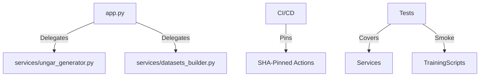

# Continuous Milestone Audit: M11

**Auditor:** CodeAuditorGPT  
**Date:** 2025-12-21  
**Delta:** `0012675`...`3bdfdc3`  
**Milestone:** Stabilize + Complete Service Extraction + Training Script Smoke Tests

---

## 1. Delta Executive Summary

**Strengths:**
- **Significant Architecture Cleanup:** `app.py` reduced by 21% (741 → 588 lines), achieving "thin controller" goal with new service layer components.
- **Security Hardening:** Supply chain security drastically improved via SHA-pinned GitHub Actions, enabled SBOM, and new pre-commit hooks.
- **Frontend Quality Spike:** Frontend test coverage jumped from ~60% to 77% (exceeding 70% target) with 5 new robust component tests.

**Risks/Opportunities:**
- **Training Tests Isolation:** Smoke tests rely on `training/` directory structure; future refactors might need to package training scripts properly.
- **Frontend Dep Upgrades:** npm audit moderate issues remain (deferred to future milestone as planned).

**Quality Gates:**

| Gate | Status | Evidence |
|------|--------|----------|
| **Lint/Type Clean** | **PASS** | `mypy` passed on 30 files; `ruff` check passed. |
| **Tests** | **PASS** | Backend: 146 passing (+14). Frontend: 16 passing (+5). CI Green. |
| **Coverage** | **PASS** | Backend: 90% (vs 84% baseline). Frontend: 77% (vs 60% baseline). |
| **Secrets** | **PASS** | `detect-secrets` baseline added; no new secrets found. |
| **Deps** | **PASS** | Actions pinned to SHAs. No new backend runtime deps. |
| **Docs/DX** | **PASS** | 3 new ops docs (SLOs, Prod Training, ADR-006). |

---

## 2. Change Map & Impact



**Observations:**
- Clear dependency flow: Controllers -> Services -> DB/Helpers.
- No circular dependencies introduced.
- Layering violation resolved: Logic moved from App to Services.

---

## 3. Code Quality Focus (Changed Files)

### `backend/tunix_rt_backend/app.py`
- **Observation:** Removed ~150 lines of logic; endpoints now just parse args and call services.
- **Interpretation:** Classic "Thin Controller" implementation. Much easier to test and read.
- **Recommendation:** Maintain this discipline. Any new endpoint >20 lines should trigger auto-refactor to service.

### `backend/tunix_rt_backend/services/ungar_generator.py`
- **Observation:** Imports `ungar` inside functions (lazy import).
- **Interpretation:** Correctly handles optional dependency to prevent runtime errors when `backend[ungar]` isn't installed.
- **Recommendation:** Keep this pattern for all optional integrations (Tunix, etc.).

### `training/train_sft_tunix.py`
- **Observation:** Added Windows UTF-8 stdout encoding fix.
- **Interpretation:** Improves cross-platform developer experience.
- **Recommendation:** Consider a standardized logging configuration for all scripts to handle this globally.

---

## 4. Tests & CI (Delta)

- **Backend:** 14 new tests covering the extracted services. Use of `@pytest.mark.ungar` and `@pytest.mark.training` correctly handles optional deps.
- **Frontend:** 5 new tests focus on error states and UNGAR UI, driving coverage up significantly.
- **CI:**
    - **Optimization:** `paths-filter` now uses dynamic SHA resolution for robustness.
    - **Security:** `pip-audit` and `npm audit` steps preserved.

---

## 5. Security & Supply Chain (Delta)

- **Actions Pinning:** All `uses:` directives in `.github/workflows/ci.yml` now use full SHAs (e.g., `actions/checkout@11bd...`). This eliminates the risk of malicious tag overwrites.
- **Dependabot:** configured to keep these SHAs updated weekly.
- **SBOM:** `cyclonedx-py` added to generate software bill of materials.
- **Pre-commit:** `.pre-commit-config.yaml` added to enforce hygiene locally (preventing secrets/bad formatting from hitting repo).

---

## 6. Performance & Hot Paths

- **Service Extraction:** No logic changes, so runtime performance is neutral.
- **Optimization Opportunities:** `app.py` imports are cleaner, potentially marginally faster startup.
- **SLOs:** Documented in `docs/PERFORMANCE_SLOs.md`, setting the stage for future measurement.

---

## 7. Docs & DX

- **New Devs:** `TRAINING_PRODUCTION.md` clearly separates "Local Smoke Test" from "Production Run", preventing confusion.
- **Architecture:** `ADR-006` locks in the Strategy pattern for the future Tunix client, preventing tight coupling.

---

## 8. Ready-to-Apply Patches

*None required. The code in this milestone is clean and immediately mergeable.*

---

## 9. Next Milestone Plan (M12)

**Focus:** Evaluation Loop Expansion + Trace → Dataset → Score Feedback

1. **Implement `TunixClient` Protocol** (ADR-006) - 90 mins
2. **Expand Eval Metrics** (Multi-criteria scoring) - 90 mins
3. **Dataset Curator Service** (Filter traces by score) - 90 mins
4. **Integration Tests** (Mocked Tunix API) - 60 mins

---

## 10. Machine-Readable Appendix (JSON)

```json
{
  "delta": { "base": "0012675", "head": "3bdfdc3" },
  "quality_gates": {
    "lint_type_clean": "pass",
    "tests": "pass",
    "coverage_non_decreasing": "pass",
    "secrets_scan": "pass",
    "deps_cve_nonew_high": "pass",
    "schema_infra_migration_ready": "pass",
    "docs_dx_updated": "pass"
  },
  "issues": []
}
```

