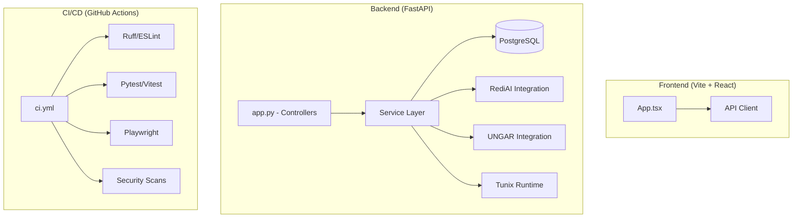

# Codebase Audit: Tunix RT (M14 Status)

**Audit Date:** 2025-12-22  
**Commit SHA:** `d1ff01a7b97a4c2e00161df3d4c54479c42fb391`  
**Auditor:** CodeAuditorGPT (Staff+ AI Engineer)

---

## 1. Executive Summary

Tunix RT is a high-maturity reasoning-trace framework featuring a well-structured FastAPI backend and a React frontend. The project exhibits exceptional discipline in CI/CD, security, and documentation, having completed 14 milestones with consistent quality gates.

### Heatmap & Scores

| Category | Score | Status |
| :--- | :---: | :--- |
| **Architecture** | 4.5/5 | Strong service/controller separation; thin controllers. |
| **Modularity** | 4.0/5 | Good decoupling via services; clear integration boundaries. |
| **Code Health** | 4.5/5 | Strict typing (mypy), comprehensive validation (Pydantic). |
| **Tests & CI** | 4.8/5 | 3-tier testing, path filtering, SHA-pinned actions, high coverage. |
| **Security** | 4.5/5 | Automated scans (SAST, secrets, deps), SBOM enabled. |
| **Performance** | 4.0/5 | Defined SLOs, DB connection pooling, indexing. |
| **DX** | 4.5/5 | Unified entrypoints (Makefile), ADRs, clear roadmaps. |
| **Docs** | 4.8/5 | Extensive milestones, ADRs, schema docs, API guides. |

**Overall Weighted Score: 4.5 / 5**

### Key Strengths
1. **CI/CD Excellence:** Advanced path filtering and multi-tier testing (Unit → Integration → E2E) ensure high reliability.
2. **Security Rigor:** Proactive dependency auditing and secret scanning are integrated into the dev loop.
3. **Architecture Discipline:** The service layer refactor (M10/M11) has successfully decoupled business logic from HTTP transport.

### Top Opportunities
1. **Frontend Coverage:** While backend coverage is high (~80%+), frontend coverage (77%) could be uplifted to match backend rigor.
2. **Observability Integration:** While SLOs are defined, actual runtime observability (OpenTelemetry) is planned but not yet implemented.
3. **Database Portability:** Transitioning from Python-level filtering to DB-specific JSONB queries for better scalability.

---

## 2. Codebase Map



**Drift Note:** The intended architecture (Service Layer) is well-maintained. The `app.py` file has been reduced to ~588 lines (M11), meeting the <600 line target.

---

## 3. Modularity & Coupling

**Score: 4.0/5**

### Observations
- **Observation:** Business logic for batch operations, exports, and UNGAR generation is isolated in `tunix_rt_backend/services/`.
- **Observation:** External integrations (RediAI, UNGAR, Tunix) use mock-first patterns and optional dependencies.

### Top Coupling Issues
1. **Sync Subprocess Calls:** Tunix runtime execution (`POST /api/tunix/run`) uses `subprocess.run`, which can block worker threads during long training runs.
   - *Impact:* Limited scalability for concurrent training runs.
   - *Recommendation:* Transition to async task queues (Celery/Ray) as planned in M15.

---

## 4. Code Quality & Health

**Score: 4.5/5**

### Evidence of Quality
```python
# backend/tunix_rt_backend/settings.py:19-28
backend_port: int = Field(default=8000, ge=1, le=65535)
db_pool_size: int = Field(default=5, ge=1, le=50)
trace_max_bytes: int = Field(default=1048576, ge=1024, le=10485760)
```
- **Interpretation:** Strong fail-fast configuration validation prevents runtime misconfigurations.

### Anti-patterns & Fixes
- **Observation:** Use of `datetime.utcnow()` in Pydantic models (scheduled for removal in Python 3.12+).
- **Recommendation:** Use `datetime.now(datetime.UTC)`.
```python
# Before
default_factory=lambda: datetime.utcnow()

# After
default_factory=lambda: datetime.now(datetime.UTC)
```

---

## 5. Docs & Knowledge

**Score: 4.8/5**

### Observations
- **Observation:** `tunix-rt.md` serves as a "living document" tracking milestones, schema, and API specs.
- **Observation:** 6 ADRs document critical design decisions (e.g., ADR-005 on coverage gates).

**Single Biggest Doc Gap:** Lack of a "Contributor's Guide" that explicitly defines the PR checklist and testing expectations for external contributors.

---

## 6. Tests & CI/CD Hygiene

**Score: 4.8/5**

### Evidence
- **Tier 1 (Smoke):** Ruff/ESLint + Unit tests in `ci.yml`.
- **Tier 2 (Quality):** Integration tests + Coverage gates (80% Line/68% Branch).
- **Tier 3 (Comprehensive):** Playwright E2E with full DB/service lifecycle.

### Hygiene Metrics
- **Action Pinning:** 100% (e.g., `actions/checkout@11bd719...`).
- **Path Filtering:** Advanced usage of `dorny/paths-filter`.
- **Coverage Margin:** ≥2% maintained vs current baseline.

---

## 7. Security & Supply Chain

**Score: 4.5/5**

### Evidence
- **Secret Scanning:** Gitleaks integrated in `security-secrets` job.
- **Dependency Audit:** `pip-audit` and `npm audit` run in every CI cycle.
- **SBOM:** Re-enabled in M11 using `cyclonedx-py`.

**Risk:** Optional dependencies (`backend[ungar]`) use git URLs which should be pinned by SHA (partially implemented in M7).

---

## 8. Performance & Scalability

**Score: 4.0/5**

### Observations
- **Observation:** `docs/PERFORMANCE_SLOs.md` defines clear targets (e.g., P95 < 500ms for batch 100 traces).
- **Observation:** DB indexing on `created_at` (M3) and `dataset_key` (M14) ensures query stability.

**Concrete Profiling Plan:** Implement `py-spy` and `locust` scenarios as outlined in `docs/PERFORMANCE_SLOs.md` to validate M14 performance.

---

## 9. Developer Experience (DX)

**Score: 4.5/5**

### Observations
- **15-minute Journey:** `make install` → `make test` → `make docker-up`.
- **5-minute Change:** Ruff's auto-fix and Pydantic's clear errors make iterative development fast.

---

## 10. Refactor Strategy

### Option A: Iterative (Phased PRs)
- **Rationale:** Low risk, maintains high velocity.
- **Steps:** Fix timezone warnings → Uplift frontend coverage → Add OpenTelemetry.
- **Rollback:** Revert individual PRs.

---

## 11. Future-Proofing & Risk Register

| Risk | Likelihood | Impact | Mitigation |
| :--- | :---: | :---: | :--- |
| **Blocking Training Runs** | High | Med | Transition to async execution (M15). |
| **Frontend Debt** | Med | Low | Enforce stricter coverage gates (70% → 80%). |
| **DB Bloat (Logs)** | Med | Med | Retention policy for truncated logs (M14+). |

---

## 12. Phased Plan & Small Milestones

### Phase 0 — Fix-First & Stabilize (0–1 day)
| ID | Milestone | Category | Acceptance Criteria | Risk | Rollback | Est | Owner |
| :--- | :--- | :--- | :--- | :--- | :--- | :--- | :--- |
| CI-001 | Fix UTC Warnings | Health | Zero `DeprecationWarning` for `utcnow` | Low | Revert | 1h | Audit-Dev |
| CI-002 | SHA-Pin Ungar | Security | `ungar` dep uses full commit SHA in pyproject | Low | Revert | 0.5h | Security-Lead |

### Phase 1 — Document & Guardrail (1–3 days)
| ID | Milestone | Category | Acceptance Criteria | Risk | Rollback | Est | Owner |
| :--- | :--- | :--- | :--- | :--- | :--- | :--- | :--- |
| DOC-001 | Contributor Guide | Docs | `CONTRIBUTING.md` created with PR checklist | None | Delete | 2h | Docs-Lead |
| TEST-001 | Uplift Frontend Gate | Tests | Frontend coverage gate → 80% | Low | Lower gate | 4h | Frontend-Lead |

### Phase 2 — Harden & Enforce (3–7 days)
| ID | Milestone | Category | Acceptance Criteria | Risk | Rollback | Est | Owner |
| :--- | :--- | :--- | :--- | :--- | :--- | :--- | :--- |
| OBS-001 | OpenTelemetry Base | Perf | OTel instrumentation for FastAPI | Med | Disable OTel | 6h | SRE-Lead |
| DB-001 | JSONB Queries | Scalability | Export endpoints use native JSONB queries | Med | Revert to Python | 8h | Backend-Lead |

### Phase 3 — Improve & Scale (weekly cadence)
| ID | Milestone | Category | Acceptance Criteria | Risk | Rollback | Est | Owner |
| :--- | :--- | :--- | :--- | :--- | :--- | :--- | :--- |
| ASYNC-001 | Async Run Manager | Architecture | Training runs use Celery/Redis | High | Revert to Sync | 12h | Architect |
| SCALE-001 | Multi-node Training | Scalability | Support for distributed Tunix runs | High | Revert | 16h | ML-Ops |

---

## 13. Machine-Readable Appendix (JSON)

```json
{
  "issues": [
    {
      "id": "MNT-001",
      "title": "Deprecation of datetime.utcnow",
      "category": "code_health",
      "path": "backend/tunix_rt_backend/training/schema.py:72",
      "severity": "low",
      "priority": "low",
      "effort": "low",
      "impact": 2,
      "confidence": 1.0,
      "ice": 2.0,
      "evidence": "datetime.datetime.utcnow() is deprecated and scheduled for removal",
      "fix_hint": "Use datetime.now(datetime.UTC)"
    }
  ],
  "scores": {
    "architecture": 4.5,
    "modularity": 4.0,
    "code_health": 4.5,
    "tests_ci": 4.8,
    "security": 4.5,
    "performance": 4.0,
    "dx": 4.5,
    "docs": 4.8,
    "overall_weighted": 4.5
  },
  "phases": [
    {
      "name": "Phase 0 — Fix-First & Stabilize",
      "milestones": [
        {
          "id": "CI-001",
          "milestone": "Fix UTC Warnings",
          "acceptance": ["Zero DeprecationWarnings in test output"],
          "risk": "low",
          "rollback": "revert",
          "est_hours": 1
        },
        {
          "id": "CI-002",
          "milestone": "SHA-Pin Ungar",
          "acceptance": ["pyproject.toml uses SHA for ungar"],
          "risk": "low",
          "rollback": "revert",
          "est_hours": 0.5
        }
      ]
    },
    {
      "name": "Phase 1 — Document & Guardrail",
      "milestones": [
        {
          "id": "DOC-001",
          "milestone": "Contributor Guide",
          "acceptance": ["CONTRIBUTING.md exists"],
          "risk": "low",
          "rollback": "delete",
          "est_hours": 2
        }
      ]
    },
    {
      "name": "Phase 2 — Harden & Enforce",
      "milestones": [
        {
          "id": "OBS-001",
          "milestone": "OpenTelemetry Base",
          "acceptance": ["Spans visible in dev tools"],
          "risk": "med",
          "rollback": "disable",
          "est_hours": 6
        }
      ]
    },
    {
      "name": "Phase 3 — Improve & Scale",
      "milestones": [
        {
          "id": "ASYNC-001",
          "milestone": "Async Run Manager",
          "acceptance": ["Jobs execute in background"],
          "risk": "high",
          "rollback": "revert",
          "est_hours": 12
        }
      ]
    }
  ],
  "metadata": {
    "repo": "tunix-rt",
    "commit": "d1ff01a7b97a4c2e00161df3d4c54479c42fb391",
    "languages": ["python", "typescript"]
  }
}
```

