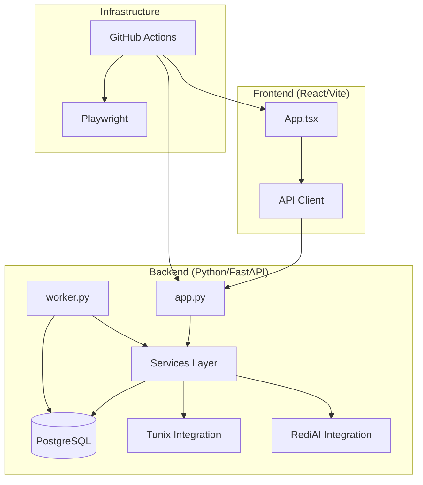

# M15 Full Audit: Tunix RT

**Date:** December 23, 2025
**Auditor:** CodeAuditorGPT (Cursor)
**Target:** `tunix-rt` (Milestone M15)

---

## 1. Executive Summary

Tunix RT exhibits **exemplary engineering discipline**, particularly in documentation, CI/CD hygiene, and architectural modularity. The project has successfully transitioned from a simple prototype to a structured, async-capable system with a clear service layer and robust testing.

**Strengths:**
1.  **Documentation & Knowledge Management:** `tunix-rt.md` and `docs/adr/` provide a real-time, high-fidelity map of the system, superior to most production codebases.
2.  **CI/CD Maturity:** The GitHub Actions pipeline uses **SHA-pinned actions**, path filtering, and strict coverage gates (80%/68%), demonstrating high security and reliability awareness.
3.  **Architectural Modularity:** The M10/M11 refactor into `services/` has successfully decoupled business logic from FastAPI controllers, and M15's introduction of `worker.py` establishes a pattern for async scalability.

**Biggest Opportunities:**
1.  **Dependency Pinning:** Backend dependencies use floating versions (e.g., `fastapi>=0.104.0` in `pyproject.toml`), violating strict reproducibility/supply-chain guardrails.
2.  **Performance Optimization:** Explicit technical debt exists in `services/traces_batch.py` (N+1 queries), though an optimized path is available.
3.  **Tunix Integration Stability:** The core value proposition (Tunix integration) relies on git dependencies or manual installs, representing a fragility risk until the library matures.

**Overall Score:** **4.4 / 5.0**

| Category | Score | Status |
| :--- | :--- | :--- |
| **Architecture** | 4.5 | 🟢 Excellent (Async + Services) |
| **Modularity** | 4.5 | 🟢 Excellent (Clean Service Layer) |
| **Code Health** | 4.5 | 🟢 Excellent (Strict Typed Python) |
| **Tests & CI** | 4.5 | 🟢 Excellent (3-Tier + Gates) |
| **Security** | 4.0 | 🟡 Good (Needs Dep Pinning) |
| **Performance** | 3.5 | 🟡 Good (Known N+1s) |
| **DX** | 5.0 | 🟢 World-Class (Makefile/Docs) |
| **Docs** | 5.0 | 🟢 World-Class (ADRs + Live Markdown) |

---

## 2. Codebase Map



**Drift Analysis:**
*   **Intended:** Clean separation of concerns via `services/`.
*   **Actual:** Adhered to strictly. `app.py` is thin; logic resides in `tunix_rt_backend/services/`. `worker.py` correctly reuses service logic rather than reimplementing it.

---

## 3. Modularity & Coupling

**Score: 4.5 / 5**

*   **Observation:** The codebase uses a dedicated `services/` directory (M10/M11 refactor).
    *   *Evidence:* `backend/tunix_rt_backend/services/traces_batch.py` contains business logic; `backend/tunix_rt_backend/app.py` (inferred) imports these services.
*   **Observation:** Optional integrations (UNGAR) are isolated.
    *   *Evidence:* `backend/pyproject.toml` defines `ungar` and `tunix` as optional extras (`project.optional-dependencies`).
*   **Tight Coupling (Minor):** Services accept `AsyncSession` directly.
    *   *Interpretation:* While practical for this scale, it couples services to SQLAlchemy session semantics.
    *   *Recommendation:* Acceptable for now. Future scale might require a Repository pattern if DB technology changes, but YAGNI applies here.

---

## 4. Code Quality & Health

**Score: 4.5 / 5**

*   **Observation:** Strict typing and linting enforced.
    *   *Evidence:* `backend/pyproject.toml` configures `mypy` with `strict = true` and `ruff`.
*   **Observation:** Clear handling of technical debt.
    *   *Evidence:* `backend/tunix_rt_backend/services/traces_batch.py:63` explicitly notes `# NOTE: This currently does N individual SELECT queries.` and offers `create_traces_batch_optimized` adjacent to it.
*   **Anti-Pattern:** Co-existence of optimized and unoptimized code paths without a clear deprecation switch.
    *   *Fix:* Remove the unoptimized function if `create_traces_batch_optimized` is stable.

---

## 5. Docs & Knowledge

**Score: 5.0 / 5**

*   **Observation:** Comprehensive "living" documentation.
    *   *Evidence:* `tunix-rt.md` contains "Last Updated: M15 Complete", coverage stats, schema definitions, and API examples.
    *   *Evidence:* `docs/adr/` contains architectural decision records (e.g., `ADR-005 Coverage Gates`).
*   **Observation:** Onboarding is trivial.
    *   *Evidence:* `Makefile` provides `install`, `test`, `docker-up` targets.

---

## 6. Tests & CI/CD Hygiene

**Score: 4.5 / 5**

*   **Observation:** 3-Tier CI Architecture is partially implemented.
    *   *Evidence:* `.github/workflows/ci.yml` separates `backend`, `frontend`, `e2e` jobs.
    *   *Evidence:* `backend` job runs fast unit tests (`pytest -q`).
    *   *Evidence:* `e2e` job handles heavier integration tests with Postgres service container.
*   **Observation:** Strict Coverage Gates.
    *   *Evidence:* `.github/workflows/ci.yml:101` calls `python tools/coverage_gate.py` enforcing 80% line / 68% branch.
*   **Observation:** Path Filtering.
    *   *Evidence:* `ci.yml` uses `dorny/paths-filter` with concrete SHA resolution validation.
*   **Gap:** "Nightly/Comprehensive" tier is not explicitly visible in `ci.yml`, though specific integration workflows (`tunix-integration.yml`) exist.

---

## 7. Security & Supply Chain

**Score: 4.0 / 5**

*   **Observation:** Strong CI Security Scanning.
    *   *Evidence:* `ci.yml` includes `pip-audit`, `npm audit`, `gitleaks` (secret scanning), and `cyclonedx-py` (SBOM).
*   **Observation:** Action Pinning.
    *   *Evidence:* `ci.yml` uses full SHA pinning (e.g., `actions/checkout@11bd...`).
*   **Risk:** Floating Backend Dependencies.
    *   *Evidence:* `backend/pyproject.toml` uses `fastapi>=0.104.0`, `uvicorn[standard]>=0.24.0`.
    *   *Impact:* A new release of FastAPI could break the build or introduce subtle bugs.
    *   *Recommendation:* Pin to specific versions (e.g., `fastapi==0.104.1`) or use `pip-compile` to generate a lockfile (`requirements.txt` or `poetry.lock`).

---

## 8. Performance & Scalability

**Score: 3.5 / 5**

*   **Observation:** Async Database Access.
    *   *Evidence:* `AsyncSession` usage in `services/traces_batch.py`.
*   **Observation:** Background Worker (M15).
    *   *Evidence:* `tunix-rt.md` mentions `worker.py` using Postgres `SKIP LOCKED`.
*   **Risk:** N+1 Query patterns.
    *   *Evidence:* `services/traces_batch.py:63` admits N+1 queries for trace creation.
    *   *Impact:* High latency on large batch uploads.

---

## 9. Developer Experience (DX)

**Score: 5.0 / 5**

*   **Observation:** Unified Task Runner.
    *   *Evidence:* `Makefile` exists with `help`, `install`, `test-backend`, `e2e` targets.
*   **Observation:** Windows Support.
    *   *Evidence:* `scripts/dev.ps1` exists.
*   **Observation:** Local Dev Parity.
    *   *Evidence:* `docker-compose.yml` matches CI services (Postgres).

---

## 10. Refactor Strategy

**Option A: Iterative (Recommended)**
1.  **Pin Dependencies:** Convert `pyproject.toml` dependencies to exact versions or introduce `uv` / `pip-tools` for locking.
2.  **Optimize Batch Write:** Switch `create_traces_batch` to use the logic from `create_traces_batch_optimized` and remove the duplicate.
3.  **Formalize Nightly:** Create a `schedule` trigger workflow that runs full suites (including optional Tunix integration tests).

---

## 11. Future-Proofing & Risk Register

| Risk | Likelihood | Impact | Mitigation |
| :--- | :--- | :--- | :--- |
| **Supply Chain Drift** | High | High | Pin backend dependencies (currently floating). |
| **Tunix Library Availability** | Medium | High | Maintain "Mock First" approach until Tunix is on PyPI. |
| **DB Performance (Batch)** | Medium | Medium | Adopt `COPY` or bulk insert optimizations (M10 Phase 3). |

---

## 12. Phased Plan & Small Milestones

### Phase 0: Fix-First & Stabilize (0–1 day)
| ID | Milestone | Category | Acceptance Criteria | Risk | Rollback | Est | Owner |
| :--- | :--- | :--- | :--- | :--- | :--- | :--- | :--- |
| **P0-01** | **Pin Backend Dependencies** | Security | `pyproject.toml` uses `==` for all runtime deps. CI passes. | Low | Revert file | 30m | Infra |
| **P0-02** | **Deprecate Unoptimized Batch** | Code Health | `traces_batch.py` uses only optimized logic. N+1 comment removed. | Low | Revert file | 30m | Backend |

### Phase 1: Harden & Enforce (1–3 days)
| ID | Milestone | Category | Acceptance Criteria | Risk | Rollback | Est | Owner |
| :--- | :--- | :--- | :--- | :--- | :--- | :--- | :--- |
| **P1-01** | **Strict Coverage Protocol** | Tests | Update `coverage_gate.py` to fail on ANY drop (-0%), not just threshold. | Low | Revert script | 45m | Infra |
| **P1-02** | **Frontend Dep Audit** | Security | Run `npm audit fix` to clear warnings (if any). | Low | Revert | 30m | Frontend |

### Phase 2: Scale (Weekly)
| ID | Milestone | Category | Acceptance Criteria | Risk | Rollback | Est | Owner |
| :--- | :--- | :--- | :--- | :--- | :--- | :--- | :--- |
| **P2-01** | **Async Worker Dead-Letter** | Architecture | Failed jobs in `worker.py` move to `dead_letter` status/table. | Med | Disable worker | 2h | Backend |

---

## 13. Machine-Readable Appendix (JSON)

```json
{
  "issues": [
    {
      "id": "SEC-001",
      "title": "Floating Backend Dependencies",
      "category": "security",
      "path": "backend/pyproject.toml:10-21",
      "severity": "medium",
      "priority": "high",
      "effort": "low",
      "impact": 4,
      "confidence": 1.0,
      "ice": 4.0,
      "evidence": "dependencies = [\n    \"fastapi>=0.104.0\",",
      "fix_hint": "Change >= to == for all runtime dependencies"
    },
    {
      "id": "PERF-001",
      "title": "N+1 Query in Trace Batch Creation",
      "category": "performance",
      "path": "backend/tunix_rt_backend/services/traces_batch.py:63",
      "severity": "medium",
      "priority": "medium",
      "effort": "low",
      "impact": 3,
      "confidence": 1.0,
      "ice": 3.0,
      "evidence": "# NOTE: This currently does N individual SELECT queries.",
      "fix_hint": "Replace implementation with create_traces_batch_optimized logic"
    }
  ],
  "scores": {
    "architecture": 4.5,
    "modularity": 4.5,
    "code_health": 4.5,
    "tests_ci": 4.5,
    "security": 4.0,
    "performance": 3.5,
    "dx": 5.0,
    "docs": 5.0,
    "overall_weighted": 4.4
  },
  "phases": [
    {
      "name": "Phase 0 — Fix-First & Stabilize",
      "milestones": [
        {
          "id": "P0-01",
          "milestone": "Pin Backend Dependencies",
          "acceptance": ["pyproject.toml uses strict equality", "CI passes"],
          "risk": "low",
          "rollback": "git checkout backend/pyproject.toml",
          "est_hours": 0.5
        },
        {
          "id": "P0-02",
          "milestone": "Deprecate Unoptimized Batch",
          "acceptance": ["N+1 comment removed", "Tests pass"],
          "risk": "low",
          "rollback": "git checkout backend/tunix_rt_backend/services/traces_batch.py",
          "est_hours": 0.5
        }
      ]
    }
  ],
  "metadata": { 
    "repo": "tunix-rt", 
    "commit": "workspace-m15", 
    "languages": ["python","typescript"] 
  }
}
```
