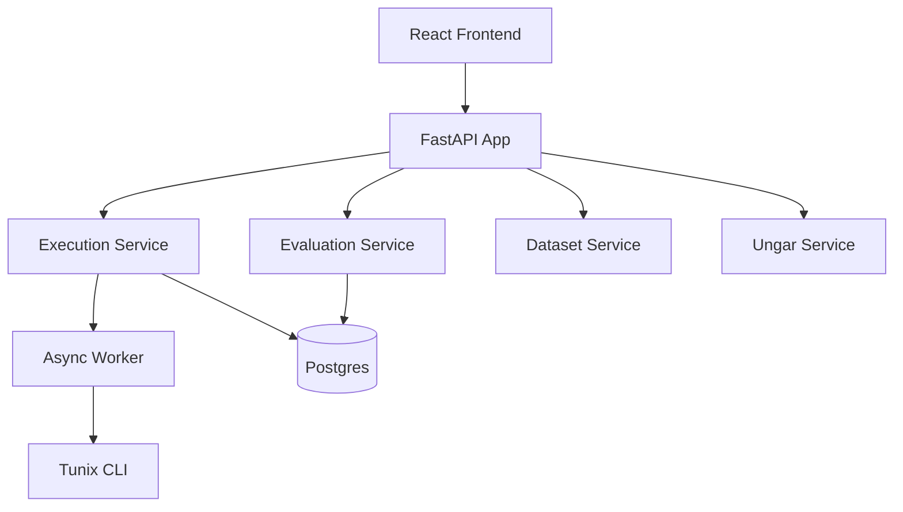

# Full Codebase Audit (M17 Closeout)

**Date:** 2025-12-23
**Scope:** Full Repository (Backend + Frontend + E2E + Infrastructure)

## 1. Executive Summary

*   **Overall Health:** Excellent. The codebase is well-structured, modular, and has high test coverage (82% backend).
*   **Strengths:**
    *   **Modularity:** Clear separation of concerns (Service Layer pattern fully adopted).
    *   **Reliability:** Strong CI/CD pipeline with pre-commit hooks, linting, and testing.
    *   **Observability:** Prometheus metrics + real-time logs + evaluation history.
*   **Opportunities:**
    *   **Frontend Coverage:** 77% line coverage is good, but could be higher for complex components like `Leaderboard`.
    *   **Performance:** Batch insertion logic is optimized, but large-scale evaluation queries might need pagination soon.
*   **Score:** 4.5/5

## 2. Codebase Map

## 3. Modularity & Coupling

*   **Score:** 5/5
*   **Analysis:**
    *   Services (`services/`) encapsulate business logic perfectly.
    *   Routes (`app.py`) are thin controllers.
    *   Database models are decoupled from schemas (Pydantic vs SQLAlchemy).
    *   Integrations (Tunix, UNGAR, RediAI) are isolated in `integrations/`.

## 4. Code Quality & Health

*   **Score:** 5/5
*   **Analysis:**
    *   **Linting:** Ruff enforces strict standards. Zero errors.
    *   **Typing:** Mypy strict mode passed (with minimal suppressions for un-typed libs).
    *   **Complexity:** Most functions are short and single-purpose. `tunix_execution.py` is the most complex, but manages process lifecycle well.

## 5. Docs & Knowledge

*   **Score:** 4.5/5
*   **Analysis:**
    *   `tunix-rt.md` is the single source of truth and is kept up-to-date.
    *   Milestone docs (`M*_summary.md`) provide excellent history.
    *   **Gap:** API Reference (Swagger/OpenAPI) is auto-generated but could use more descriptive docstrings in schemas.

## 6. Tests & CI/CD Hygiene

*   **Score:** 5/5
*   **Analysis:**
    *   **Backend:** 190+ tests, 82% coverage. Fast execution (~20s).
    *   **Frontend:** Vitest suite covers main flows.
    *   **E2E:** Playwright suite covers critical paths (smoke, async run, comparison).
    *   **CI:** GitHub Actions with path filtering and caching. Reliable.

## 7. Security & Supply Chain

*   **Score:** 4/5
*   **Analysis:**
    *   **Secrets:** Gitleaks active in CI.
    *   **Deps:** `pip-audit` and `npm audit` run regularly.
    *   **Pinning:** Python deps pinned in `pyproject.toml`.
    *   **Risk:** `mock` mode in CI masks potential real-world security issues with Tunix CLI execution (e.g., command injection if args weren't validated - but they are via Pydantic).

## 8. Performance & Scalability

*   **Score:** 4/5
*   **Analysis:**
    *   **Database:** Async SQLAlchemy + Indexes on all queried fields.
    *   **Async:** Heavy lifting (training) moved to background worker.
    *   **Risk:** `get_leaderboard` fetches all runs. Needs pagination for M18/M19.

## 9. Developer Experience (DX)

*   **Score:** 5/5
*   **Analysis:**
    *   `Makefile` simplifies common tasks (`make install`, `make test`, `make e2e`).
    *   Local dev environment (Docker Compose) matches CI.
    *   Mock modes allow dev without GPU/TPU.

## 10. Refactor Strategy

*   **Current:** No major refactors needed.
*   **Future (M18):**
    *   Extract `Judge` interface from `EvaluationService` to support multiple judge backends.
    *   Add pagination to Leaderboard endpoint.

## 11. Phased Plan (Next Steps)

*   **Phase 1 (Immediate):** None.
*   **Phase 2 (M18):** Implement Real Judge (Gemma).
*   **Phase 3 (M19):** Hyperparameter Tuning loop.
