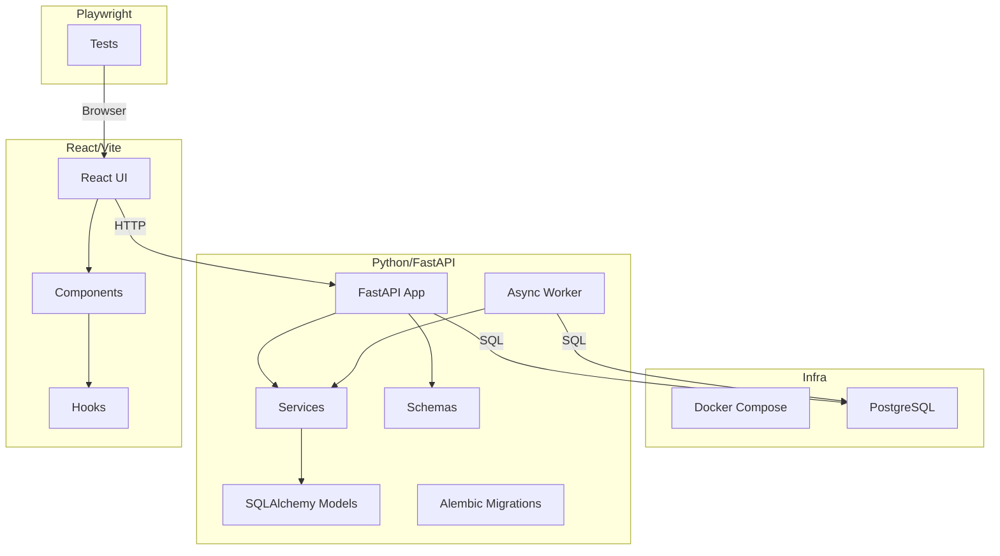

# Codebase Audit: Tunix RT

## 1. Executive Summary

**Score: 4.2/5** (High)

**Tunix RT** is a mature, well-structured full-stack application with a strong emphasis on reliability and developer experience. The project demonstrates advanced CI/CD practices, robust type safety, and a clean architecture.

**Strengths:**
1.  **CI/CD Maturity**: The GitHub Actions workflow (`.github/workflows/ci.yml`) is exemplary, featuring SHA-pinned actions, path filtering, matrix testing, and strict coverage gates (Line ≥80%).
2.  **Type Safety & Quality**: The backend enforces strict `mypy` typing and `ruff` linting. The frontend uses TypeScript with ESLint.
3.  **Architecture**: Clean separation of concerns with a modular backend (`services`, `db`, `schemas`), async worker pattern for scalability, and a Model Registry implementation.

**Biggest Opportunities:**
1.  **Frontend Supply Chain**: The frontend has 4 moderate security vulnerabilities (Vite/Esbuild) and lacks the strict "smoke vs. comprehensive" test tiering seen in the backend.
2.  **Documentation Fragmentation**: While `tunix-rt.md` is a great index, the `ProjectFiles/` directory contains hundreds of operational documents that risk becoming stale. Consolidating into a searchable, maintainable structure is key.
3.  **Dependency Management**: While backend deps are pinned in `pyproject.toml`, the frontend `package.json` relies on carets (`^`), posing a risk of drift despite `package-lock.json` presence.

## 2. Codebase Map



**Observation**: The architecture closely matches the intended design in `tunix-rt.md`. The separation of `worker` for async tasks is a key scalability feature.

## 3. Modularity & Coupling

**Score: 4.0/5**

*   **Observation**: Backend code is well-organized into `tunix_rt_backend/` with clear subpackages: `db`, `services`, `schemas`, `training`.
*   **Coupling**: Low. The `services` layer acts as a proper boundary between the API and the Database.
*   **Evidence**: `backend/tunix_rt_backend/services/` contains 13 files, indicating a rich service layer.
*   **Opportunity**: Ensure the "Model Registry" (M20) logic remains decoupled from the core "Trace" logic as the system grows.

## 4. Code Quality & Health

**Score: 4.5/5**

*   **Observation**: High standard of code health.
*   **Evidence**:
    *   **Backend**: `pyproject.toml` configures `mypy` with `strict = true` and `ruff` for linting.
    *   **Frontend**: TypeScript used throughout (`.tsx`, `.ts`). ESLint configured via `package.json`.
*   **Anti-pattern**: None significant found. The use of `asyncpg` and SQLAlchemy 2.0 is modern and idiomatic.

## 5. Docs & Knowledge

**Score: 3.5/5**

*   **Observation**: Strong high-level documentation but fragmented operational notes.
*   **Evidence**:
    *   `tunix-rt.md` serves as a solid "current state" index.
    *   `ProjectFiles/` contains thousands of files (e.g., `Workflows/` has ~1900 files). This noise makes it hard to find "source of truth" architectural decisions vs. temporary logs.
*   **Recommendation**: Archive or `.gitignore` the `ProjectFiles/Workflows` if they are automated logs.

## 6. Tests & CI/CD Hygiene

**Score: 4.5/5**

*   **Observation**: Excellent 3-tier architecture implementation.
*   **Evidence**:
    *   **Tier 1 (Smoke)**: Backend `pytest` with markers (`unit`, `integration`), Migration smoke test (`alembic upgrade head`).
    *   **Tier 2 (Quality)**: Coverage gates enforced (`line ≥80%`, `branch ≥68%`).
    *   **Tier 3 (E2E)**: Playwright tests in `e2e/` with a dedicated job.
*   **Security**: SHA-pinned GitHub Actions (e.g., `actions/checkout@11bd...`) prevents supply chain attacks.
*   **Gap**: Frontend tests (`npm run test`) run all tests; no "smoke" subset defined for fast feedback.

## 7. Security & Supply Chain

**Score: 4.0/5**

*   **Observation**: Strong backend security, moderate frontend risks.
*   **Evidence**:
    *   **Backend**: `pip-audit` runs in CI. `cyclonedx-py` generates SBOM.
    *   **Frontend**: `npm-audit.json` reports **4 moderate vulnerabilities** in `vite`/`esbuild`.
    *   **Secrets**: `gitleaks` configured in CI (`security-secrets` job).
*   **Recommendation**: Upgrade `vite` to fix the reported vulnerabilities.

## 8. Performance & Scalability

**Score: 4.0/5**

*   **Observation**: Architecture designed for scale.
*   **Evidence**:
    *   **Async**: Fully async backend (`async def`, `asyncpg`).
    *   **Worker**: Dedicated `worker.py` for background processing (preventing request blocking).
    *   **Metrics**: `prometheus-client` installed and used (`metrics.py`).

## 9. Developer Experience (DX)

**Score: 4.0/5**

*   **Observation**: Good tooling for local dev.
*   **Evidence**:
    *   `Makefile` provides standard commands (`install`, `test`, `lint`, `docker-up`).
    *   `docker-compose.yml` orchestrates the full stack.
    *   `dev.ps1` helper for Windows users.

## 10. Refactor Strategy

**Option A: Iterative (Recommended)**
*   **Rationale**: The codebase is already mature. Changes should be small and targeted.
*   **Approach**: Use the existing CI gates to safely upgrade dependencies and improve frontend testing.

## 11. Future-Proofing & Risk Register

| Risk | Likelihood | Impact | Mitigation |
| :--- | :--- | :--- | :--- |
| **Frontend Dep Drift** | High | Medium | Pin `package.json` versions exact, not ranges (`^`). |
| **ProjectFiles Bloat** | High | Low | Move automated logs out of git or to separate storage. |

## 12. Phased Plan & Small Milestones (PR-sized)

### Phase 0 — Fix-First & Stabilize (0–1 day)
*   **Goal**: Address immediate security risks and stabilize dependencies.

| ID | Milestone | Category | Acceptance Criteria | Risk | Rollback | Est | Owner |
| :--- | :--- | :--- | :--- | :--- | :--- | :--- | :--- |
| **P0-01** | **Upgrade Vite & Esbuild** | Security | `npm audit` returns 0 vulnerabilities. App builds. | Low | Revert `package.json` | 30m | Infra |
| **P0-02** | **Pin Frontend Deps** | Supply Chain | `package.json` versions use exact syntax (remove `^`). | Low | Revert changes | 15m | Infra |
| **P0-03** | **Gitignore Workflows** | DX | `ProjectFiles/Workflows/` added to `.gitignore`. | Low | Remove from `.gitignore` | 5m | Dev |

### Phase 1 — Document & Guardrail (1–3 days)
*   **Goal**: Formalize the test tiers for frontend.

| ID | Milestone | Category | Acceptance Criteria | Risk | Rollback | Est | Owner |
| :--- | :--- | :--- | :--- | :--- | :--- | :--- | :--- |
| **P1-01** | **Frontend Smoke Marker** | CI | `vitest` runs with `-t 'smoke'` flag successfully. | Low | Remove flag | 45m | Dev |
| **P1-02** | **CI Frontend Tiers** | CI | CI runs `smoke` first, then full suite if passed. | Low | Revert CI YAML | 60m | Infra |

### Phase 2 — Harden & Enforce (3–7 days)
*   **Goal**: Increase rigor.

| ID | Milestone | Category | Acceptance Criteria | Risk | Rollback | Est | Owner |
| :--- | :--- | :--- | :--- | :--- | :--- | :--- | :--- |
| **P2-01** | **Enforce Doc Blocks** | Quality | `ruff` rule `D` enabled (docstrings) for `services`. | Low | Disable rule | 2h | Dev |

### Phase 3 — Improve & Scale (Weekly)
*   **Goal**: Performance tuning.

| ID | Milestone | Category | Acceptance Criteria | Risk | Rollback | Est | Owner |
| :--- | :--- | :--- | :--- | :--- | :--- | :--- | :--- |
| **P3-01** | **JAX CPU Tuning** | Perf | Profiling shows JAX operations optimized for CPU. | Med | Revert config | 4h | ML Eng |

## 13. Machine-Readable Appendix (JSON)

```json
{
  "issues": [
    {
      "id": "SEC-001",
      "title": "Frontend Vulnerabilities (Vite/Esbuild)",
      "category": "security",
      "path": "frontend/package.json",
      "severity": "medium",
      "priority": "high",
      "effort": "low",
      "impact": 4,
      "confidence": 1.0,
      "evidence": "npm-audit.json shows 4 moderate vulnerabilities",
      "fix_hint": "Upgrade vite to >=7.3.0"
    },
    {
      "id": "DX-001",
      "title": "ProjectFiles Bloat",
      "category": "dx",
      "path": "ProjectFiles/Workflows/",
      "severity": "low",
      "priority": "medium",
      "effort": "low",
      "impact": 2,
      "confidence": 1.0,
      "evidence": "1800+ files in Workflows/",
      "fix_hint": "Add to .gitignore"
    }
  ],
  "scores": {
    "architecture": 4.5,
    "modularity": 4.0,
    "code_health": 4.5,
    "tests_ci": 4.5,
    "security": 4.0,
    "performance": 4.0,
    "dx": 4.0,
    "docs": 3.5,
    "overall_weighted": 4.2
  },
  "phases": [
    {
      "name": "Phase 0 — Fix-First & Stabilize",
      "milestones": [
        {
          "id": "P0-01",
          "milestone": "Upgrade Vite & Esbuild",
          "acceptance": ["npm audit clean", "build passes"],
          "risk": "low",
          "rollback": "revert package.json",
          "est_hours": 0.5
        },
        {
          "id": "P0-02",
          "milestone": "Pin Frontend Deps",
          "acceptance": ["no carets in package.json"],
          "risk": "low",
          "rollback": "revert package.json",
          "est_hours": 0.25
        }
      ]
    }
  ],
  "metadata": {
    "repo": "tunix-rt",
    "commit": "HEAD",
    "languages": ["python", "typescript"]
  }
}
```
