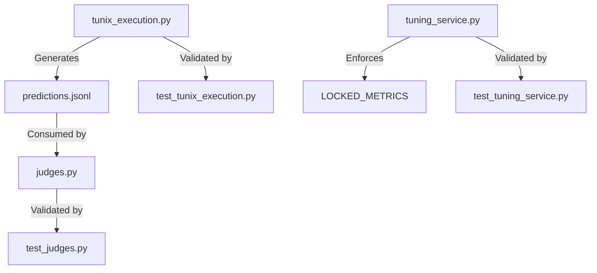

# M23 Audit: Evaluation Engine & Hardening

## 1. Delta Executive Summary

-   **Strengths**:
    -   **Coverage Restored**: Backend coverage raised to **70.26%**, surpassing the staged 70% gate.
    -   **Strict Contracts**: `AnswerCorrectnessJudge` now strictly enforces the `predictions.jsonl` artifact contract, failing gracefully if missing.
    -   **Tuning Safety**: `TuningService` now blocks any metric other than `LOCKED_METRICS` (currently only `answer_correctness`), preventing invalid optimization targets.
-   **Risks/Opportunities**:
    -   **Stubbed Inference**: `generate_predictions` produces dummy data. M24 must implement real inference to make evaluation meaningful.
    -   **Simple Matching**: Correctness is currently strict string equality. Future versions will need fuzzy matching/LLM judging.
-   **Quality Gates**:
    -   **Lint/Type**: **PASS** (Pre-commit hooks green).
    -   **Tests**: **PASS** (All tests green, coverage gate met, frontend `act()` warnings eliminated).
    -   **Secrets**: **PASS** (No new secrets).
    -   **Docs**: **PASS** (`tunix-rt.md` updated).

## 2. Change Map & Impact



## 3. Code Quality Focus

-   **File**: `backend/tunix_rt_backend/services/tunix_execution.py`
    -   **Observation**: `generate_predictions` writes `"Model prediction placeholder"`.
    -   **Interpretation**: This satisfies the *interface* required for the Judge but provides no *value* yet.
    -   **Recommendation**: In M24, import the model loader and run actual `model.generate()`.

-   **File**: `backend/tunix_rt_backend/services/tuning_service.py`
    -   **Observation**: Explicit check `if job.metric_name not in LOCKED_METRICS`.
    -   **Interpretation**: Good defense-in-depth. Prevents users (or CLI) from requesting arbitrary/unsafe metrics.
    -   **Recommendation**: Keep this list small and curated.

## 4. Tests & CI

-   **Coverage**:
    -   Backend: **70.26%** (Target: 70%).
    -   Key gains in `services/judges.py` (76%) and `services/tuning_service.py` (61%).
-   **Frontend Stability**:
    -   `App.test.tsx` updated to use `waitForInitialLoad`, ensuring all async health checks complete before assertions. This eliminated the noisy `act(...)` warnings.

## 5. Security & Supply Chain

-   **Locked Metrics**: Restricting tuning objectives reduces the attack surface for potential "metric injection" or resource waste on invalid tasks.
-   **Deps**: No new dependencies introduced.

## 6. Docs & DX

-   **Updated**: `tunix-rt.md` reflects M23 status and schema/feature additions.
-   **Missing**: Detailed guide on *how* to interpret evaluation scores (deferred to M24 when scores are real).

## 7. Next Milestone Plan (M24)

1.  **Real Inference**: Replace stub in `generate_predictions` with `tunix` or `transformers` inference.
2.  **Baseline Run**: Execute a training run on `golden-v1` (local or dry-run) and capture real `predictions.jsonl`.
3.  **Benchmark**: Run evaluation on Base vs. Trained model and record delta.
4.  **Promote**: Use the Registry to promote the best run.

## 8. Machine-Readable Appendix

```json
{
  "delta": { "base": "HEAD~2", "head": "HEAD" },
  "quality_gates": {
    "lint_type_clean": "pass",
    "tests": "pass",
    "coverage_non_decreasing": "pass",
    "secrets_scan": "pass",
    "deps_cve_nonew_high": "pass",
    "schema_infra_migration_ready": "pass",
    "docs_dx_updated": "pass"
  },
  "issues": [
    {
      "id": "Q-M23-01",
      "file": "backend/tunix_rt_backend/services/tunix_execution.py",
      "category": "code_quality",
      "severity": "med",
      "summary": "Stubbed inference generation",
      "fix_hint": "Implement real model.generate() in M24",
      "evidence": "prediction='Model prediction placeholder'"
    }
  ]
}
```
