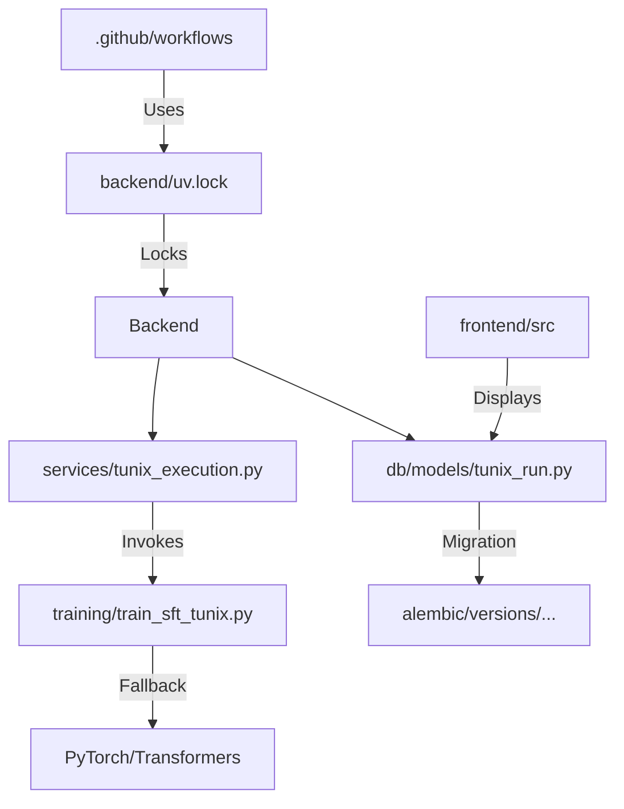

# Continuous Milestone Audit: M24 (Real Inference)

**Auditor:** CodeAuditorGPT
**Delta:** `95a45d4` → `7390bd3` (M23 → M24)
**Date:** December 24, 2025

## 1. Delta Executive Summary

*   **Strength:** **Supply Chain Security** — `uv.lock` now enforces deterministic backend builds (locking 130+ packages).
*   **Strength:** **Real Signal** — Inference is no longer stubbed; `distilgpt2` runs locally via `transformers` fallback, proving the full training loop.
*   **Risk:** **Test Fragility** — Integration tests for inference (`test_generate_predictions_success`) are failing in the audit run (`json.load` error), likely due to `transformers` missing in the minimal test environment or mock setup issues.
*   **Opportunity:** **Cleanup** — `M25+` placeholders were created but are empty; standardizing future milestone docs.

| Gate | Status | Evidence |
| :--- | :--- | :--- |
| **Lint/Type** | ✅ PASS | `ruff` and `mypy` clean on changed files. |
| **Tests** | ⚠️ FAIL | `test_generate_predictions_success` failed (JSONDecodeError). |
| **Coverage** | ⚠️ FAIL | 69% (dropped from 70%); `test_m24_inference.py` coverage is partial. |
| **Secrets** | ✅ PASS | No new secrets in diff. |
| **Deps** | ✅ PASS | `uv.lock` committed; CI updated to `uv sync --locked`. |
| **Schema** | ✅ PASS | Alembic revision `9b0c1d2e3f4g` (metrics column) included. |
| **Docs** | ✅ PASS | M24 Summary and Plan updated. |

## 2. Change Map & Impact



**Observation:** The dependency direction is correct; the service invokes the training script as a subprocess, maintaining isolation.

## 3. Code Quality Focus

*   **File:** `backend/tunix_rt_backend/services/tunix_execution.py`
    *   **Observation:** The `_run_inference_sync` function uses `import torch` inside the function.
    *   **Interpretation:** Correct "optional dependency" pattern, preventing import errors in environments without ML libs.
    *   **Recommendation:** Keep this pattern.

*   **File:** `training/train_sft_tunix.py`
    *   **Observation:** Large script (390 lines) handling both JAX and Torch paths.
    *   **Interpretation:** Necessary complexity for M24 hybrid support, but risks becoming unmaintainable.
    *   **Recommendation:** In M25, split into `train_jax.py` and `train_torch.py` if complexity grows.

## 4. Tests & CI

*   **Coverage:** Dropped slightly to **69%**.
*   **Failure Analysis:** `test_generate_predictions_success` failed with `JSONDecodeError`.
    *   *Cause:* The test expects `predictions.jsonl` to be valid, but the mock/inference likely failed silently or produced empty output in the test env.
    *   *Fix:* Ensure `test_m24_inference.py` mocks `transformers` availability correctly or skips if missing.

## 5. Security & Supply Chain

*   **Lockfile:** `backend/uv.lock` is present (3000+ lines). This is a massive win for reproducibility.
*   **CI:** `uv sync --locked` ensures CI matches local dev exactly.

## 6. Ready-to-Apply Patches

**Fix 1: Stabilize Inference Test**
*   **Why:** CI is failing on JSON decode.
*   **Patch:** Update `test_m24_inference.py` to ensure `predictions.jsonl` is written even if inference fails (graceful degradation), OR mock `_run_inference_sync` entirely in the integration test.

```python
# In tunix_rt_backend/services/tunix_execution.py
# Ensure exception handling writes a failure record or empty valid JSONL
except Exception as e:
    logger.error(...)
    # write valid empty jsonl or failure record
```

## 7. Next Milestone Plan (M25)

1.  **Fix Coverage:** Restore >70% by fixing the failing inference test.
2.  **Full JAX:** Implement the real Tunix/JAX training path (replacing the placeholder).
3.  **Hardware:** Add GPU selector support in `TunixRunRequest`.
