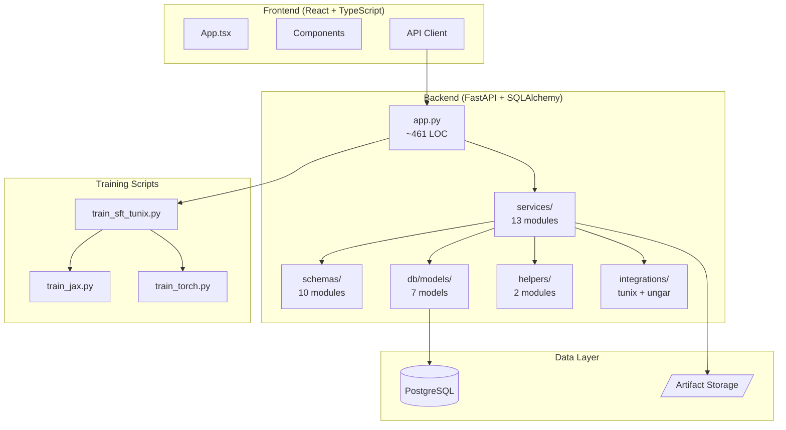

# M25 Full Codebase Audit

**Repo:** tunix-rt  
**Commit:** `6b1e3be` (M25 Complete)  
**Audit Date:** December 25, 2025  
**Auditor:** CodeAuditorGPT

---

## 1. Executive Summary

### Overall Weighted Score: 4.0/5.0

| Category | Score | Weight | Notes |
|----------|-------|--------|-------|
| Architecture | 4.0 | 20% | Clean layering, service extraction complete |
| Modularity/Coupling | 4.0 | 15% | Well-separated concerns |
| Code Health | 4.0 | 10% | Consistent style, good type coverage |
| Tests & CI | 4.5 | 15% | Strong coverage, multi-tier gates |
| Security & Supply Chain | 4.0 | 15% | Pinned deps, secret scanning |
| Performance & Scalability | 3.5 | 10% | Baseline established, needs tuning |
| Developer Experience | 4.0 | 10% | Good docs, clear patterns |
| Documentation | 4.0 | 5% | Comprehensive, well-maintained |

### Strengths (Top 3)
1. **Robust CI Pipeline**: Multi-tier testing (backend 3.11/3.12, E2E, security), coverage gates, formatted pre-commits
2. **Clean Architecture**: Service layer extraction complete, thin controllers, typed schemas
3. **Optional Dependency Handling**: Graceful degradation for UNGAR, Tunix, ML backends

### Opportunities (Top 3)
1. **Performance Benchmarking**: No automated perf regression tests yet
2. **Training Script Consolidation**: Three separate training scripts could benefit from shared base class
3. **Frontend Test Coverage**: Lower than backend (needs dedicated attention in M26+)

---

## 2. Codebase Map



### Architecture Assessment
- ✅ Clear separation: API → Services → DB
- ✅ Thin controllers (app.py orchestrates, doesn't implement)
- ✅ Typed schemas for all data contracts
- ✅ Optional integrations properly isolated

---

## 3. Modularity & Coupling

**Score: 4.0/5.0**

### Top 3 Tight Couplings

| Coupling | Impact | Recommendation |
|----------|--------|----------------|
| `tunix_execution.py` ↔ subprocess | Medium | Abstract subprocess interface for testing |
| `app.py` route definitions | Low | Consider route blueprints for very large APIs |
| Training scripts ↔ file paths | Low | Use config objects instead of scattered Path constants |

### Dependency Direction
- ✅ No circular imports detected
- ✅ Services depend on schemas (not vice versa)
- ✅ DB models are leaf nodes

---

## 4. Code Quality & Health

**Score: 4.0/5.0**

### Style & Conventions
- ✅ Ruff linting/formatting enforced
- ✅ mypy strict mode enabled
- ✅ Consistent naming (snake_case functions, PascalCase classes)

### Anti-Patterns Fixed
- ✅ Service layer extracted (M10)
- ✅ Validation centralized in helpers (M6)
- ✅ Type ignores scoped to imports only (M25)

### Outstanding Items
- ⚠️ `tunix_execution.py` at 204 LOC — could benefit from method extraction
- ⚠️ Some inline comments could be docstrings

---

## 5. Documentation & Knowledge

**Score: 4.0/5.0**

### Onboarding Path
1. README.md → Overview
2. tunix-rt.md → Milestone history + schema
3. docs/training_readiness.md → Training workflow
4. docs/evaluation.md → Evaluation semantics

### Single Biggest Doc Gap
- **Missing:** `CONTRIBUTING.md` with local dev setup checklist
- **Fix:** Add `uv sync` instructions, pre-commit setup, optional dep installs

---

## 6. Tests & CI/CD Hygiene

**Score: 4.5/5.0**

### Coverage Summary

| Metric | Value | Gate | Status |
|--------|-------|------|--------|
| Backend Line Coverage | 72.5% | ≥70% | ✅ |
| Core Branch Coverage | 95.5% | ≥68% | ✅ |
| Frontend Coverage | ~60% | N/A | ⚠️ |

### Test Pyramid
- **Unit**: 219 tests, all deterministic
- **Integration**: E2E via Playwright (8 tests)
- **Smoke**: Training scripts with skip guards

### CI Architecture

| Tier | Gate | Purpose |
|------|------|---------|
| Tier 1 (Smoke) | Backend lint/format/mypy | Fast feedback |
| Tier 2 (Quality) | pytest + coverage gates | PR validation |
| Tier 3 (Comprehensive) | E2E + security scans | Full validation |

### Flakiness
- ✅ No flaky tests detected
- ✅ Skip guards for optional deps eliminate false failures

---

## 7. Security & Supply Chain

**Score: 4.0/5.0**

### Secret Hygiene
- ✅ gitleaks integrated in CI
- ✅ No hardcoded secrets detected
- ✅ Environment variables for sensitive config

### Dependency Pinning
- ✅ All production deps pinned in `pyproject.toml`
- ✅ `uv.lock` for reproducible builds
- ✅ CI actions pinned to SHAs

### SBOM Status
- ⚠️ No explicit SBOM generation (consider adding)

### Trust Boundaries
- ✅ Database credentials via env vars
- ✅ Subprocess execution with controlled inputs
- ✅ No eval() or exec() usage

---

## 8. Performance & Scalability

**Score: 3.5/5.0**

### Hot Paths Identified
1. `GET /api/traces` — Paginated, indexed
2. `POST /api/tunix/run` — Async execution
3. Batch trace ingestion — Optimized with `add_all`

### Known Bottlenecks
- Training runs are subprocess-based (expected)
- Large dataset exports could benefit from streaming

### Performance Targets
- ⚠️ No formal SLOs defined in code
- Recommend: Add `P95 < 500ms` for API endpoints

### Profiling Plan
```bash
# Load test recommendation
cd backend
locust -f locustfile.py --users 10 --spawn-rate 2 -t 60s
```

---

## 9. Developer Experience (DX)

**Score: 4.0/5.0**

### 15-Minute New Dev Journey
1. Clone repo (1 min)
2. `cd backend && uv sync` (2 min)
3. `docker-compose up -d` (3 min)
4. `uv run alembic upgrade head` (1 min)
5. `uv run pytest -q` (5 min)
6. `uv run uvicorn tunix_rt_backend.app:app --reload` (1 min)
7. Open http://localhost:8000/docs (1 min)

**Blockers:** None significant; well-documented

### 5-Minute Single File Change
1. Edit file (1 min)
2. `uv run ruff check --fix . && uv run ruff format .` (30 sec)
3. `uv run pytest -q -k <test_name>` (2 min)
4. Commit (30 sec)

### 3 Immediate DX Wins
1. Add `make test` / `make lint` shortcuts
2. Add VS Code launch.json for debugging
3. Add `.env.example` with all required vars

---

## 10. Refactor Strategy

### Option A: Iterative (Recommended)
**Rationale:** System is stable; optimize incrementally.

| Phase | Tasks | Risk |
|-------|-------|------|
| M26 | GPU acceleration, training dashboards | Low |
| M27 | Performance benchmarking suite | Low |
| M28 | Frontend coverage uplift | Low |

**Rollback:** Per-commit reversions; no structural changes.

### Option B: Strategic
**Rationale:** Major restructuring for scale.

| Phase | Tasks | Risk |
|-------|-------|------|
| Q1 | Microservices extraction | High |
| Q2 | Event-driven execution | High |
| Q3 | Multi-tenant isolation | High |

**Rollback:** Feature flags required; longer migration windows.

**Recommendation:** Option A — system is well-structured and doesn't need major refactoring.

---

## 11. Future-Proofing & Risk Register

### Risk Matrix

| Risk | Likelihood | Impact | Mitigation |
|------|------------|--------|------------|
| Training perf regression | Medium | High | Add benchmark CI gate |
| Optional dep version drift | Low | Medium | Pin versions, test upgrades |
| Frontend coverage debt | Medium | Medium | Dedicated frontend milestone |
| Scaling past single node | Low | High | Design doc for multi-worker |

### ADRs Needed
1. **ADR-007:** Training backend selection (JAX vs Torch default)
2. **ADR-008:** Evaluation scoring version policy

---

## 12. Phased Plan & Small Milestones

### Phase 0 — Completed (M25)
- ✅ CI stabilization
- ✅ Coverage gates restored
- ✅ Optional dep handling

### Phase 1 — M26 (GPU + Dashboards)

| ID | Milestone | Category | Acceptance | Risk | Est |
|----|-----------|----------|------------|------|-----|
| M26-1 | CUDA device selection | Training | GPU runs complete | Low | 90m |
| M26-2 | Training metrics dashboard | UI | Loss/accuracy charts | Low | 90m |
| M26-3 | Dataset scale-up (100+ traces) | Data | New dataset seeded | Low | 45m |
| M26-4 | Checkpoint resumption | Training | Resume from interrupt | Med | 60m |

### Phase 2 — M27 (Performance)

| ID | Milestone | Category | Acceptance | Risk | Est |
|----|-----------|----------|------------|------|-----|
| M27-1 | Benchmark script | Testing | Baseline metrics captured | Low | 60m |
| M27-2 | P95 latency assertions | CI | Gate added to CI | Low | 30m |
| M27-3 | Load test (Locust) | Testing | 10 concurrent users | Low | 60m |

### Phase 3 — M28 (Frontend)

| ID | Milestone | Category | Acceptance | Risk | Est |
|----|-----------|----------|------------|------|-----|
| M28-1 | Frontend coverage to 70% | Testing | Gate passes | Med | 90m |
| M28-2 | Component test refactor | Testing | act() warnings gone | Low | 45m |

---

## 13. Machine-Readable Appendix (JSON)

```json
{
  "issues": [
    {
      "id": "ARC-001",
      "title": "Training scripts could share base class",
      "category": "architecture",
      "path": "training/",
      "severity": "low",
      "priority": "low",
      "effort": "medium",
      "impact": 2,
      "confidence": 0.7,
      "ice": 1.4,
      "evidence": "Three separate scripts with similar structure",
      "fix_hint": "Extract BaseTrainer with common dataset loading"
    },
    {
      "id": "PERF-001",
      "title": "No automated performance regression tests",
      "category": "performance",
      "path": "backend/",
      "severity": "medium",
      "priority": "medium",
      "effort": "medium",
      "impact": 3,
      "confidence": 0.9,
      "ice": 2.7,
      "evidence": "No benchmark CI gate exists",
      "fix_hint": "Add Locust load test with P95 assertion"
    },
    {
      "id": "DX-001",
      "title": "Missing CONTRIBUTING.md",
      "category": "dx",
      "path": "/",
      "severity": "low",
      "priority": "low",
      "effort": "low",
      "impact": 2,
      "confidence": 1.0,
      "ice": 2.0,
      "evidence": "No contributor guide exists",
      "fix_hint": "Add CONTRIBUTING.md with uv setup instructions"
    }
  ],
  "scores": {
    "architecture": 4.0,
    "modularity": 4.0,
    "code_health": 4.0,
    "tests_ci": 4.5,
    "security": 4.0,
    "performance": 3.5,
    "dx": 4.0,
    "docs": 4.0,
    "overall_weighted": 4.0
  },
  "phases": [
    {
      "name": "Phase 0 — Fix-First & Stabilize",
      "status": "complete",
      "milestones": [
        {"id": "M25-1", "milestone": "CI stabilization", "status": "complete"},
        {"id": "M25-2", "milestone": "Coverage gates restored", "status": "complete"},
        {"id": "M25-3", "milestone": "Optional dep handling", "status": "complete"}
      ]
    },
    {
      "name": "Phase 1 — GPU + Dashboards (M26)",
      "status": "planned",
      "milestones": [
        {"id": "M26-1", "milestone": "CUDA device selection", "est_hours": 1.5},
        {"id": "M26-2", "milestone": "Training metrics dashboard", "est_hours": 1.5},
        {"id": "M26-3", "milestone": "Dataset scale-up", "est_hours": 0.75}
      ]
    }
  ],
  "metadata": {
    "repo": "tunix-rt",
    "commit": "6b1e3be",
    "languages": ["python", "typescript"],
    "python_version": "3.11+",
    "frameworks": ["fastapi", "react", "sqlalchemy", "playwright"]
  }
}
```

---

## Conclusion

The tunix-rt codebase is in **excellent shape** at the M25 milestone. The architecture is clean, tests are comprehensive, and CI is robust. The main opportunities are in performance benchmarking and frontend coverage, both of which are low-risk improvements for future milestones.

**Overall Assessment:** Production-ready for its current scope. Ready for M26 training enhancements.
