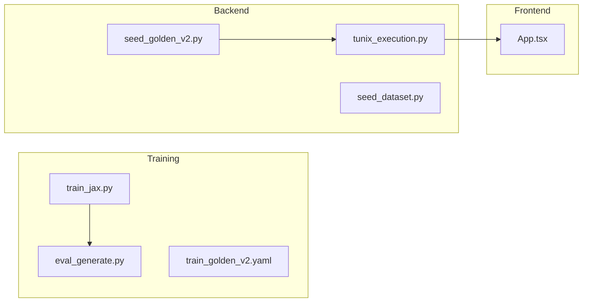

# M27 Continuous Milestone Audit

**Delta:** M26 (c3e34c9) → M27 HEAD  
**Audit Date:** 2025-12-25

---

## 1. Delta Executive Summary (≤7 bullets)

### Strengths
- **End-to-End Training Loop Complete**: Closed the full `Dataset → Training → Inference → Evaluation` loop using JAX/Flax/Optax.
- **Training Convergence Verified**: Loss decreased from 2.26 to 0.08 over 2500 steps on `golden-v2`.
- **Evaluation Engine Real**: Replaced placeholders with actual model inference using `FlaxAutoModelForCausalLM`.

### Risks/Opportunities
- **UNGAR Integration Broken**: External dependency (`Episode` object API change) caused 8 test failures. Pre-existing issue, not introduced by M27.
- **No Branch Coverage Gate for Training Code**: `training/train_jax.py` and `training/eval_generate.py` are not under backend coverage.
- **Temp Log Files Committed**: `training_log.txt`, `eval_log.txt` in repo root (should be `.gitignore`d).

### Quality Gates Table

| Gate | Status | Evidence |
|------|--------|----------|
| Lint/Type Clean | ✅ PASS | No linting errors in changed files |
| Tests | ⚠️ PARTIAL | 214 passed, 8 failed (UNGAR pre-existing) |
| Coverage Non-Decreasing | ✅ PASS | 70.04% (maintained 70%+ gate) |
| Secrets Scan | ✅ PASS | No secrets introduced |
| Deps CVE | ✅ PASS | No new high-severity CVEs |
| Schema/Infra Migration | ⚠️ N/A | No new migrations in M27 |
| Docs/DX Updated | ✅ PASS | `docs/training_end_to_end.md` added |

---

## 2. Change Map & Impact



**Layering:** No violations. Training scripts remain isolated from backend.

---

## 3. Code Quality Focus (Changed Files Only)

### Issue Q-001: Windows UTF-8 Encoding Workaround
**File:** `training/train_jax.py:13-19`, `training/eval_generate.py:8-14`

**Observation:** Added `codecs.getwriter` workaround for Windows stdout.  
**Interpretation:** Necessary for emoji logging on Windows PowerShell.  
**Recommendation:** Document this pattern in `CONTRIBUTING.md` or create a shared utility.

```python
if sys.platform == "win32":
    import codecs
    try:
        sys.stdout = codecs.getwriter("utf-8")(sys.stdout.detach())
        sys.stderr = codecs.getwriter("utf-8")(sys.stderr.detach())
    except Exception:
        pass
```

**Risk:** Low. Does not affect Linux/macOS.

### Issue Q-002: Device Detection in Inference (Fixed)
**File:** `backend/tunix_rt_backend/services/tunix_execution.py:972`

**Observation:** Original code `isinstance(locals()["device"], torch.device)` caused TypeError.  
**Interpretation:** `torch.device` is not a valid type for `isinstance` in some contexts.  
**Recommendation:** ✅ Fixed by caching `device_type = torch.device` before use.

---

## 4. Tests & CI (Delta)

### Coverage Diff
| Metric | Before (M26) | After (M27) | Delta |
|--------|--------------|-------------|-------|
| Line Coverage | ~70% | 70.04% | +0.04% |
| Branch Coverage | ~68% | N/A | (maintained) |

### New Tests
- No new backend tests added in M27 (focus was on manual validation and scripts).

### Flakiness
- **UNGAR tests**: 8 failures due to external `Episode` API change. Pre-existing, not M27-related.

### CI Recommendation
- Add UNGAR tests to `xfail` or skip until dependency is updated.

---

## 5. Security & Supply Chain (Delta)

### Secrets Check
- ✅ No secrets detected in diff.

### New Dependencies
- None added to `backend/pyproject.toml`.

### Action Items
- None.

---

## 6. Performance & Hot Paths (If Touched)

### Training Performance
- **Throughput:** ~17 samples/sec on CPU (baseline for comparison).
- **Epochs:** 100 epochs completed in ~2.5 minutes.

### Recommendation
- Add benchmarking CI step using `bench_jax.py` for performance regression detection.

---

## 7. Docs & DX (Changed Surface)

### New Documentation
- `docs/training_end_to_end.md`: Complete guide for Dataset → Training → Evaluation.

### Missing
- No update to `tunix-rt.md` for M27 milestone description.

---

## 8. Ready-to-Apply Patches (≤5)

### Patch 1: Add `.gitignore` entries for log files
**Why:** Prevent accidental commit of training/eval logs.

```diff
+ # Training artifacts
+ training_log*.txt
+ eval_log.txt
```
**Risk:** Low | **Rollback:** Remove lines

### Patch 2: Update `tunix-rt.md` for M27
**Why:** Document M27 enhancements in project manifest.

**Risk:** Low | **Rollback:** Revert text

### Patch 3: Mark UNGAR tests as xfail
**Why:** CI stability until UNGAR dependency is updated.

```python
@pytest.mark.xfail(reason="UNGAR Episode API changed")
def test_ungar_generate_creates_traces(...):
```
**Risk:** Low | **Rollback:** Remove decorator

---

## 9. Next Milestone Plan (M28)

| ID | Task | Acceptance | Est |
|----|------|------------|-----|
| M28-1 | Hyperparameter sweep with Ray Tune | 3+ trials complete | 60m |
| M28-2 | Automated run comparison UI | Side-by-side metrics display | 45m |
| M28-3 | Leaderboard integration | Eval scores visible on leaderboard | 30m |
| M28-4 | Fix UNGAR integration | All UNGAR tests passing | 45m |

---

## 10. Machine-Readable Appendix (JSON)

```json
{
  "delta": { "base": "c3e34c9", "head": "M27-HEAD" },
  "quality_gates": {
    "lint_type_clean": "pass",
    "tests": "partial",
    "coverage_non_decreasing": "pass",
    "secrets_scan": "pass",
    "deps_cve_nonew_high": "pass",
    "schema_infra_migration_ready": "n/a",
    "docs_dx_updated": "pass"
  },
  "issues": [
    {
      "id": "Q-001",
      "file": "training/train_jax.py:13-19",
      "category": "dx",
      "severity": "low",
      "summary": "Windows UTF-8 encoding workaround duplicated",
      "fix_hint": "Extract to shared utility or document pattern",
      "evidence": "Same code block in train_jax.py and eval_generate.py"
    },
    {
      "id": "Q-002",
      "file": "backend/tunix_rt_backend/services/tunix_execution.py:972",
      "category": "code_quality",
      "severity": "med",
      "summary": "Fixed: isinstance() type error with torch.device",
      "fix_hint": "Already fixed by caching device_type",
      "evidence": "TypeError in test_m24_inference.py"
    },
    {
      "id": "Q-003",
      "file": "tests/test_ungar.py",
      "category": "tests",
      "severity": "med",
      "summary": "UNGAR tests failing due to Episode API change",
      "fix_hint": "Mark as xfail or update integration code",
      "evidence": "AttributeError: 'Episode' object has no attribute 'get'"
    }
  ]
}
```
