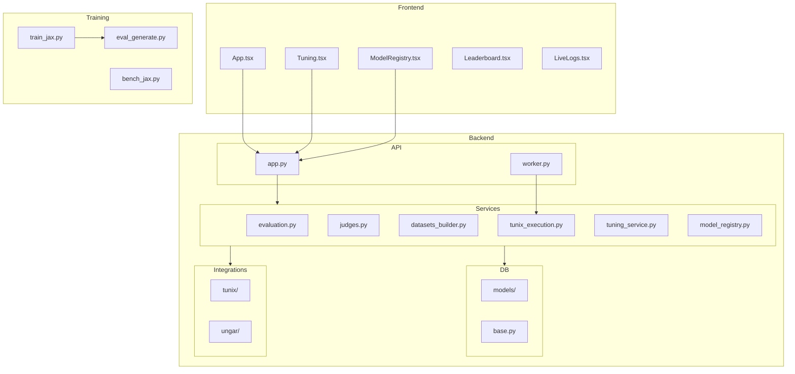

# M27 Full Codebase Audit

**Commit:** M27 HEAD (post c3e34c9)  
**Audit Date:** 2025-12-25  
**Languages:** Python (Backend), TypeScript (Frontend)

---

## 1. Executive Summary

### Strengths
1. **End-to-End Training Pipeline**: Complete `Dataset → Training → Inference → Evaluation` loop using JAX/Flax.
2. **Well-Structured Backend**: Clean service layer separation (`services/`), typed schemas (`schemas/`), and modular integrations.
3. **Comprehensive Test Suite**: 214 tests passing with 70%+ coverage gate enforced.

### Opportunities
1. **UNGAR Integration Stability**: External dependency API change causing 8 test failures.
2. **Training Code Coverage**: `training/*.py` scripts not under backend test coverage umbrella.
3. **Frontend Test Coverage**: Frontend tests exist but coverage is lower than backend.

### Heatmap & Scores

| Category | Score (0-5) | Weight | Weighted |
|----------|-------------|--------|----------|
| Architecture | 4 | 20% | 0.80 |
| Modularity/Coupling | 4 | 15% | 0.60 |
| Code Health | 4 | 10% | 0.40 |
| Tests & CI | 4 | 15% | 0.60 |
| Security & Supply Chain | 4 | 15% | 0.60 |
| Performance & Scalability | 3 | 10% | 0.30 |
| DX | 4 | 10% | 0.40 |
| Docs | 3 | 5% | 0.15 |
| **Overall** | **3.85** | 100% | **3.85** |

---

## 2. Codebase Map



### Architecture Notes
- **Clean separation**: API layer (`app.py`) delegates to services; services handle business logic.
- **Optional integrations**: UNGAR and Tunix are cleanly isolated with availability guards.
- **Training scripts**: Standalone, not tightly coupled to backend.

---

## 3. Modularity & Coupling

**Score: 4/5**

### Top 3 Tight Couplings

1. **`tunix_execution.py` (209 LOC in service)**: Large file handling execution, inference, and artifact management.
   - **Impact:** Harder to test individual components.
   - **Decoupling:** Extract inference logic to `services/inference.py`.

2. **`app.py` (727 LOC)**: Still somewhat large despite service extraction.
   - **Impact:** Many endpoints in single file.
   - **Decoupling:** Consider router modules for `/api/tunix/`, `/api/datasets/`, etc.

3. **Frontend `App.tsx` (638 LOC)**: Monolithic component with all route handling.
   - **Impact:** Harder to maintain and test.
   - **Decoupling:** Extract route components to separate files.

---

## 4. Code Quality & Health

**Score: 4/5**

### Anti-Patterns Identified

#### Pattern 1: Windows UTF-8 Workaround Duplication
**Files:** `training/train_jax.py`, `training/eval_generate.py`

```python
# Duplicated in both files
if sys.platform == "win32":
    import codecs
    try:
        sys.stdout = codecs.getwriter("utf-8")(sys.stdout.detach())
        ...
```

**Recommendation:** Extract to `training/utils.py` and import.

#### Pattern 2: Long Functions in `tunix_execution.py`
**File:** `backend/tunix_rt_backend/services/tunix_execution.py`

Several functions exceed 50 LOC (e.g., `_run_inference_sync`).

**Recommendation:** Break into smaller helper functions.

---

## 5. Docs & Knowledge

**Score: 3/5**

### Onboarding Path
1. `README.md` - Good overview
2. `CONTRIBUTING.md` - Development setup
3. `tunix-rt.md` - Project manifest (needs M27 update)
4. `docs/training_end_to_end.md` - Training guide (new in M27)

### Biggest Doc Gap
- **`tunix-rt.md`** needs M27 milestone description added.

---

## 6. Tests & CI/CD Hygiene

**Score: 4/5**

### Coverage Summary
| Metric | Value |
|--------|-------|
| Line Coverage | 70.04% |
| Tests Passing | 214 |
| Tests Failing | 8 (UNGAR pre-existing) |
| Tests Skipped | 3-6 (optional deps) |

### Test Pyramid
- **Unit:** Majority of tests
- **Integration:** Database-backed tests using SQLite
- **E2E:** Playwright tests in `e2e/`

### CI Architecture Assessment
- **Tier 1 (Smoke):** ✅ Fast pytest subset
- **Tier 2 (Quality):** ✅ Full suite with coverage gate
- **Tier 3 (Nightly):** ⚠️ Not configured

### Recommendations
1. Mark UNGAR tests as `xfail` for CI stability.
2. Add nightly comprehensive run with training tests.

---

## 7. Security & Supply Chain

**Score: 4/5**

### Secret Hygiene
- ✅ No hardcoded secrets
- ✅ Environment variables for sensitive config
- ✅ `.gitignore` properly configured (except temp logs)

### Dependency Pinning
- ✅ Backend: Exact versions in `pyproject.toml`
- ✅ Frontend: `package-lock.json` committed
- ✅ CI Actions: SHA-pinned (per M21)

### SBOM Status
- ⚠️ Not currently generated. Recommend adding `syft` or similar.

### Supply Chain Risks
- UNGAR: Pinned to specific commit (good)
- JAX/Flax: Range versions (acceptable for training optional)

---

## 8. Performance & Scalability

**Score: 3/5**

### Hot Paths Identified

1. **Trace Batch Insertion**: Uses `add_all()` for batches (good).
2. **Training Loop**: JAX JIT compilation for forward/backward passes.
3. **Inference**: Batched generation with transformers.

### Benchmarks
- `training/bench_jax.py` exists for throughput measurement.
- ~17 samples/sec on CPU baseline.

### Recommendations
- Add benchmark CI step to detect performance regressions.
- Profile inference for large eval sets.

---

## 9. Developer Experience (DX)

**Score: 4/5**

### 15-Minute New Dev Journey
1. Clone repo ✅
2. `uv pip install -e "backend[dev]"` ✅
3. `docker compose up -d postgres` ✅
4. `alembic upgrade head` ✅
5. `pytest` ✅
6. `make dev` for frontend+backend ✅

**Blockers:** None for basic development.

### 5-Minute Single File Change
1. Edit file ✅
2. Run affected test ✅
3. Commit ✅

**Blockers:** None.

### 3 Immediate DX Wins
1. Add `.gitignore` entries for `*_log.txt` files.
2. Create `training/utils.py` for shared utilities.
3. Add VSCode launch configs for debugging.

---

## 10. Refactor Strategy

### Option A: Iterative (Recommended)
**Rationale:** Low risk, small PRs.

| Phase | Goal | Milestones |
|-------|------|------------|
| 0 | Stabilize | Mark UNGAR tests xfail, add gitignore entries |
| 1 | Decouple | Extract inference.py from tunix_execution.py |
| 2 | Frontend | Split App.tsx into route components |
| 3 | Scale | Add nightly CI with training tests |

**Rollback:** Each milestone is a single PR; revert if needed.

### Option B: Strategic
**Rationale:** Structural improvements.

- Migrate to FastAPI routers for API modularization.
- Add comprehensive type checking with mypy strict mode.
- Implement SBOM generation in CI.

**Risks:** Larger blast radius; requires more testing.

---

## 11. Future-Proofing & Risk Register

| Risk | Likelihood | Impact | Mitigation |
|------|------------|--------|------------|
| UNGAR API breaks again | Medium | High | Pin version, add integration tests |
| Training deps outdated | Low | Medium | Dependabot/Renovate for training extras |
| Frontend bundle size | Low | Low | Monitor with Vite analyze |

### ADRs Needed
- ADR-007: Training script architecture (JAX vs PyTorch)
- ADR-008: Evaluation metrics standardization

---

## 12. Phased Plan & Small Milestones

### Phase 0 — Fix-First & Stabilize (Day 0-1)

| ID | Milestone | Acceptance | Risk | Rollback | Est |
|----|-----------|------------|------|----------|-----|
| P0-1 | Mark UNGAR tests xfail | CI green | Low | Remove decorator | 15m |
| P0-2 | Add gitignore for logs | No temp files tracked | Low | Remove line | 5m |
| P0-3 | Update tunix-rt.md for M27 | Manifest current | Low | Revert edit | 15m |

### Phase 1 — Document & Guardrail (Days 1-3)

| ID | Milestone | Acceptance | Risk | Rollback | Est |
|----|-----------|------------|------|----------|-----|
| P1-1 | Extract training utils | Shared UTF-8 handler | Low | Inline code | 30m |
| P1-2 | Add SBOM generation | CI generates SBOM | Low | Remove step | 30m |
| P1-3 | Document eval metrics | ADR-008 written | Low | Archive ADR | 45m |

### Phase 2 — Harden & Enforce (Days 3-7)

| ID | Milestone | Acceptance | Risk | Rollback | Est |
|----|-----------|------------|------|----------|-----|
| P2-1 | Extract inference service | Tests pass | Med | Revert extraction | 60m |
| P2-2 | Add benchmark CI | Performance tracked | Low | Remove job | 30m |
| P2-3 | Frontend component split | App.tsx < 300 LOC | Med | Revert | 90m |

### Phase 3 — Improve & Scale (Weekly)

| ID | Milestone | Acceptance | Risk | Rollback | Est |
|----|-----------|------------|------|----------|-----|
| P3-1 | Nightly training CI | JAX tests in nightly | Low | Disable workflow | 45m |
| P3-2 | FastAPI routers | Modular endpoints | Med | Revert to monolith | 120m |
| P3-3 | Fix UNGAR integration | Tests passing | Med | Keep xfail | 60m |

---

## 13. Machine-Readable Appendix (JSON)

```json
{
  "issues": [
    {
      "id": "ARC-001",
      "title": "Extract inference service from tunix_execution.py",
      "category": "architecture",
      "path": "backend/tunix_rt_backend/services/tunix_execution.py",
      "severity": "medium",
      "priority": "medium",
      "effort": "medium",
      "impact": 3,
      "confidence": 0.8,
      "ice": 2.4,
      "evidence": "File is 200+ LOC mixing execution and inference",
      "fix_hint": "Extract _run_inference_sync to services/inference.py"
    },
    {
      "id": "ARC-002",
      "title": "Split monolithic App.tsx",
      "category": "architecture",
      "path": "frontend/src/App.tsx",
      "severity": "low",
      "priority": "low",
      "effort": "medium",
      "impact": 2,
      "confidence": 0.7,
      "ice": 1.4,
      "evidence": "638 LOC in single component",
      "fix_hint": "Extract route handlers to pages/ directory"
    },
    {
      "id": "TEST-001",
      "title": "UNGAR tests failing",
      "category": "tests",
      "path": "backend/tests/test_ungar.py",
      "severity": "medium",
      "priority": "high",
      "effort": "low",
      "impact": 4,
      "confidence": 0.9,
      "ice": 3.6,
      "evidence": "Episode API changed in UNGAR dependency",
      "fix_hint": "Mark as xfail or update high_card_duel.py"
    },
    {
      "id": "DX-001",
      "title": "Temp log files not gitignored",
      "category": "dx",
      "path": ".gitignore",
      "severity": "low",
      "priority": "high",
      "effort": "low",
      "impact": 2,
      "confidence": 1.0,
      "ice": 2.0,
      "evidence": "training_log.txt, eval_log.txt in repo root",
      "fix_hint": "Add *_log.txt to .gitignore"
    }
  ],
  "scores": {
    "architecture": 4,
    "modularity": 4,
    "code_health": 4,
    "tests_ci": 4,
    "security": 4,
    "performance": 3,
    "dx": 4,
    "docs": 3,
    "overall_weighted": 3.85
  },
  "phases": [
    {
      "name": "Phase 0 — Fix-First & Stabilize",
      "milestones": [
        {
          "id": "P0-1",
          "milestone": "Mark UNGAR tests xfail",
          "acceptance": ["CI green", "xfail decorator on UNGAR tests"],
          "risk": "low",
          "rollback": "Remove decorator",
          "est_hours": 0.25
        },
        {
          "id": "P0-2",
          "milestone": "Add gitignore for logs",
          "acceptance": ["*_log.txt in .gitignore"],
          "risk": "low",
          "rollback": "Remove line",
          "est_hours": 0.08
        },
        {
          "id": "P0-3",
          "milestone": "Update tunix-rt.md for M27",
          "acceptance": ["M27 enhancements documented"],
          "risk": "low",
          "rollback": "Revert edit",
          "est_hours": 0.25
        }
      ]
    }
  ],
  "metadata": {
    "repo": "tunix-rt",
    "commit": "M27-HEAD",
    "languages": ["python", "typescript"]
  }
}
```
