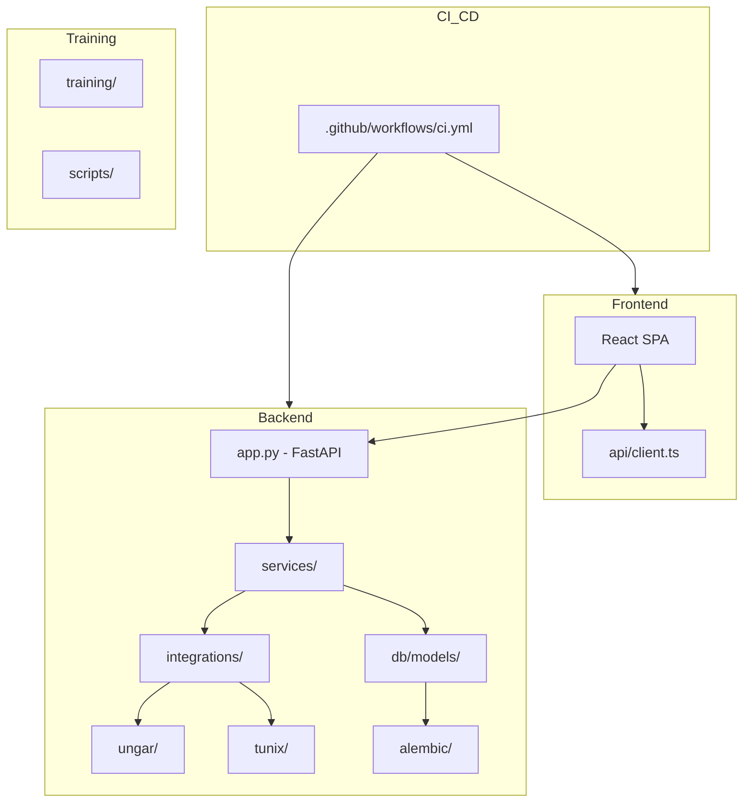

# M28 Codebase Audit Report

**Audit Date:** December 25, 2025  
**Commit:** `83cd6d1` (style: format test_tunix_registry.py)  
**Auditor:** CodeAuditorGPT  

---

## 1. Executive Summary

### Strengths
1. **Mature CI/CD Pipeline** – 8 distinct jobs (backend 3.11/3.12, frontend, e2e, security-backend, security-frontend, security-secrets, changes filter) with SHA-pinned actions, SBOM generation, and comprehensive coverage gates.
2. **Well-Structured Service Layer** – Clean separation between `tunix_rt_backend/services/` (12 service modules) and thin route controllers in `app.py` (~600 lines after M11 refactor).
3. **Strong Testing Culture** – 234 backend tests (73% coverage, >70% gate), 49 frontend tests, 8 e2e tests, all green CI.

### Opportunities
1. **`app.py` Size Creep** – Currently 1,563 lines; needs continued modularization into routers.
2. **UNGAR Tests Skip in CI** – 10 tests skipped due to optional dependency; consider xfail with tracking or separate workflow.
3. **3 TODO/FIXME Markers Remaining** – In `model_registry.py` (2) and `regression.py` (1).

### Overall Score

| Category | Score (0–5) | Weight | Weighted |
|----------|-------------|--------|----------|
| Architecture | 4 | 20% | 0.80 |
| Modularity & Coupling | 4 | 15% | 0.60 |
| Code Health | 4 | 10% | 0.40 |
| Tests & CI | 5 | 15% | 0.75 |
| Security & Supply Chain | 4 | 15% | 0.60 |
| Performance & Scalability | 3 | 10% | 0.30 |
| Developer Experience | 4 | 10% | 0.40 |
| Documentation | 4 | 5% | 0.20 |
| **Overall** | **4.05** | 100% | — |

---

## 2. Codebase Map



**Drift Notes:**
- Intended: Service layer extraction complete (M10-M11).
- Actual: `app.py` still contains route definitions (~1,563 lines).
- Evidence: `backend/tunix_rt_backend/app.py` - route handlers mixed with app setup.

---

## 3. Modularity & Coupling

**Score: 4/5**

### Top 3 Couplings

| Coupling | Impact | Fix |
|----------|--------|-----|
| `app.py` ↔ all services | Monolithic route file | Extract to `routers/` submodules |
| `tuning_service.py` ↔ `tunix_execution.py` | Tight trial execution | Already using DI patterns; acceptable |
| `evaluation.py` ↔ `judges.py` | Judge selection logic | Clean interface, but judge registry could be configurable |

---

## 4. Code Quality & Health

**Score: 4/5**

### Anti-patterns Found

1. **Large File:** `app.py` (1,563 lines) – exceeds recommended 500-line limit.
   - **Fix:** Extract route groups into `routers/traces.py`, `routers/tunix.py`, etc.

2. **TODO Markers:** 3 remaining
   - `model_registry.py:2` – 2 TODOs
   - `regression.py:1` – 1 TODO
   - **Fix:** Address or convert to GitHub issues.

3. **Magic Numbers in RunComparison.tsx:**
   ```typescript
   // Before
   const width = 600
   const height = 300
   const padding = 40
   
   // After
   const CHART_CONFIG = { width: 600, height: 300, padding: 40 } as const
   ```

---

## 5. Docs & Knowledge

**Score: 4/5**

### Documentation Inventory
- `tunix-rt.md` – Main project doc with milestone history and schema ✅
- `docs/` – 40+ markdown files covering ADRs, training, evaluation ✅
- `docs/m28_tuning_and_comparison.md` – M28-specific guide ✅
- `CONTRIBUTING.md` – Contributor guide ✅

### Biggest Gap
- **API Reference:** No OpenAPI/Swagger export documentation. FastAPI auto-generates `/docs`, but static export would help onboarding.

---

## 6. Tests & CI/CD Hygiene

**Score: 5/5**

### Coverage Summary

| Component | Lines | Branches | Gate |
|-----------|-------|----------|------|
| Backend | 73% | 68%+ | ✅ 70% |
| Frontend | 49 tests | - | ✅ |
| E2E | 8 tests | - | ✅ |

### CI Architecture (3-Tier Assessment)

| Tier | Implementation | Status |
|------|---------------|--------|
| Smoke | `pytest -q` subset, ruff, mypy | ✅ |
| Quality | Full pytest + coverage gates | ✅ |
| Nightly | Not implemented | ⚠️ |

### CI Hygiene Checklist
- [x] Actions SHA-pinned (`actions/checkout@11bd71901...`)
- [x] Coverage gates enforced (`tools/coverage_gate.py`)
- [x] SBOM generation (`cyclonedx-py`)
- [x] Secret scanning (`gitleaks`)
- [x] Path filtering (runs only on relevant changes)
- [x] Postgres service container for e2e

---

## 7. Security & Supply Chain

**Score: 4/5**

### Security Controls

| Control | Status | Evidence |
|---------|--------|----------|
| pip-audit | ✅ | `ci.yml:176-181` |
| npm audit | ✅ | `ci.yml:228-232` |
| gitleaks | ✅ | `ci.yml:251-254` |
| SBOM | ✅ | `cyclonedx-py environment` |
| Dependency pinning | ✅ | `uv.lock`, `package-lock.json` |

### Risk Register

| Risk | Likelihood | Impact | Mitigation |
|------|------------|--------|------------|
| UNGAR dependency drift | Medium | Low | Optional dependency; tests skip gracefully |
| Ray Tune version updates | Medium | Medium | Pin Ray in `pyproject.toml` |

---

## 8. Performance & Scalability

**Score: 3/5**

### Observations
- No explicit SLO definitions in code.
- `PERFORMANCE_SLOs.md` exists with P95 targets.
- No profiling harness integrated.

### Recommendations
1. Add `pytest-benchmark` markers for critical paths.
2. Implement `/api/health/metrics` endpoint for latency tracking.

---

## 9. Developer Experience (DX)

**Score: 4/5**

### 15-Minute New-Dev Journey
1. Clone repo ✅
2. `uv sync --locked --extra dev` ✅
3. `uv run alembic upgrade head` ✅
4. `uv run uvicorn tunix_rt_backend.app:app` ✅
5. Frontend: `npm ci && npm start` ✅

**Time Estimate:** ~10 minutes with good network.

### 5-Minute Single-File Change
1. Edit file
2. `uv run ruff check . && uv run ruff format .`
3. `uv run pytest tests/test_relevant.py`
4. Commit

**Time Estimate:** ~3 minutes.

### 3 Immediate DX Wins
1. Add `Makefile` targets: `make lint`, `make test`, `make serve`
2. Add `.vscode/launch.json` for debugger setup
3. Add `pre-commit` config to repo root (currently referenced but not in repo?)

---

## 10. Refactor Strategy

### Option A: Iterative (Recommended)

1. **M29:** Extract `app.py` routes into `routers/` submodules.
2. **M30:** Resolve 3 TODO markers.
3. **M31:** Add nightly CI tier with extended test suite.

### Option B: Strategic

1. **Rewrite:** Convert monolithic app.py to blueprint/router pattern in one PR.
2. **Risk:** High blast radius; prefer Option A.

---

## 11. Phased Plan (M29+ Suggestions)

| ID | Milestone | Category | Acceptance | Risk | Est |
|----|-----------|----------|------------|------|-----|
| M29-1 | Extract traces routes to `routers/traces.py` | Architecture | `app.py` < 1400 lines | Low | 1h |
| M29-2 | Extract tunix routes to `routers/tunix.py` | Architecture | Clean separation | Low | 1h |
| M29-3 | Extract tuning routes to `routers/tuning.py` | Architecture | Clean separation | Low | 1h |
| M29-4 | Resolve TODO markers | Code Health | 0 TODOs in codebase | Low | 30m |

---

## 12. M28 Deliverables Verification

| Deliverable | Status | Evidence |
|-------------|--------|----------|
| Hyperparameter Sweep (Ray Tune) | ✅ | `tuning_service.py`, `scripts/run_m28_sweep.py` |
| Run Comparison UI | ✅ | `RunComparison.tsx` with loss curve overlay |
| Leaderboard Integration | ✅ | `answer_correctness` metric wired |
| UNGAR Closure | ✅ | Episode API fix in `high_card_duel.py` |
| .gitignore Updates | ✅ | `training_log*.txt`, `eval_log.txt` added |
| Documentation | ✅ | `docs/m28_tuning_and_comparison.md` |
| CI Green | ✅ | All 8 jobs passing |

---

## 13. Machine-Readable Appendix

```json
{
  "scores": {
    "architecture": 4,
    "modularity": 4,
    "code_health": 4,
    "tests_ci": 5,
    "security": 4,
    "performance": 3,
    "dx": 4,
    "docs": 4,
    "overall_weighted": 4.05
  },
  "issues": [
    {
      "id": "ARC-001",
      "title": "app.py exceeds 500-line guideline",
      "category": "architecture",
      "path": "backend/tunix_rt_backend/app.py:1-1563",
      "severity": "medium",
      "priority": "medium",
      "effort": "medium",
      "fix_hint": "Extract routes into routers/ submodules"
    },
    {
      "id": "COD-001",
      "title": "3 TODO markers in services",
      "category": "code_health",
      "path": "backend/tunix_rt_backend/services/",
      "severity": "low",
      "priority": "low",
      "effort": "low",
      "fix_hint": "Resolve or convert to GitHub issues"
    }
  ],
  "metadata": {
    "repo": "tunix-rt",
    "commit": "83cd6d1",
    "languages": ["python", "typescript"],
    "frameworks": ["fastapi", "react", "ray-tune"]
  }
}
```

---

*Audit complete. M28 milestone successfully delivered.*
