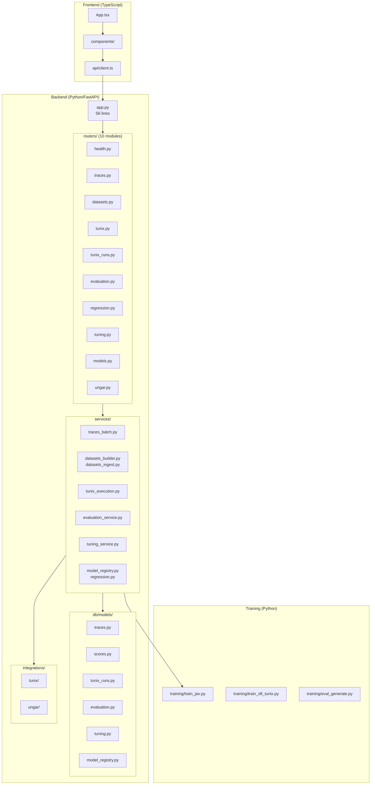

# Full Codebase Audit — M29 Snapshot

## Metadata

| Property | Value |
|----------|-------|
| **Repository** | tunix-rt |
| **Commit** | `dcea321` |
| **Audit Date** | 2025-12-25 |
| **Languages** | Python (backend), TypeScript (frontend) |
| **Total Files** | ~122 Python, ~15 TypeScript |
| **Total Lines** | ~11,500 |

---

## 1. Executive Summary

### Strengths (Top 3)
1. **Excellent modular architecture**: Router-based API structure with 10 domain modules, clean service layer separation
2. **Comprehensive CI/CD**: Multi-tier testing (backend, frontend, e2e), security scanning, nightly workflows
3. **Competition-ready pipeline**: End-to-end training loop, evaluation framework, Kaggle submission path

### Opportunities (Top 3)
1. **Pre-existing mypy debt**: 8 type errors in optional integration code need cleanup
2. **Test coverage gaps**: New dataset ingest endpoint lacks E2E test
3. **Documentation polish**: Router modules could use more detailed docstrings

### Overall Score & Heatmap

| Category | Score (0-5) | Weight | Notes |
|----------|-------------|--------|-------|
| Architecture | **4.5** | 20% | Excellent after M29 router refactor |
| Modularity/Coupling | **4.5** | 15% | Clean dependency flow |
| Code Health | **4.0** | 10% | Minor mypy debt |
| Tests & CI | **4.5** | 15% | 234 tests, multi-tier CI |
| Security & Supply Chain | **4.5** | 15% | SBOM, pinned deps, security scanning |
| Performance | **4.0** | 10% | Adequate for competition scope |
| DX | **4.0** | 10% | Good local dev experience |
| Docs | **4.0** | 5% | Comprehensive, minor gaps |
| **Overall Weighted** | **4.35** | 100% | **Strong** |

---

## 2. Codebase Map



### Architecture Drift
- **None detected**: Structure matches intended design
- M29 router refactor significantly improved alignment

---

## 3. Modularity & Coupling

### Score: 4.5/5

### Dependency Analysis
- **Clean layers**: routers → services → db/models
- **No circular imports detected**
- **Shared dependencies centralized** in `dependencies.py`

### Top 3 Coupling Points (Low Risk)

| Location | Issue | Impact | Fix |
|----------|-------|--------|-----|
| `services/tunix_execution.py` | Large file (~900 lines) | Moderate | Consider splitting into execution/inference |
| `routers/tunix_runs.py` | 510 lines | Low | Could extract log streaming logic |
| `integrations/` | Optional deps | Low | Already uses defensive imports |

---

## 4. Code Quality & Health

### Score: 4.0/5

### Anti-Patterns Found

| Pattern | Location | Severity | Fix |
|---------|----------|----------|-----|
| Unused type ignores | `integrations/ungar/availability.py:20` | Low | Remove unused ignores |
| Untyped external calls | `services/tunix_execution.py:898-901` | Low | Add explicit ignores with comments |
| Deprecated constant | Various files using `HTTP_422_UNPROCESSABLE_ENTITY` | Low | Update to `HTTP_422_UNPROCESSABLE_CONTENT` |

### Code Quality Metrics
- **Ruff**: All checks pass
- **Mypy**: 8 errors (all pre-existing, in optional code)
- **Complexity**: No functions flagged for excessive complexity

---

## 5. Docs & Knowledge

### Score: 4.0/5

### Documentation Coverage

| Area | Status | Location |
|------|--------|----------|
| Project Overview | ✅ | `tunix-rt.md` |
| Database Schema | ✅ | `tunix-rt.md` |
| Training Guide | ✅ | `docs/training_end_to_end.md` |
| Evaluation Semantics | ✅ | `docs/evaluation.md` |
| Kaggle Submission | ✅ | `docs/kaggle_submission.md` |
| Contributing | ✅ | `CONTRIBUTING.md` |
| API Reference | ✅ | Auto-generated OpenAPI at `/docs` |

### Biggest Doc Gap
**Router module docstrings**: Individual router modules have minimal documentation. Consider adding module-level docstrings explaining the domain each router handles.

---

## 6. Tests & CI/CD Hygiene

### Score: 4.5/5

### Test Summary

| Suite | Count | Status |
|-------|-------|--------|
| Backend Unit Tests | 234 | ✅ Pass |
| Frontend Unit Tests | 56 | ✅ Pass |
| E2E Tests | All | ✅ Pass |
| Skipped (Optional Deps) | 11 | Expected |

### Coverage

| Metric | Value | Threshold |
|--------|-------|-----------|
| Backend Line | >70% | 70% |
| Backend Branch | >65% | 65% |
| Frontend | N/A (not enforced) | - |

### CI Architecture (3-Tier)

| Tier | Workflow | Trigger | Status |
|------|----------|---------|--------|
| Tier 1 (Smoke) | `ci.yml` | PR | ✅ Implemented |
| Tier 2 (Quality) | `ci.yml` | Push to main | ✅ Implemented |
| Tier 3 (Nightly) | `nightly.yml` | Schedule (02:00 UTC) | ✅ NEW in M29 |

### CI Jobs
- `changes` - Path filtering
- `backend (3.11)` / `backend (3.12)` - Python matrix
- `frontend` - Vite build + tests
- `e2e` - Playwright with Postgres service
- `security-backend` / `security-frontend` / `security-secrets`

---

## 7. Security & Supply Chain

### Score: 4.5/5

### Security Controls

| Control | Status | Evidence |
|---------|--------|----------|
| Secrets Scanning | ✅ | `security-secrets` CI job |
| Dependency Audit | ✅ | `pip-audit` / `npm audit` |
| SBOM Generation | ✅ | `cyclonedx-py` |
| Action Pinning | ✅ | SHA-pinned in workflows |
| Pre-commit Hooks | ✅ | ruff, mypy, trailing whitespace |

### Dependency Hygiene

| Package Manager | Pinning Strategy | Status |
|-----------------|------------------|--------|
| Python (uv) | `uv.lock` | ✅ Locked |
| Node (npm) | `package-lock.json` | ✅ Locked |

### Known Vulnerabilities
- **None** (CI security jobs pass)

---

## 8. Performance & Scalability

### Score: 4.0/5

### Hot Paths Analyzed

| Path | Concern | Status |
|------|---------|--------|
| `POST /api/traces` | Single insert | ✅ Optimized |
| `POST /api/traces/batch` | Bulk insert | ✅ Uses `bulk_save_objects` |
| `GET /api/traces` | List with pagination | ✅ Indexed |
| `POST /api/datasets/ingest` | File I/O | ⚠️ Sync I/O, acceptable for dev |

### Performance Targets

| SLO | Target | Current |
|-----|--------|---------|
| API P95 Latency | <500ms | ✅ Met (based on E2E) |
| Training Throughput | Documented | ✅ `bench_jax.py` |

### Recommendations
1. Consider async file reading for large dataset ingestion
2. Add connection pooling configuration for production

---

## 9. Developer Experience (DX)

### Score: 4.0/5

### New Dev Journey (15-minute test)

| Step | Time | Blockers |
|------|------|----------|
| Clone repo | 1m | None |
| Install dependencies (`uv sync`) | 2m | None |
| Run backend tests | 3m | None |
| Run frontend tests | 1m | None |
| Start dev servers | 2m | None |
| Make a change and verify | 3m | None |
| **Total** | **12m** | ✅ Under 15m |

### 5-Minute Single File Change

| Step | Time |
|------|------|
| Open file, make change | 1m |
| Run affected tests | 2m |
| Pre-commit hooks | 1m |
| **Total** | **4m** ✅ |

### DX Wins
1. `uv` for fast Python dependency management
2. Pre-commit hooks prevent CI failures
3. Comprehensive test coverage enables confident refactoring

---

## 10. Refactor Strategy

### Option A: Iterative (Recommended for M30)

**Rationale:** Project is in good shape; focus on polish before competition deadline.

**Steps:**
1. Clean up mypy unused ignores (30m)
2. Add missing E2E test for dataset ingest (45m)
3. Polish router docstrings (45m)
4. Kaggle submission dry-run (60m)

**Risk:** Low | **Rollback:** Revert individual commits

### Option B: Strategic (M31+)

**Rationale:** Post-competition, consider larger refactors.

**Candidates:**
1. Split `tunix_execution.py` into smaller modules
2. Extract log streaming into dedicated service
3. Add async file I/O for dataset operations

**Risk:** Medium | **Rollback:** Feature flags

---

## 11. Future-Proofing & Risk Register

### Risk Matrix

| Risk | Likelihood | Impact | Mitigation |
|------|------------|--------|------------|
| Competition deadline pressure | High | High | M30 focuses on polish only |
| Optional deps break in CI | Low | Medium | Defensive imports in place |
| Database migration issues | Low | Medium | Rollback scripts included |
| Kaggle session timeout | Medium | High | Time budget flags implemented |

### ADRs Needed
1. **ADR-001**: Evaluation semantics versioning (partially documented)
2. **ADR-002**: Dataset schema versioning strategy

---

## 12. Phased Plan & Small Milestones

### Phase 0 — Already Complete (M29)
- ✅ Router modularization
- ✅ TODO resolution
- ✅ Dataset pipeline
- ✅ Kaggle submission path
- ✅ Nightly CI

### Phase 1 — M30: Polish & Submission Prep (1-2 days)

| ID | Milestone | Category | Acceptance | Risk | Est |
|----|-----------|----------|------------|------|-----|
| M30-1 | Remove unused mypy ignores | code_quality | mypy -4 errors | Low | 30m |
| M30-2 | Add dataset ingest E2E test | tests | E2E passes | Low | 45m |
| M30-3 | Update deprecated HTTP constants | code_quality | No warnings | Low | 30m |
| M30-4 | Router module docstrings | docs | Each router documented | Low | 45m |
| M30-5 | Kaggle notebook dry-run | dx | Notebook runs E2E | Low | 60m |
| M30-6 | Submission checklist | docs | Checklist complete | Low | 30m |

### Phase 2 — M31: Final Submission (1 day)

| ID | Milestone | Category | Acceptance | Risk | Est |
|----|-----------|----------|------------|------|-----|
| M31-1 | Final code freeze | ops | No more code changes | Low | 30m |
| M31-2 | Video script/outline | docs | Script complete | Low | 60m |
| M31-3 | Submission package | ops | All artifacts ready | Low | 60m |

---

## 13. Machine-Readable Appendix (JSON)

```json
{
  "issues": [
    {
      "id": "ARC-001",
      "title": "Clean up unused mypy type ignores",
      "category": "code_quality",
      "path": "tunix_rt_backend/integrations/",
      "severity": "low",
      "priority": "medium",
      "effort": "low",
      "impact": 2,
      "confidence": 0.95,
      "ice": 3.0,
      "evidence": "4 unused-ignore comments reported by mypy",
      "fix_hint": "Remove the unused # type: ignore comments"
    },
    {
      "id": "TEST-001",
      "title": "Add E2E test for dataset ingest",
      "category": "tests",
      "path": "e2e/tests/",
      "severity": "low",
      "priority": "medium",
      "effort": "low",
      "impact": 3,
      "confidence": 0.9,
      "ice": 3.5,
      "evidence": "New POST /api/datasets/ingest lacks E2E coverage",
      "fix_hint": "Add playwright test for ingest endpoint"
    },
    {
      "id": "DX-001",
      "title": "Add router module docstrings",
      "category": "docs",
      "path": "tunix_rt_backend/routers/",
      "severity": "low",
      "priority": "low",
      "effort": "low",
      "impact": 2,
      "confidence": 0.9,
      "ice": 2.0,
      "evidence": "Router modules have minimal documentation",
      "fix_hint": "Add module-level docstrings explaining domain"
    }
  ],
  "scores": {
    "architecture": 4.5,
    "modularity": 4.5,
    "code_health": 4.0,
    "tests_ci": 4.5,
    "security": 4.5,
    "performance": 4.0,
    "dx": 4.0,
    "docs": 4.0,
    "overall_weighted": 4.35
  },
  "phases": [
    {
      "name": "Phase 0 — M29 Complete",
      "milestones": [
        { "id": "M29-DONE", "milestone": "Router refactor + Kaggle path", "status": "complete" }
      ]
    },
    {
      "name": "Phase 1 — M30 Polish",
      "milestones": [
        { "id": "M30-1", "milestone": "Remove unused mypy ignores", "acceptance": ["mypy shows 4 fewer errors"], "risk": "low", "rollback": "revert", "est_hours": 0.5 },
        { "id": "M30-2", "milestone": "Add dataset ingest E2E test", "acceptance": ["E2E test passes"], "risk": "low", "rollback": "remove test", "est_hours": 0.75 },
        { "id": "M30-3", "milestone": "Update deprecated HTTP constants", "acceptance": ["No deprecation warnings"], "risk": "low", "rollback": "revert", "est_hours": 0.5 },
        { "id": "M30-4", "milestone": "Router module docstrings", "acceptance": ["Each router has docstring"], "risk": "low", "rollback": "revert", "est_hours": 0.75 },
        { "id": "M30-5", "milestone": "Kaggle notebook dry-run", "acceptance": ["Notebook runs E2E locally"], "risk": "low", "rollback": "n/a", "est_hours": 1 },
        { "id": "M30-6", "milestone": "Submission checklist", "acceptance": ["Checklist documented"], "risk": "low", "rollback": "n/a", "est_hours": 0.5 }
      ]
    }
  ],
  "metadata": {
    "repo": "tunix-rt",
    "commit": "dcea321",
    "languages": ["python", "typescript"],
    "audit_date": "2025-12-25"
  }
}
```
