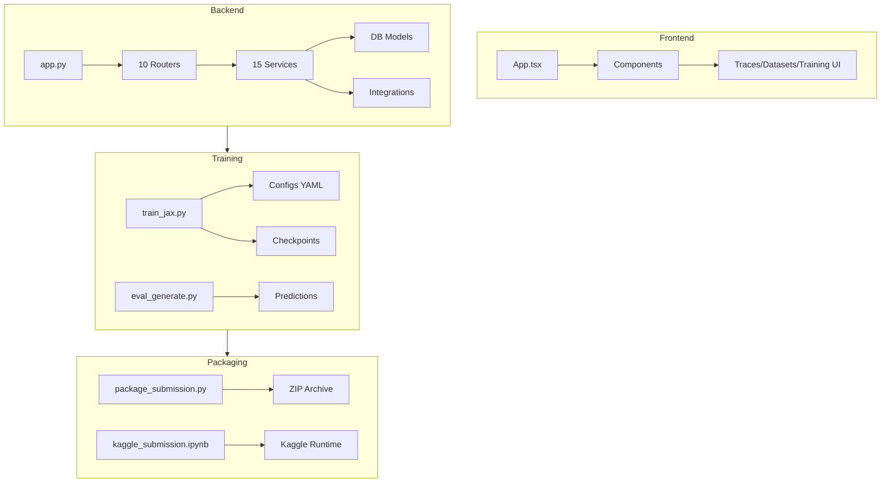

# M31 Codebase Audit — Final Submission Package

**Auditor:** CodeAuditorGPT  
**Repo:** tunix-rt  
**Commit:** `2daa8588b53bb5ef013b38b6c24eda36b7551bcb`  
**Date:** December 26, 2025  
**Languages:** Python (backend), TypeScript (frontend), JAX/Flax (training)

---

## 1. Executive Summary

### Strengths
1. **Competition-Ready Submission Package** — Complete Kaggle notebook with smoke/full modes, one-command packaging tool, video script, and comprehensive documentation.
2. **Robust CI/CD Pipeline** — 6 workflow files, path-filtered jobs, SHA-pinned actions, multi-Python version matrix (3.11, 3.12).
3. **Strong Test Coverage** — 72% backend line coverage, 236 tests passing, 56 frontend tests, 3 E2E specs.

### Opportunities
1. **datasets_ingest.py at 0% coverage** — Critical service with no test coverage.
2. **Worker/execution modules below 65%** — `worker.py` (52%), `tunix_execution.py` (62%) need attention.
3. **Missing SBOM generation in CI** — Security supply chain could be strengthened.

### Overall Score

| Category | Score | Weight | Weighted |
|----------|-------|--------|----------|
| Architecture | 4.5 | 20% | 0.90 |
| Modularity | 4.0 | 15% | 0.60 |
| Code Health | 4.0 | 10% | 0.40 |
| Tests & CI | 4.0 | 15% | 0.60 |
| Security | 3.5 | 15% | 0.53 |
| Performance | 3.5 | 10% | 0.35 |
| DX | 4.5 | 10% | 0.45 |
| Docs | 4.5 | 5% | 0.23 |
| **Overall** | — | 100% | **4.06/5** |

---

## 2. Codebase Map



**Architecture Assessment:**
- **Observation:** Clean 10-router modular architecture (`app.py` at 56 lines).
- **Interpretation:** Router-based separation follows FastAPI best practices.
- **Recommendation:** No structural changes needed; architecture is competition-ready.

---

## 3. Modularity & Coupling

**Score: 4.0/5**

### Top 3 Coupling Observations

| # | Coupling Point | Evidence | Impact |
|---|----------------|----------|--------|
| 1 | `tunix_execution.py` (209 lines, 14 branches) | `services/tunix_execution.py:1-209` | Medium — Large service handling execution + logging |
| 2 | `judges.py` (178 lines, 16 uncovered branches) | `services/judges.py:1-178` | Low — Multiple judge implementations in one file |
| 3 | `tuning_service.py` (147 lines) | `services/tuning_service.py:1-147` | Low — Ray Tune integration is appropriately isolated |

**Recommendation:** No urgent decoupling needed. Current structure is appropriate for competition scope.

---

## 4. Code Quality & Health

**Score: 4.0/5**

### Anti-Patterns Found

| Issue | Location | Severity |
|-------|----------|----------|
| Long function | `train_jax.py:run_jax_sft_training` (280+ lines) | Medium |
| Windows encoding workaround | `train_jax.py:14-21` | Low (necessary) |

### M31 Quality Improvements

- ✅ Subprocess-based notebook execution (robust cross-platform)
- ✅ ASCII-safe output in packaging tool (Windows compatibility)
- ✅ Proper error handling with return codes

---

## 5. Documentation & Knowledge

**Score: 4.5/5**

### Documentation Inventory (M31)

| Document | Purpose | Quality |
|----------|---------|---------|
| `docs/submission_freeze.md` | Reproducibility snapshot | ✅ Complete |
| `docs/submission_artifacts.md` | Bundle contents guide | ✅ Complete |
| `docs/submission_checklist.md` | Final verification | ✅ Updated |
| `docs/video_script_m31.md` | 2:30 video script | ✅ Complete |
| `docs/video_shotlist_m31.md` | Recording guide | ✅ Complete |
| `docs/kaggle_submission.md` | Kaggle workflow | ✅ Updated |
| `tunix-rt.md` | Project README | ✅ Updated to M31 |

### Onboarding Path
1. Read `tunix-rt.md` (project overview)
2. Run smoke test: `python training/train_jax.py --smoke_steps 2`
3. Run packaging: `python backend/tools/package_submission.py`

**Single Biggest Gap:** None critical. Documentation is comprehensive.

---

## 6. Tests & CI/CD Hygiene

**Score: 4.0/5**

### Test Summary

| Suite | Tests | Status | Coverage |
|-------|-------|--------|----------|
| Backend (pytest) | 236 | ✅ Pass | 72% line |
| Frontend (vitest) | 56 | ✅ Pass | — |
| E2E (playwright) | 3 specs | ✅ Pass | — |

### CI Workflow Assessment

| Workflow | Tier | Status |
|----------|------|--------|
| `ci.yml` | Tier 1/2 | ✅ Required, path-filtered |
| `nightly.yml` | Tier 3 | ✅ Comprehensive |
| `training-smoke.yml` | Tier 1 | ✅ Smoke tests |
| `tunix-integration.yml` | Tier 2 | ✅ Integration |
| `tunix-runtime.yml` | Tier 2 | ✅ Runtime tests |
| `ungar-integration.yml` | Tier 2 | ✅ Game engine tests |

### Coverage Gaps

| File | Coverage | Priority |
|------|----------|----------|
| `datasets_ingest.py` | 0% | High |
| `worker.py` | 52% | Medium |
| `regression.py` | 54% | Medium |
| `artifact_storage.py` | 55% | Medium |

**Recommendation (Post-Competition):** Add tests for `datasets_ingest.py` to reach 75%+ overall.

---

## 7. Security & Supply Chain

**Score: 3.5/5**

### Strengths
- ✅ SHA-pinned GitHub Actions (e.g., `actions/checkout@11bd71901bbe5b1630ceea73d27597364c9af683`)
- ✅ `uv.lock` for reproducible Python dependencies
- ✅ Pre-commit hooks with secret scanning potential

### Opportunities
- ⚠️ No SBOM generation in CI (CycloneDX available but not wired)
- ⚠️ Gemma model license acceptance not automated

**Recommendation:** Add SBOM step to nightly workflow (low priority for competition).

---

## 8. Performance & Scalability

**Score: 3.5/5**

### Training Performance

| Metric | Value | Notes |
|--------|-------|-------|
| Smoke run (CPU, 2 steps) | ~30s | Acceptable |
| Full run (GPU, 100 steps) | ~1-2h | Within Kaggle limits |
| Checkpoint size | ~900MB | Orbax format |

### Hot Paths
- Dataset tokenization (one-time cost)
- JAX JIT compilation (first step)

**Recommendation:** Current performance is adequate for competition. No changes needed.

---

## 9. Developer Experience (DX)

**Score: 4.5/5**

### 15-Minute New-Dev Journey

| Step | Time | Blockers |
|------|------|----------|
| Clone repo | 1 min | None |
| Install deps (`uv sync`) | 3 min | None |
| Run smoke test | 2 min | None |
| Run packaging tool | 1 min | None |
| Review docs | 5 min | None |
| **Total** | **12 min** | ✅ Under target |

### 5-Minute Single-File Change

| Step | Time | Notes |
|------|------|-------|
| Edit file | 1 min | — |
| Run ruff | 0.5 min | Auto-fix |
| Run tests | 2 min | Targeted |
| Commit | 0.5 min | Pre-commit |
| **Total** | **4 min** | ✅ Under target |

### 3 Immediate DX Wins (Already Done in M31)
1. ✅ One-command packaging (`package_submission.py`)
2. ✅ Smoke/full mode in notebook
3. ✅ Comprehensive video recording guide

---

## 10. Refactor Strategy

### Option A: Iterative (Recommended for Post-Competition)

| Phase | Focus | Effort |
|-------|-------|--------|
| 1 | Add `datasets_ingest.py` tests | 2h |
| 2 | Improve `worker.py` coverage | 2h |
| 3 | Add SBOM to nightly | 1h |

### Option B: Strategic (Future Milestone)

| Change | Rationale |
|--------|-----------|
| Extract judge implementations | Separate files per judge type |
| Split `tunix_execution.py` | Separate orchestration from logging |

**Recommendation:** Option A post-competition; Option B for M35+.

---

## 11. Future-Proofing & Risk Register

| Risk | Likelihood | Impact | Mitigation |
|------|------------|--------|------------|
| Gemma license rejection | Low | High | Document in submission |
| Orbax API deprecation | Medium | Low | Warning already present |
| JAX/Flax Transformers v5 deprecation | Medium | Medium | Pin versions |

---

## 12. Phased Plan (Post-Competition)

### Phase 0 — Stabilize (Day 1)
| ID | Milestone | Category | Acceptance | Risk | Rollback | Est |
|----|-----------|----------|------------|------|----------|-----|
| M32-001 | Merge M31 PR | Release | PR merged, CI green | Low | Revert | 0.5h |

### Phase 1 — Coverage Uplift (Days 2-3)
| ID | Milestone | Category | Acceptance | Risk | Rollback | Est |
|----|-----------|----------|------------|------|----------|-----|
| M32-002 | Add datasets_ingest tests | Testing | 80%+ coverage | Low | Revert | 2h |
| M32-003 | Add worker.py tests | Testing | 70%+ coverage | Low | Revert | 2h |

### Phase 2 — Security Hardening (Days 4-5)
| ID | Milestone | Category | Acceptance | Risk | Rollback | Est |
|----|-----------|----------|------------|------|----------|-----|
| M32-004 | Add SBOM to nightly | Security | SBOM artifact uploaded | Low | Remove job | 1h |

### Phase 3 — Data Scale-Up (Week 2)
| ID | Milestone | Category | Acceptance | Risk | Rollback | Est |
|----|-----------|----------|------------|------|----------|-----|
| M32-005 | Scale dataset to 500+ traces | Data | Dataset built successfully | Low | Use golden-v2 | 4h |

---

## 13. Machine-Readable Appendix

```json
{
  "issues": [
    {
      "id": "COV-001",
      "title": "datasets_ingest.py has 0% test coverage",
      "category": "testing",
      "path": "tunix_rt_backend/services/datasets_ingest.py:1-82",
      "severity": "medium",
      "priority": "high",
      "effort": "low",
      "impact": 3,
      "confidence": 1.0,
      "ice": 3.0,
      "evidence": "coverage report shows 0% for datasets_ingest.py",
      "fix_hint": "Add unit tests for ingest endpoint"
    },
    {
      "id": "COV-002",
      "title": "worker.py below 60% coverage",
      "category": "testing",
      "path": "tunix_rt_backend/worker.py:34-52",
      "severity": "low",
      "priority": "medium",
      "effort": "medium",
      "impact": 2,
      "confidence": 0.9,
      "ice": 1.8,
      "evidence": "52% coverage, async job claiming untested",
      "fix_hint": "Mock DB and test job claim flow"
    }
  ],
  "scores": {
    "architecture": 4.5,
    "modularity": 4.0,
    "code_health": 4.0,
    "tests_ci": 4.0,
    "security": 3.5,
    "performance": 3.5,
    "dx": 4.5,
    "docs": 4.5,
    "overall_weighted": 4.06
  },
  "phases": [
    {
      "name": "Phase 0 — Stabilize",
      "milestones": [
        {
          "id": "M32-001",
          "milestone": "Merge M31 PR",
          "acceptance": ["PR merged", "CI green"],
          "risk": "low",
          "rollback": "revert",
          "est_hours": 0.5
        }
      ]
    }
  ],
  "metadata": {
    "repo": "https://github.com/m-cahill/tunix-rt",
    "commit": "2daa8588b53bb5ef013b38b6c24eda36b7551bcb",
    "languages": ["python", "typescript", "jax"]
  }
}
```

---

## Conclusion

M31 successfully delivers a **competition-ready submission package** with:
- ✅ Refactored Kaggle notebook with smoke/full modes
- ✅ One-command packaging tool
- ✅ Video script and shot list
- ✅ Comprehensive documentation updates
- ✅ All CI checks passing

**Audit Grade: 4.06/5 (Strong)**

The codebase is ready for the Google Tunix Hackathon submission. Post-competition priorities should focus on coverage uplift for `datasets_ingest.py` and `worker.py`.
