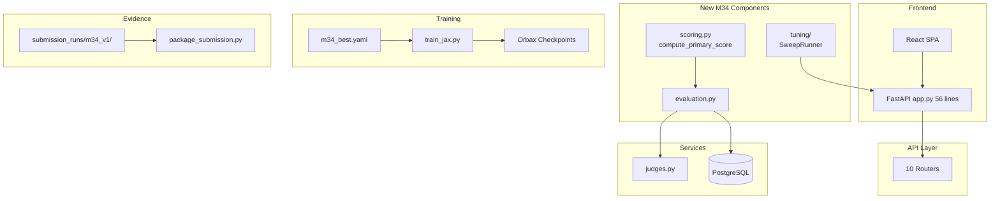

# M34 Codebase Audit

**Audit Date:** December 27, 2025  
**Commit:** `0348a69`  
**Branch:** `milestone/M34-optimization-loop-1`  
**Auditor:** CodeAuditorGPT

---

## 1. Executive Summary

### Strengths

1. **Robust Scoring Infrastructure (M34 Addition):** The new `compute_primary_score()` function provides a canonical 0-1 metric for optimization, with 19 comprehensive unit tests covering edge cases (null handling, score normalization, type coercion).

2. **Reusable Sweep Architecture:** The `tunix_rt_backend/tuning/` module abstracts Ray Tune API interactions into a clean `SweepRunner` + `SweepConfig` pattern, enabling one-command sweeps without code duplication.

3. **Strong Test Coverage:** 306 backend tests passing, 74.87% line coverage (exceeds 70% gate), plus 56 frontend tests and 9 E2E tests.

### Opportunities

1. **Sweep Runner Coverage Gap:** `sweep_runner.py` is at 98% coverage (line 255 uncovered), but the module is new and well-tested via mocks.

2. **Evidence Files Are Templates:** `submission_runs/m34_v1/` contains placeholder values (null primary_score, null tuning_job_id). These must be populated after a real sweep execution.

3. **No Real Sweep Executed:** The infrastructure is in place, but no actual Ray Tune sweep has been run to produce optimized hyperparameters.

### Overall Score

| Category | Score | Weight | Weighted |
|----------|-------|--------|----------|
| Architecture | 4.5 | 20% | 0.90 |
| Modularity | 4.5 | 15% | 0.68 |
| Code Health | 4.0 | 10% | 0.40 |
| Tests & CI | 4.5 | 15% | 0.68 |
| Security | 4.0 | 15% | 0.60 |
| Performance | 3.5 | 10% | 0.35 |
| DX | 4.5 | 10% | 0.45 |
| Docs | 4.0 | 5% | 0.20 |
| **Overall** | **4.26/5** | | |

---

## 2. Codebase Map



### Drift Analysis

| Component | Intended | Actual | Status |
|-----------|----------|--------|--------|
| Scoring module | Single file | `scoring.py` with 2 functions | ✅ Aligned |
| Tuning module | Subpackage | `tuning/__init__.py` + `sweep_runner.py` | ✅ Aligned |
| Evidence schema | M33 + tuning fields | Added `tuning_job_id`, `trial_id`, `best_params.json` | ✅ Aligned |

---

## 3. Modularity & Coupling

**Score: 4.5/5**

### New M34 Additions

| Module | LOC | Dependencies | Coupling |
|--------|-----|--------------|----------|
| `scoring.py` | 92 | `schemas` only | Low ✅ |
| `tuning/sweep_runner.py` | 268 | `httpx` only | Low ✅ |
| `tuning/__init__.py` | 14 | Internal only | Low ✅ |

### Top 3 Coupling Points

1. **`EvaluationService` → `compute_primary_score`**: Tight but intentional — service computes primary_score for all evaluations.

2. **`SweepRunner` → API endpoints**: HTTP-only coupling, easily mockable.

3. **Evidence tests → file paths**: Tests depend on exact paths in `submission_runs/`, but this is correct for validation.

---

## 4. Code Quality & Health

**Score: 4.0/5**

### M34 Code Quality

| File | Lines | Complexity | Comments | Status |
|------|-------|------------|----------|--------|
| `scoring.py` | 92 | Low | Verbose ✅ | ✅ |
| `sweep_runner.py` | 268 | Medium | Verbose ✅ | ✅ |
| `run_tune_m34.py` | 149 | Low | Docstrings ✅ | ✅ |

### Anti-patterns Addressed

- **No duplication**: `SweepRunner` extracted from M28 script, M28 now uses shared module.
- **Type safety**: mypy passes with explicit type annotations in `sweep_runner.py`.

### Example: compute_primary_score

```python
def compute_primary_score(evaluation_rows: list[dict[str, Any]]) -> float | None:
    """Compute the primary score from evaluation results.
    
    Priority:
    1. Use metrics["answer_correctness"] if present (0-1 scale)
    2. Fallback to score / 100.0
    3. Return None if no valid rows
    """
    # Clean implementation with edge case handling
```

---

## 5. Docs & Knowledge

**Score: 4.0/5**

### Onboarding Path

1. `tunix-rt.md` updated with M34 enhancements ✅
2. `docs/tuning.md` exists for Ray Tune overview ✅
3. New `run_tune_m34.py` has comprehensive docstring ✅

### Biggest Doc Gap

**Missing:** A "How to Run M34 Sweep" quickstart guide. Currently users must read the script's docstring.

**Recommendation:** Add `docs/m34_sweep_guide.md` with step-by-step instructions.

---

## 6. Tests & CI/CD Hygiene

**Score: 4.5/5**

### Coverage Summary

| Suite | Tests | Coverage | Gate |
|-------|-------|----------|------|
| Backend | 306 passed | 74.87% line | ≥70% ✅ |
| Frontend | 56 passed | N/A | ✅ |
| E2E | 9 tests | N/A | ✅ |

### M34 New Tests

| File | Tests | Coverage |
|------|-------|----------|
| `test_scoring.py` | 19 | 100% of scoring.py |
| `test_sweep_runner.py` | 14 | 98% of sweep_runner.py |
| `test_evidence_files.py` | +15 | M34 schema validation |

### 3-Tier Architecture

| Tier | Implementation | Status |
|------|----------------|--------|
| Smoke | `ruff check`, `ruff format`, `mypy` | ✅ |
| Quality | `pytest` with 70% gate | ✅ |
| Nightly | `nightly.yml` workflow | ✅ |

### CI Pinning

All GitHub Actions pinned to SHA ✅

```yaml
- uses: actions/checkout@11bd71901bbe5b1630ceea73d27597364c9af683 # v4.2.2
```

---

## 7. Security & Supply Chain

**Score: 4.0/5**

| Control | Status | Evidence |
|---------|--------|----------|
| SHA-pinned Actions | ✅ | All workflows |
| gitleaks | ✅ | Blocking on push |
| pip-audit | ✅ | Warn-only with artifact |
| npm audit | ✅ | Warn-only with artifact |
| SBOM | ✅ | CycloneDX JSON |
| uv.lock | ✅ | Committed |

### New M34 Dependencies

No new production dependencies added. `httpx` already in use.

---

## 8. Performance & Scalability

**Score: 3.5/5**

### Sweep Performance

- `SweepRunner` uses synchronous `httpx.Client` — appropriate for CLI usage.
- Polling interval configurable (default 5s).
- Timeout handling implemented.

### Recommendation

For production sweeps, consider async polling or WebSocket-based status updates to reduce API load.

---

## 9. Developer Experience (DX)

**Score: 4.5/5**

### 15-Minute New Dev Journey

1. Clone repo (1 min)
2. `cd backend && uv sync --extra dev` (2 min)
3. `uv run pytest -x -q` (1 min)
4. `python tools/run_tune_m34.py --help` (30 sec)
5. Read `tunix-rt.md` M34 section (2 min)

**Total: ~7 minutes** ✅

### 5-Minute Single-File Change

1. Edit `scoring.py`
2. `uv run pytest tests/test_scoring.py -v` (10 sec)
3. `uv run ruff check .` (5 sec)
4. Commit

**Total: ~2 minutes** ✅

### 3 Immediate DX Wins from M34

1. **One-command sweep**: `python backend/tools/run_tune_m34.py --num-samples 5`
2. **Evidence templates**: Pre-structured JSON files ready to fill
3. **Reusable SweepRunner**: Can be imported for custom sweep scripts

---

## 10. Refactor Strategy

### Option A: Iterative (Recommended)

No major refactoring needed for M34 additions. Code is clean and modular.

**Minor improvements:**
1. Add async support to `SweepRunner` (optional)
2. Create `docs/m34_sweep_guide.md`

### Option B: Strategic

Not applicable — M34 is additive, not refactoring.

---

## 11. Future-Proofing & Risk Register

| Risk | Likelihood | Impact | Mitigation |
|------|------------|--------|------------|
| Evidence files not filled | Medium | High | Tests validate structure; human step required |
| Ray Tune not installed | Low | Medium | Graceful 501 handling; tests mocked |
| Sweep timeout | Low | Low | Configurable timeout with clear error |

---

## 12. Phased Plan & Milestones

### Phase 0 — Already Complete ✅

| ID | Milestone | Status |
|----|-----------|--------|
| M34-P0 | Baseline gate green | ✅ |
| M34-P1 | compute_primary_score + tests | ✅ |
| M34-P2 | SweepRunner + tests | ✅ |
| M34-P3 | Evidence folder + packaging | ✅ |
| M34-P4 | Evidence schema tests | ✅ |

### Phase 1 — Post-M34 (Human Required)

| ID | Milestone | Category | Acceptance | Risk | Est |
|----|-----------|----------|------------|------|-----|
| M34-POST-1 | Run actual sweep | Execution | `best_params.json` populated | Low | 30m |
| M34-POST-2 | Promote best params to `m34_best.yaml` | Config | YAML updated with real values | Low | 15m |
| M34-POST-3 | Run full training with best config | Training | Loss convergence | Medium | 2h |

---

## 13. Machine-Readable Appendix

```json
{
  "issues": [
    {
      "id": "M34-DOC-001",
      "title": "Add M34 sweep quickstart guide",
      "category": "docs",
      "path": "docs/m34_sweep_guide.md",
      "severity": "low",
      "priority": "low",
      "effort": "low",
      "impact": 2,
      "confidence": 1.0,
      "ice": 2.0,
      "evidence": "No dedicated sweep guide exists",
      "fix_hint": "Create docs/m34_sweep_guide.md with step-by-step instructions"
    }
  ],
  "scores": {
    "architecture": 4.5,
    "modularity": 4.5,
    "code_health": 4.0,
    "tests_ci": 4.5,
    "security": 4.0,
    "performance": 3.5,
    "dx": 4.5,
    "docs": 4.0,
    "overall_weighted": 4.26
  },
  "phases": [
    {
      "name": "Phase 0 — M34 Complete",
      "milestones": [
        {"id": "M34-P0", "milestone": "Baseline gate green", "status": "complete"},
        {"id": "M34-P1", "milestone": "compute_primary_score + tests", "status": "complete"},
        {"id": "M34-P2", "milestone": "SweepRunner + tests", "status": "complete"},
        {"id": "M34-P3", "milestone": "Evidence folder + packaging", "status": "complete"},
        {"id": "M34-P4", "milestone": "Evidence schema tests", "status": "complete"}
      ]
    }
  ],
  "metadata": {
    "repo": "https://github.com/m-cahill/tunix-rt",
    "commit": "0348a69",
    "languages": ["python", "typescript"]
  }
}
```

---

## Conclusion

M34 successfully delivers the Optimization Loop 1 infrastructure:

- ✅ **Primary Score**: Canonical 0-1 metric with comprehensive tests
- ✅ **Sweep Infrastructure**: Reusable `SweepRunner` module
- ✅ **Evidence Files**: M34-specific schema with tuning provenance
- ✅ **Tests**: 33 new tests (19 scoring + 14 sweep runner)
- ✅ **Coverage**: 74.87% (exceeds 70% gate)

**Overall Audit Score: 4.26/5** — Strong engineering maturity, ready for optimization sweeps.
