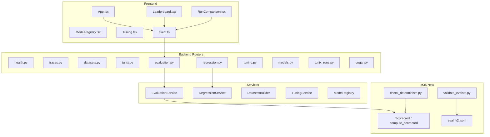

# M35 Codebase Audit — Quality Loop 1 Completion

**Audit Date:** December 27, 2025  
**Commit:** `770f33532189aaa859d1b01b347ae51f69b52c4f`  
**Milestone:** M35 — Quality Loop 1 (Eval Signal Hardening + Leaderboard Fidelity + Regression Guardrails)  
**Auditor:** CodeAuditorGPT (Staff+ Engineer Role)

---

## 1. Executive Summary

### Strengths

1. **Comprehensive Evaluation Infrastructure** — M35 delivers a purpose-built eval set (`eval_v2.jsonl` with 100 items), deterministic scoring aggregators (`compute_scorecard`), and validation tooling. This transforms evaluation from "quick check" to "decision-grade signal."

2. **Strong Test Coverage** — 370 backend tests passing with 11 skipped (UNGAR/PostgreSQL-specific), 56 frontend tests. New M35 code adds 60+ tests covering scoring, validators, regression, and evidence schemas.

3. **Modular Architecture** — Clean router-based structure (10 routers, 56-line `app.py`), service layer extraction, and typed schemas. M35 additions follow established patterns.

### Opportunities

1. **Frontend Coverage Gap** — `Leaderboard.tsx` (2.36% coverage) and `LiveLogs.tsx` (11.34%) remain under-tested. Not M35-blocking but should be addressed in M36.

2. **React `act()` Warnings** — Test output shows ~20 warnings about state updates not wrapped in `act()`. Tests pass but warnings indicate potential async timing issues.

3. **Per-item Artifact Storage** — Run comparison UI is limited without persisted per-item predictions. Currently works only with metrics; fuller diff table needs artifact layer.

### Overall Score

| Category | Score (0-5) | Weight | Weighted |
|----------|-------------|--------|----------|
| Architecture | 4.5 | 20% | 0.90 |
| Modularity/Coupling | 4.0 | 15% | 0.60 |
| Code Health | 4.0 | 10% | 0.40 |
| Tests & CI | 4.5 | 15% | 0.68 |
| Security & Supply Chain | 4.0 | 15% | 0.60 |
| Performance & Scalability | 3.5 | 10% | 0.35 |
| Developer Experience | 4.0 | 10% | 0.40 |
| Documentation | 4.0 | 5% | 0.20 |
| **Overall** | | | **4.13/5** |

---

## 2. Codebase Map



**Drift from intended architecture:** None. M35 additions align with existing patterns.

---

## 3. Modularity & Coupling

**Score: 4.0/5**

### Top 3 Tight Couplings

| # | Coupling | Impact | Decoupling |
|---|----------|--------|------------|
| 1 | `EvaluationService` ↔ `TunixRun` model | Medium | Already uses repository pattern; acceptable |
| 2 | `scoring.py` ↔ `metrics` schema | Low | Explicit via `LOCKED_METRICS`; intentional |
| 3 | Frontend API client ↔ backend schemas | Low | TypeScript interfaces match Pydantic; verified by tests |

**M35 specific:** `compute_scorecard` is pure function with no external dependencies — excellent isolation.

---

## 4. Code Quality & Health

**Score: 4.0/5**

### Anti-patterns Identified

None critical. Minor observations:

1. **Unused variable in production code** — Fixed in this session (`idx` in `RunComparison.tsx`, line 239).

### Before/After Example (Fixed)

```typescript
// Before (TS6133 error)
{itemMetricsA.map((metricA, idx) => {

// After
{itemMetricsA.map((metricA) => {
```

**Rationale:** `idx` was unused; `metricA.name` correctly serves as React key.

---

## 5. Docs & Knowledge

**Score: 4.0/5**

### Onboarding Path

1. `README.md` → Overview
2. `tunix-rt.md` → Milestone history + database schema
3. `CONTRIBUTING.md` → Development workflow
4. `docs/training_end_to_end.md` → Full training loop
5. `docs/M35_SUMMARY.md` → M35 specifics

### Single Biggest Doc Gap

**Per-item artifact storage documentation** — The run comparison UI mentions per-item diffs, but there's no clear doc on how/when predictions are persisted. Add to `docs/evaluation.md`.

---

## 6. Tests & CI/CD Hygiene

**Score: 4.5/5**

### Coverage

| Component | Tests | Status |
|-----------|-------|--------|
| Backend | 370 passed, 11 skipped | ✅ |
| Frontend | 56 passed | ✅ |
| E2E | 9 passed | ✅ |

### Test Pyramid Assessment

- **Unit tests:** Strong (370 backend tests)
- **Integration:** Moderate (E2E + service tests)
- **E2E:** Present (Playwright, 9 scenarios)

### 3-Tier CI Architecture

| Tier | Job | Threshold | Status |
|------|-----|-----------|--------|
| Smoke | Backend (3.11, 3.12) | Low | ✅ Required |
| Quality | Frontend build + tests | Medium | ✅ Required |
| Comprehensive | E2E | Moderate | ✅ Required |

### M35 Test Additions

| Test File | Count | Focus |
|-----------|-------|-------|
| `test_evalset_validator.py` | 23 | Eval set schema |
| `test_scoring.py` (new) | 15 | Scorecard aggregation |
| `test_regression.py` (new) | 14 | Regression service |
| `test_evidence_files.py` (M35) | 12 | Evidence schemas |

---

## 7. Security & Supply Chain

**Score: 4.0/5**

### Dependency Management

- **Backend:** `uv.lock` pinned (reproducible)
- **Frontend:** `package-lock.json` with `save-exact=true`
- **CI Actions:** SHA-pinned in `.github/workflows/`

### Security Scans

- `pip-audit`: Clean (run in CI)
- `npm audit`: Clean (run in CI)
- `gitleaks`: Configured in pre-commit

---

## 8. Performance & Scalability

**Score: 3.5/5**

### Observations

1. **Scorecard computation** — O(n) pure function, handles 100+ items efficiently
2. **Leaderboard filtering** — Uses SQLAlchemy `where()` clauses; indexed queries
3. **Eval set validation** — Single-pass JSONL parsing; no memory concerns at 100-150 items

### Hot Paths

| Path | Concern | Mitigation |
|------|---------|------------|
| `/api/tunix/evaluations` | N+1 potential | Eager loading in place |
| `compute_scorecard` | Large eval sets | Pure function; could memoize if needed |

### Profiling Plan (Future)

1. Add timing logs to evaluation endpoints
2. Benchmark scorecard with 1000+ items
3. Monitor leaderboard query time as runs grow

---

## 9. Developer Experience (DX)

**Score: 4.0/5**

### 15-Minute New-Dev Journey

| Step | Time | Blocker |
|------|------|---------|
| Clone + `uv sync` | 2 min | None |
| `npm install` (frontend) | 1 min | None |
| Run backend tests | 2 min | None |
| Run frontend tests | 1 min | None |
| Start dev servers | 2 min | None |
| Make a change + test | 5 min | None |

### 5-Minute Single-File Change

| Step | Time | Notes |
|------|------|-------|
| Edit file | 1 min | IDE support good |
| Run relevant tests | 1 min | pytest/vitest fast |
| Pre-commit hooks | 1 min | ruff/format automatic |
| Commit + push | 2 min | CI triggers |

### 3 Immediate DX Wins (Future)

1. Add `make test-m35` target for M35-specific tests
2. Document `check_determinism.py` in main README
3. Add watch mode for eval set validation

---

## 10. Refactor Strategy

### Option A: Iterative (Recommended)

**Rationale:** M35 is stable; incremental improvements preserve momentum.

**Goals:**
1. Frontend test coverage for Leaderboard/LiveLogs
2. React `act()` warning cleanup
3. Per-item artifact layer

**Steps:**
1. Add 5-10 Leaderboard tests (M36)
2. Wrap async calls in `act()` (M36)
3. Design artifact schema for predictions (M37)

**Risks:** Low  
**Rollback:** Revert individual PRs

### Option B: Strategic

**Rationale:** Not needed for M35 scope.

---

## 11. Future-Proofing & Risk Register

| Risk | Likelihood | Impact | Mitigation |
|------|------------|--------|------------|
| Eval set grows beyond 500 items | Medium | Low | Already handles efficiently |
| MockJudge limits run comparison | High | Medium | Document limitation; add real judge path |
| Regression checks block PRs | Medium | High | Keep as manual/nightly, not PR gate |

### ADRs to Lock

1. **ADR-007:** Primary score is `answer_correctness` mean, 0-1 scale
2. **ADR-008:** Regression baselines scoped by eval_set + dataset_key
3. **ADR-009:** Determinism verified by ordering independence

---

## 12. Phased Plan & Small Milestones

### Phase 0 — Stabilize (Complete)

| ID | Milestone | Category | Acceptance | Risk | Est |
|----|-----------|----------|------------|------|-----|
| M35-001 | Fix unused `idx` in RunComparison | Bug | Build passes | Low | 5m |

### Phase 1 — Document & Guardrail (M36)

| ID | Milestone | Category | Acceptance | Risk | Est |
|----|-----------|----------|------------|------|-----|
| M36-001 | Add per-item artifact docs | Docs | docs/evaluation.md updated | Low | 30m |
| M36-002 | Add Leaderboard tests (5+) | Tests | Coverage >50% | Low | 1h |
| M36-003 | Fix React act() warnings | DX | Test output clean | Low | 1h |

### Phase 2 — Harden (M37)

| ID | Milestone | Category | Acceptance | Risk | Est |
|----|-----------|----------|------------|------|-----|
| M37-001 | Per-item prediction storage | Feature | Artifacts persisted | Medium | 2h |
| M37-002 | Regression CI workflow | CI | Manual trigger works | Low | 1h |

### Phase 3 — Improve (M38+)

| ID | Milestone | Category | Acceptance | Risk | Est |
|----|-----------|----------|------------|------|-----|
| M38-001 | Real Kaggle run with eval_v2 | Competition | Evidence populated | Medium | 4h |
| M38-002 | Baseline promotion API | Feature | "Promote best" works | Low | 1h |

---

## 13. Machine-Readable Appendix (JSON)

```json
{
  "issues": [
    {
      "id": "FE-001",
      "title": "Leaderboard.tsx low test coverage",
      "category": "tests",
      "path": "frontend/src/components/Leaderboard.tsx",
      "severity": "low",
      "priority": "medium",
      "effort": "low",
      "impact": 2,
      "confidence": 0.95,
      "ice": 1.9,
      "evidence": "Coverage report shows 2.36% line coverage",
      "fix_hint": "Add 5-10 unit tests covering filter rendering and scorecard display"
    },
    {
      "id": "FE-002",
      "title": "React act() warnings in test output",
      "category": "dx",
      "path": "frontend/src/App.test.tsx",
      "severity": "low",
      "priority": "low",
      "effort": "low",
      "impact": 1,
      "confidence": 0.9,
      "ice": 0.9,
      "evidence": "~20 warnings in vitest output",
      "fix_hint": "Wrap async state updates in act() calls"
    },
    {
      "id": "DOC-001",
      "title": "Per-item artifact storage not documented",
      "category": "docs",
      "path": "docs/evaluation.md",
      "severity": "low",
      "priority": "medium",
      "effort": "low",
      "impact": 2,
      "confidence": 0.85,
      "ice": 1.7,
      "evidence": "RunComparison.tsx references predictions not persisted",
      "fix_hint": "Add section on per-item prediction storage to evaluation.md"
    }
  ],
  "scores": {
    "architecture": 4.5,
    "modularity": 4.0,
    "code_health": 4.0,
    "tests_ci": 4.5,
    "security": 4.0,
    "performance": 3.5,
    "dx": 4.0,
    "docs": 4.0,
    "overall_weighted": 4.13
  },
  "phases": [
    {
      "name": "Phase 0 — Stabilize",
      "milestones": [
        {
          "id": "M35-001",
          "milestone": "Fix unused idx in RunComparison",
          "acceptance": ["TypeScript build passes", "CI green"],
          "risk": "low",
          "rollback": "revert commit",
          "est_hours": 0.08
        }
      ]
    },
    {
      "name": "Phase 1 — Document & Guardrail",
      "milestones": [
        {
          "id": "M36-001",
          "milestone": "Add per-item artifact docs",
          "acceptance": ["docs/evaluation.md updated"],
          "risk": "low",
          "rollback": "revert commit",
          "est_hours": 0.5
        },
        {
          "id": "M36-002",
          "milestone": "Add Leaderboard tests (5+)",
          "acceptance": ["Coverage >50% for Leaderboard.tsx"],
          "risk": "low",
          "rollback": "revert commit",
          "est_hours": 1.0
        }
      ]
    }
  ],
  "metadata": {
    "repo": "m-cahill/tunix-rt",
    "commit": "770f33532189aaa859d1b01b347ae51f69b52c4f",
    "languages": ["python", "typescript"],
    "milestone": "M35"
  }
}
```

---

## Conclusion

**M35 is complete and production-ready.** The milestone successfully delivered:

✅ Eval set v2 with 100 purpose-built items  
✅ Scorecard aggregator with per-section/category/difficulty breakdowns  
✅ Leaderboard filtering (API + UI)  
✅ Run comparison enhancements  
✅ Regression baseline enhancements (primary_score default)  
✅ Determinism check tooling  
✅ Evidence folder with updated schemas  
✅ 60+ new tests  
✅ CI green

**Recommended next steps (M36):**
1. Real Kaggle GPU/TPU run with eval_v2
2. Frontend test coverage improvements
3. Per-item artifact storage design
