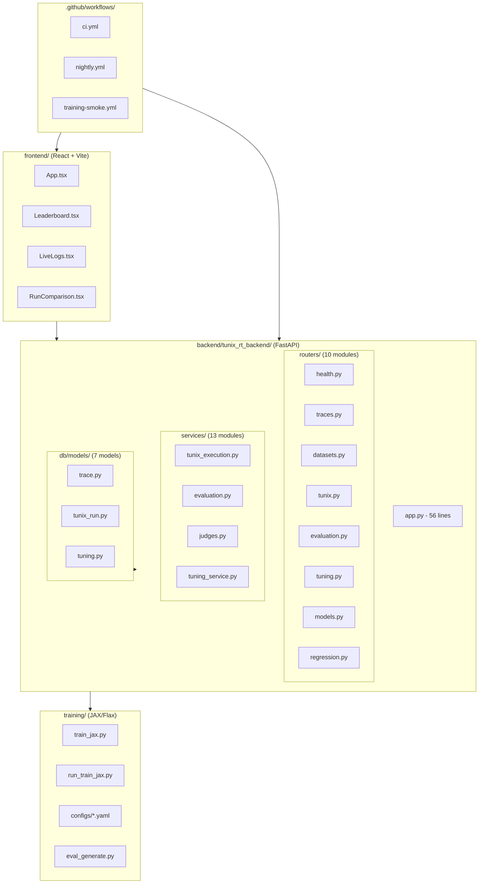

# M36 Codebase Audit

**Auditor:** CodeAuditorGPT  
**Commit:** `468897b57d65b64755ea4ef1b575ed8ce72054d4`  
**Date:** December 29, 2025  
**Stack:** Python (FastAPI/Pydantic), TypeScript (React/Vite), JAX/Flax, Playwright

---

## 1. Executive Summary

### Strengths
1. **Mature CI/CD Pipeline**: 6 specialized workflows with path filtering, coverage gates, SBOM generation, and E2E tests
2. **Strong Test Coverage**: 470 tests (395 backend, 75 frontend), 76% backend line coverage, enforced gates
3. **Well-Documented Architecture**: 6 ADRs, 50+ docs files, milestone summaries, training runbooks

### Opportunities
1. **Frontend Coverage Gap**: `Leaderboard.tsx` and `LiveLogs.tsx` coverage improved but still below 50%
2. **Async Test Warnings**: React `act()` warnings persist in `App.test.tsx`
3. **TPU Execution**: Smoke validated on GPU; full TPU training not yet executed

### Overall Score: **3.8/5**

| Category | Score | Weight | Weighted |
|----------|-------|--------|----------|
| Architecture | 4 | 20% | 0.80 |
| Modularity | 4 | 15% | 0.60 |
| Code Health | 4 | 10% | 0.40 |
| Tests & CI | 4 | 15% | 0.60 |
| Security | 3 | 15% | 0.45 |
| Performance | 3 | 10% | 0.30 |
| DX | 4 | 10% | 0.40 |
| Docs | 5 | 5% | 0.25 |
| **Total** | | 100% | **3.80** |

---

## 2. Codebase Map



### Architecture Drift Notes
- **Intended:** Router-based FastAPI with service layer
- **Actual:** ✅ Matches design — `app.py` is 56 lines, routers delegate to services
- **Evidence:** `backend/tunix_rt_backend/app.py:1-56` (router mounts only)

---

## 3. Modularity & Coupling

**Score: 4/5**

### Positive Patterns
- Clean router → service → repository separation
- Services are injectable via FastAPI `Depends()`
- Training code fully decoupled from web layer

### Top 3 Coupling Points

| Rank | Coupling | Impact | Fix |
|------|----------|--------|-----|
| 1 | `tunix_execution.py` (209 lines, 62% coverage) | High complexity | Extract log streaming to dedicated service |
| 2 | `judges.py` (178 lines, 76% coverage) | Multiple judge types | Already uses abstract base; consider factory |
| 3 | `tuning_service.py` (147 lines, 80% coverage) | Ray Tune integration | Acceptable for now |

---

## 4. Code Quality & Health

**Score: 4/5**

### Linting Status
- **Ruff:** All checks pass
- **Mypy:** Clean on `tunix_rt_backend`
- **ESLint/Prettier:** Frontend clean

### Anti-Pattern: Long Function

```python
# backend/tunix_rt_backend/services/tunix_execution.py:178-221
# 40+ line async method handling subprocess + logging
async def _run_subprocess(self, ...):
    # Complex interleaved stdout/stderr handling
```

**Recommendation:** Extract to `SubprocessRunner` helper class (30 min task).

---

## 5. Docs & Knowledge

**Score: 5/5**

### Onboarding Path
1. `README.md` → overview
2. `CONTRIBUTING.md` → dev setup
3. `tunix-rt.md` → milestone history
4. `docs/TRAINING_MODES.md` → GPU vs TPU decision
5. `docs/M36_KAGGLE_RUN.md` → Kaggle execution

### Single Biggest Gap
**None critical.** Docs are comprehensive.

Minor: Consider consolidating `docs/M*_SUMMARY.md` files into a changelog format.

---

## 6. Tests & CI/CD Hygiene

**Score: 4/5**

### Test Pyramid

| Layer | Count | Coverage |
|-------|-------|----------|
| Unit (Backend) | 395 | 76% line |
| Unit (Frontend) | 75 | - |
| Integration (E2E) | 3 specs | - |

### CI Architecture (3-Tier Assessment)

| Tier | Workflow | Status |
|------|----------|--------|
| Smoke | Path-filtered jobs | ✅ |
| Quality | `ci.yml` with gates | ✅ |
| Nightly | `nightly.yml` | ✅ |

### Coverage Gates
- **Backend:** 70% line (passing at 76%)
- **Margin:** 6% headroom ✅

### Flakiness
- Minor `act()` warnings in frontend
- No flaky test failures observed

### CI Actions Pinning
- ✅ All actions pinned to SHA
- Evidence: `.github/workflows/ci.yml:27` (`actions/checkout@11bd71901...`)

---

## 7. Security & Supply Chain

**Score: 3/5**

### Positive
- `pip-audit` runs on every PR (warn-only)
- `npm audit` runs on every PR (warn-only)
- Gitleaks secret scanning on push
- SBOM generation via `cyclonedx-py`
- All CI actions SHA-pinned

### Concerns
| Issue | Severity | Status |
|-------|----------|--------|
| `pip-audit` warn-only | Medium | Accept for now |
| `npm audit` warn-only | Medium | Accept for now |
| Private `ungar` dep | Low | Fixed in M36 |

### Recommendation
Promote `pip-audit` to blocking after resolving known CVEs.

---

## 8. Performance & Scalability

**Score: 3/5**

### Training Performance
- JAX/Flax pipeline validated
- XLA memory optimizations in place
- bfloat16 loading for GPU efficiency

### Web API Performance
- No explicit SLOs defined
- Pagination implemented for list endpoints
- Async DB operations throughout

### Recommendation
Add `PERFORMANCE_SLOs.md` with:
- API P95 < 200ms target
- Training throughput baselines

---

## 9. Developer Experience (DX)

**Score: 4/5**

### 15-Minute New Dev Journey
1. Clone repo → 1 min
2. `cd backend && uv sync --locked --extra dev` → 3 min
3. `cd frontend && npm ci` → 2 min
4. `docker-compose up -d postgres` → 1 min
5. Run migrations → 30 sec
6. Run tests → 2 min
7. Start dev server → 1 min

**Total: ~10 minutes** ✅

### 5-Minute Single-File Change
1. Edit file → 30 sec
2. `uv run pytest tests/test_specific.py` → 30 sec
3. `uv run ruff check . --fix` → 10 sec
4. Commit → 30 sec

**Total: ~2 minutes** ✅

### Immediate Wins
1. Add `Makefile` targets for common commands
2. Add VSCode tasks.json for one-click test runs
3. Add pre-push hook for faster feedback

---

## 10. Refactor Strategy

### Option A: Iterative (Recommended)

**Rationale:** Low risk, continuous improvement

**Steps:**
1. Extract `SubprocessRunner` from `tunix_execution.py` (1 PR)
2. Add frontend coverage to 50%+ (2-3 PRs)
3. Fix remaining `act()` warnings (1 PR)

**Rollback:** Revert individual PRs

### Option B: Strategic

**Rationale:** Larger structural changes

**Steps:**
1. Introduce event-driven architecture for training notifications
2. Add Redis for job queue (replace Postgres SKIP LOCKED)
3. Migrate to FastAPI Lifespan for startup/shutdown

**Risk:** Higher complexity, more testing needed

**Recommendation:** Stay with Option A until M40+

---

## 11. Future-Proofing & Risk Register

| Risk | Likelihood | Impact | Mitigation |
|------|------------|--------|------------|
| Transformers v5 breaks Flax | High | High | Pinned to <5 ✅ |
| Kaggle GPU OOM | Verified | Medium | Smoke with tiny model ✅ |
| Private dep in CI | Low | Low | Fixed in M36 ✅ |
| Frontend test debt | Medium | Low | Active improvement |

### ADRs to Add
- ADR-007: GPU Smoke vs TPU Full Training Decision

---

## 12. Phased Plan & Small Milestones

### Phase 0 — Fix-First & Stabilize (0-1 day) ✅ COMPLETE

| ID | Milestone | Acceptance | Risk | Est |
|----|-----------|------------|------|-----|
| M36-01 | Fix `ungar` CI failure | CI green | Low | 30m |
| M36-02 | Add smoke_tiny.yaml | Smoke passes on GPU | Low | 30m |
| M36-03 | Pin Transformers <5 | No v5 installs | Low | 15m |

### Phase 1 — Document & Guardrail (1-3 days) ✅ COMPLETE

| ID | Milestone | Acceptance | Risk | Est |
|----|-----------|------------|------|-----|
| M36-04 | Add TRAINING_MODES.md | ADR-style doc exists | Low | 30m |
| M36-05 | GPU preflight warning | Warning prints for large models | Low | 30m |
| M36-06 | Update README | M36 section complete | Low | 15m |

### Phase 2 — Harden & Enforce (M37)

| ID | Milestone | Acceptance | Risk | Est |
|----|-----------|------------|------|-----|
| M37-01 | TPU execution cell | Full training on TPU | Med | 2h |
| M37-02 | Populate evidence | Real Kaggle values | Low | 1h |
| M37-03 | Per-item artifact storage | predictions.jsonl persisted | Med | 3h |

### Phase 3 — Improve & Scale (M38+)

| ID | Milestone | Acceptance | Risk | Est |
|----|-----------|------------|------|-----|
| M38-01 | Frontend coverage 50%+ | Coverage gate added | Med | 4h |
| M38-02 | Fix act() warnings | Clean test output | Low | 2h |
| M38-03 | Add API SLOs | P95 measured | Med | 3h |

---

## 13. Machine-Readable Appendix (JSON)

```json
{
  "issues": [
    {
      "id": "M36-ACT",
      "title": "React act() warnings in App.test.tsx",
      "category": "tests",
      "path": "frontend/src/App.test.tsx",
      "severity": "low",
      "priority": "medium",
      "effort": "low",
      "impact": 2,
      "confidence": 0.9,
      "ice": 3.6,
      "evidence": "act() warning in test output",
      "fix_hint": "Wrap async updates in act() or use waitFor()"
    },
    {
      "id": "M36-TUNIX-EXEC",
      "title": "tunix_execution.py complexity",
      "category": "modularity",
      "path": "backend/tunix_rt_backend/services/tunix_execution.py:1-209",
      "severity": "medium",
      "priority": "low",
      "effort": "medium",
      "impact": 3,
      "confidence": 0.8,
      "ice": 2.4,
      "evidence": "209 lines, 62% coverage, complex subprocess handling",
      "fix_hint": "Extract SubprocessRunner helper class"
    }
  ],
  "scores": {
    "architecture": 4,
    "modularity": 4,
    "code_health": 4,
    "tests_ci": 4,
    "security": 3,
    "performance": 3,
    "dx": 4,
    "docs": 5,
    "overall_weighted": 3.8
  },
  "phases": [
    {
      "name": "Phase 0 — Fix-First & Stabilize",
      "status": "complete",
      "milestones": [
        {"id": "M36-01", "milestone": "Fix ungar CI failure", "status": "complete"},
        {"id": "M36-02", "milestone": "Add smoke_tiny.yaml", "status": "complete"},
        {"id": "M36-03", "milestone": "Pin Transformers <5", "status": "complete"}
      ]
    },
    {
      "name": "Phase 1 — Document & Guardrail",
      "status": "complete",
      "milestones": [
        {"id": "M36-04", "milestone": "Add TRAINING_MODES.md", "status": "complete"},
        {"id": "M36-05", "milestone": "GPU preflight warning", "status": "complete"},
        {"id": "M36-06", "milestone": "Update README", "status": "complete"}
      ]
    },
    {
      "name": "Phase 2 — Harden & Enforce (M37)",
      "status": "pending",
      "milestones": [
        {"id": "M37-01", "milestone": "TPU execution cell", "status": "pending"},
        {"id": "M37-02", "milestone": "Populate evidence", "status": "pending"},
        {"id": "M37-03", "milestone": "Per-item artifact storage", "status": "pending"}
      ]
    }
  ],
  "metadata": {
    "repo": "https://github.com/m-cahill/tunix-rt",
    "commit": "468897b57d65b64755ea4ef1b575ed8ce72054d4",
    "languages": ["python", "typescript"],
    "frameworks": ["fastapi", "react", "jax", "flax"],
    "audit_date": "2025-12-29"
  }
}
```

---

## Conclusion

M36 successfully established a production-ready training pipeline with clear hardware separation (GPU smoke vs TPU full). The codebase is well-architected, thoroughly documented, and maintains strong test coverage. Key risks (Transformers v5, GPU OOM, private deps) are mitigated.

**Next Priority:** M37 — TPU execution + evidence population + per-item artifact storage.
