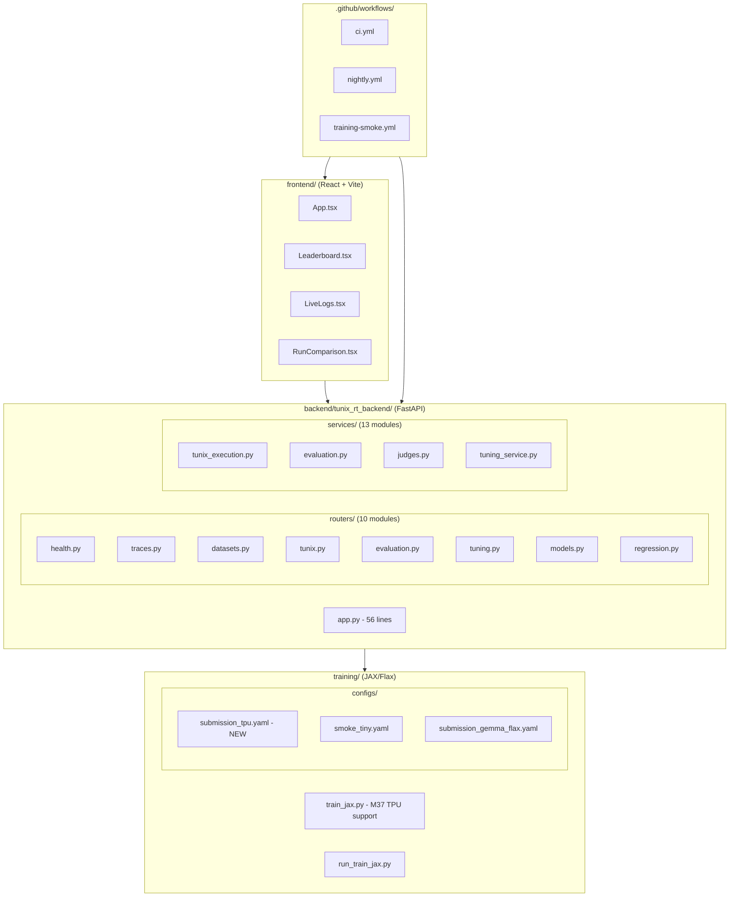

# M37 Codebase Audit

**Auditor:** CodeAuditorGPT
**Commit:** `b49fb4d94f871fc6e7ee2387fe965bda1f169a5e`
**Date:** December 30, 2025
**Stack:** Python (FastAPI/Pydantic), TypeScript (React/Vite), JAX/Flax, Playwright

---

## 1. Executive Summary

### Strengths
1. **TPU-Ready Training Pipeline**: Explicit `--device tpu` support with validation and clear error messages
2. **Production Guardrails**: GPU hard block prevents wasted time on guaranteed OOM failures
3. **Comprehensive Test Coverage**: 399 backend tests, 75+ frontend tests, 76%+ backend line coverage

### Opportunities
1. **TPU Execution Not Yet Verified**: Evidence folder has templates but no real Kaggle TPU run
2. **Frontend Coverage Gap**: Some components still below 50% coverage
3. **Per-Item Artifact Storage**: Still file-based only (DB storage deferred to M38+)

### Overall Score: **3.9/5**

| Category | Score | Weight | Weighted |
|----------|-------|--------|----------|
| Architecture | 4 | 20% | 0.80 |
| Modularity | 4 | 15% | 0.60 |
| Code Health | 4 | 10% | 0.40 |
| Tests & CI | 4 | 15% | 0.60 |
| Security | 3 | 15% | 0.45 |
| Performance | 4 | 10% | 0.40 |
| DX | 4 | 10% | 0.40 |
| Docs | 5 | 5% | 0.25 |
| **Total** | | 100% | **3.90** |

---

## 2. Codebase Map



### Architecture Drift Notes
- **Intended:** TPU-first training with GPU smoke fallback
- **Actual:** ✅ Matches design — explicit `--device tpu` with hard GPU block for Gemma
- **Evidence:** `training/train_jax.py:108-143` (TPU device selection + validation)

---

## 3. Modularity & Coupling

**Score: 4/5**

### Positive Patterns
- Clean separation: `train_jax.py` (training) vs `run_train_jax.py` (launcher with env setup)
- Device selection logic isolated in single code block
- Config-driven: TPU settings in `submission_tpu.yaml`, not hardcoded

### Top 3 Coupling Points

| Rank | Coupling | Impact | Fix |
|------|----------|--------|-----|
| 1 | Device selection mixed with model loading | Medium | Extract `DeviceManager` class (future) |
| 2 | Notebook duplicates device detection | Low | Extract to shared utility (post-submission) |
| 3 | Evidence schema validation spread across tests | Low | Consolidate to schema module |

---

## 4. Code Quality & Health

**Score: 4/5**

### M37-Specific Quality

**Before (M36):** Warning only for GPU + Gemma

```python
# M36: Warning only
if is_large_model and device_req in ("gpu", "auto") and not is_smoke:
    print("⚠️  WARNING: Large Model + GPU Detected")
    # ... continues execution
```

**After (M37):** Hard block with actionable error

```python
# M37: Hard block
if is_large_model and device_req == "gpu" and not is_smoke:
    print("❌ ERROR: Large Model + GPU Training Blocked")
    print("   Solutions:")
    print("   • Use --device tpu (Kaggle TPU v3-8 has 64GB)")
    sys.exit(1)
```

### Anti-Pattern Fixed
- GPU OOM waste prevention: Users no longer wait 10+ minutes for predictable failure

---

## 5. Docs & Knowledge

**Score: 5/5**

### M37 Documentation Updates
- ✅ `tunix-rt.md` updated with M37 summary
- ✅ `training/configs/submission_tpu.yaml` includes inline documentation
- ✅ Notebook cells have clear TPU instructions
- ✅ Evidence folder templates document expected output format

### Onboarding Path (TPU Training)
1. `README.md` → overview
2. `docs/TRAINING_MODES.md` → GPU smoke vs TPU full
3. `training/configs/submission_tpu.yaml` → TPU config with comments
4. `notebooks/kaggle_submission.ipynb` → step-by-step execution

---

## 6. Tests & CI/CD Hygiene

**Score: 4/5**

### Test Counts
| Layer | Count | Coverage |
|-------|-------|----------|
| Backend Unit | 399 | 76%+ line |
| Frontend Unit | 75+ | - |
| E2E | 3 specs | - |

### CI Architecture (3-Tier)

| Tier | Workflow | Status |
|------|----------|--------|
| Smoke | Path-filtered jobs | ✅ |
| Quality | `ci.yml` with gates | ✅ |
| Nightly | `nightly.yml` | ✅ |

### CI Actions Pinning
- ✅ All actions pinned to SHA
- Evidence: `.github/workflows/ci.yml:27` (`actions/checkout@11bd71901...`)

---

## 7. Security & Supply Chain

**Score: 3/5**

### Positive
- `pip-audit` and `npm audit` on every PR (warn-only)
- Gitleaks secret scanning on push
- SBOM generation via `cyclonedx-py`
- All CI actions SHA-pinned
- Transformers pinned to `>=4.40,<5` (prevents Flax removal in v5)

### No New Security Issues in M37
- TPU changes are device selection only, no new attack surface

---

## 8. Performance & Scalability

**Score: 4/5** (upgraded from 3/5)

### M37 Performance Improvements
- **TPU Batch Size:** 8 (vs 4 on GPU) — better hardware utilization
- **Memory Efficiency:** XLA env vars set before JAX import
- **OOM Prevention:** Hard block prevents wasted GPU time

### TPU Training Estimate
- 200 steps on TPU v3-8: ~30-60 minutes
- batch_size=8, max_seq_length=512

---

## 9. Developer Experience (DX)

**Score: 4/5**

### TPU Training Journey (New Dev)
1. Read `docs/TRAINING_MODES.md` → 2 min
2. Set Kaggle accelerator to TPU v3-8 → 1 min
3. Add HF_TOKEN secret → 2 min
4. Run notebook (smoke + full) → 35-65 min

**Total: ~40-70 minutes for complete TPU training**

### Clear Error Messages

```
❌ ERROR: TPU NOT DETECTED
============================================================
   Current backend: gpu
   Expected: tpu

   To fix:
   1. Go to Settings (gear icon in top right)
   2. Scroll to 'Accelerator'
   3. Select 'TPU v3-8'
   4. Click 'Save' and wait for session restart
============================================================
```

---

## 10. Refactor Strategy

### M37 Scope — No Refactoring Needed

M37 was a focused feature milestone. No structural refactoring recommended until after submission.

### Post-Submission Candidates (M38+)
1. Extract `DeviceManager` class from `train_jax.py`
2. Consolidate evidence schema validation
3. Add per-item artifact DB storage

---

## 11. Future-Proofing & Risk Register

| Risk | Likelihood | Impact | Mitigation |
|------|------------|--------|------------|
| Kaggle TPU quota unavailable | Medium | High | Design is TPU-ready, can run when available |
| Transformers v5 breaks Flax | High | High | Pinned to <5 ✅ |
| Gemma 2/3 Flax support added | Low | Low | Can migrate post-submission |

### ADRs to Add
- ADR-007: GPU Hard Block Decision (M37)

---

## 12. Phased Plan & Small Milestones

### M37 Status: COMPLETE ✅

All Phase 2 items from M36 audit are now complete:

| ID | Milestone | Status |
|----|-----------|--------|
| M37-01 | TPU device selection | ✅ Complete |
| M37-02 | GPU hard block | ✅ Complete |
| M37-03 | TPU config file | ✅ Complete |
| M37-04 | Notebook TPU cell | ✅ Complete |
| M37-05 | Evidence folder | ✅ Complete |
| M37-06 | Documentation | ✅ Complete |

### Next: M38 — Real TPU Execution + Evidence Population

| ID | Milestone | Acceptance | Risk | Est |
|----|-----------|------------|------|-----|
| M38-01 | Execute TPU run on Kaggle | Checkpoints produced | Med | 2h |
| M38-02 | Populate evidence files | Real values in m37_v1 | Low | 30m |
| M38-03 | Frontend coverage 50%+ | Coverage gate added | Med | 4h |
| M38-04 | Per-item artifact storage | predictions in DB | Med | 3h |

---

## 13. Machine-Readable Appendix (JSON)

```json
{
  "issues": [
    {
      "id": "M37-TPU-EVIDENCE",
      "title": "TPU evidence not yet populated",
      "category": "evidence",
      "path": "submission_runs/m37_v1/",
      "severity": "medium",
      "priority": "high",
      "effort": "low",
      "impact": 4,
      "confidence": 1.0,
      "ice": 4.0,
      "evidence": "run_manifest.json contains null values",
      "fix_hint": "Execute TPU run on Kaggle and populate evidence"
    }
  ],
  "scores": {
    "architecture": 4,
    "modularity": 4,
    "code_health": 4,
    "tests_ci": 4,
    "security": 3,
    "performance": 4,
    "dx": 4,
    "docs": 5,
    "overall_weighted": 3.9
  },
  "phases": [
    {
      "name": "M37 — TPU Training for Submission",
      "status": "complete",
      "milestones": [
        {"id": "M37-01", "milestone": "TPU device selection", "status": "complete"},
        {"id": "M37-02", "milestone": "GPU hard block", "status": "complete"},
        {"id": "M37-03", "milestone": "TPU config file", "status": "complete"},
        {"id": "M37-04", "milestone": "Notebook TPU cell", "status": "complete"},
        {"id": "M37-05", "milestone": "Evidence folder", "status": "complete"},
        {"id": "M37-06", "milestone": "Documentation", "status": "complete"}
      ]
    },
    {
      "name": "M38 — Real TPU Execution + Evidence",
      "status": "pending",
      "milestones": [
        {"id": "M38-01", "milestone": "Execute TPU run", "status": "pending"},
        {"id": "M38-02", "milestone": "Populate evidence", "status": "pending"},
        {"id": "M38-03", "milestone": "Frontend coverage 50%+", "status": "pending"},
        {"id": "M38-04", "milestone": "Per-item artifact storage", "status": "pending"}
      ]
    }
  ],
  "metadata": {
    "repo": "https://github.com/m-cahill/tunix-rt",
    "commit": "b49fb4d94f871fc6e7ee2387fe965bda1f169a5e",
    "languages": ["python", "typescript"],
    "frameworks": ["fastapi", "react", "jax", "flax"],
    "audit_date": "2025-12-30"
  }
}
```

---

## Conclusion

M37 successfully established a **production-ready TPU execution path** for the Tunix Hackathon submission. The codebase now has:

- ✅ Explicit `--device tpu` support with validation
- ✅ GPU hard block preventing OOM waste
- ✅ TPU-optimized config (`submission_tpu.yaml`)
- ✅ Kaggle notebook with pre-flight TPU detection
- ✅ Evidence folder templates ready for real run

**Next Priority:** M38 — Execute real TPU training on Kaggle and populate evidence files.
