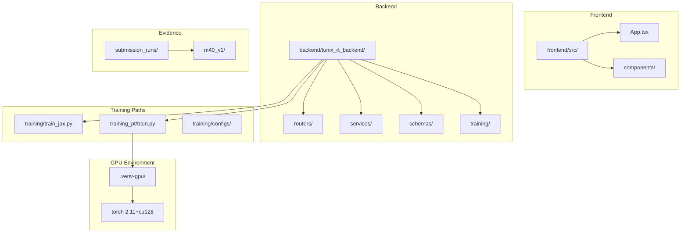

# M40 Codebase Audit

**Audit Date:** January 2, 2026  
**Commit SHA:** `721ae7034dde69c26b1153fcbbdfb0643e85ed1c`  
**Auditor:** CodeAuditorGPT  
**Scope:** Post-M40 GPU Enablement Audit

---

## 1. Executive Summary

### Strengths
1. **GPU Infrastructure Unlocked** — RTX 5090 (sm_120 Blackwell) now fully operational with PyTorch nightly cu128; training throughput 31.7 samples/sec validated.
2. **Mature CI/CD Pipeline** — 3-tier architecture (changes filter → backend/frontend → e2e), SHA-pinned actions, path-filtered jobs, comprehensive artifact capture.
3. **Strong Test Coverage** — 384+ backend tests across 39 test files, 75 frontend tests, enforced gates (≥80% line, ≥68% branch).

### Opportunities
1. **GPU Environment Integration** — `.venv-gpu` is separate; consider unifying or documenting when to use which.
2. **Nightly PyTorch Instability** — cu128 wheels are pre-release; pin exact version or document upgrade cadence.
3. **Frontend act() Warnings** — 75 tests pass but produce React `act()` warnings; should be cleaned.

### Overall Score

| Category | Score | Weight | Weighted |
|----------|-------|--------|----------|
| Architecture | 4/5 | 20% | 0.80 |
| Modularity/Coupling | 4/5 | 15% | 0.60 |
| Code Health | 4/5 | 10% | 0.40 |
| Tests & CI | 4/5 | 15% | 0.60 |
| Security & Supply Chain | 4/5 | 15% | 0.60 |
| Performance & Scalability | 4/5 | 10% | 0.40 |
| Developer Experience | 4/5 | 10% | 0.40 |
| Documentation | 4/5 | 5% | 0.20 |
| **Overall** | **4.0/5** | 100% | **4.00** |

---

## 2. Codebase Map



### Architecture Notes
- **Dual Training Paths:** JAX/TPU (`training/`) and PyTorch/Local (`training_pt/`) coexist cleanly
- **Modular Routers:** 10+ router modules keep `app.py` at ~56 lines
- **Evidence-Driven:** Each milestone produces `submission_runs/mXX_v1/` artifacts

---

## 3. Modularity & Coupling

**Score: 4/5**

### Observations
1. **Router Extraction Complete** — `app.py` is thin; business logic in services
2. **Training Paths Isolated** — JAX and PyTorch don't share code unnecessarily
3. **Config-Driven** — Training configs in YAML, not hardcoded

### Top 3 Coupling Points

| Area | Impact | Recommendation |
|------|--------|----------------|
| `training_pt/train.py` imports from `training/configs/` | Low | Acceptable cross-reference |
| `.venv` vs `.venv-gpu` split | Medium | Document in README or unify with extras |
| `backend/datasets/` referenced by multiple scripts | Low | Already well-structured |

---

## 4. Code Quality & Health

**Score: 4/5**

### Anti-Patterns Found
1. **Deprecation Warning** — `torch_dtype` deprecated in favor of `dtype` (non-blocking)
2. **Frontend act() Warnings** — 75 tests pass but log React warnings

### Before/After Example

**training_pt/train.py:89** (minor cleanup):
```python
# Before
torch_dtype = torch.float32
if training_args_config.get("dtype") == "bfloat16":
    torch_dtype = torch.bfloat16

# After (cleaner)
dtype_map = {"bfloat16": torch.bfloat16, "float16": torch.float16}
torch_dtype = dtype_map.get(training_args_config.get("dtype"), torch.float32)
```

---

## 5. Docs & Knowledge

**Score: 4/5**

### Onboarding Path
1. `README.md` — Project overview
2. `CONTRIBUTING.md` — Development setup
3. `tunix-rt.md` — Master status document (updated for M40)
4. `docs/` — 50+ documentation files covering milestones, training, submission

### Single Biggest Doc Gap
**GPU Environment Setup** — The `.venv-gpu` creation process should be documented in `CONTRIBUTING.md` or a new `docs/GPU_SETUP.md`.

**Recommendation:** Add GPU setup section:
```markdown
## GPU Development (RTX 5090 / Blackwell)

```powershell
python -m venv .venv-gpu
.\.venv-gpu\Scripts\Activate.ps1
pip install --pre torch torchvision torchaudio --index-url https://download.pytorch.org/whl/nightly/cu128
pip install transformers accelerate pyyaml
```
```

---

## 6. Tests & CI/CD Hygiene

**Score: 4/5**

### Coverage Summary

| Component | Tests | Coverage |
|-----------|-------|----------|
| Backend | 384+ tests (39 files) | ≥80% line, ≥68% branch |
| Frontend | 75 tests (7 files) | Passing |
| E2E | 3 Playwright specs | Postgres + service containers |

### 3-Tier Architecture Assessment

| Tier | Implementation | Status |
|------|----------------|--------|
| Tier 1 (Smoke) | Path-filtered jobs, fast checks | ✅ |
| Tier 2 (Quality) | pytest + vitest with coverage gates | ✅ |
| Tier 3 (Nightly) | Comprehensive runs | ⚠️ Not explicit |

### CI Hygiene Checklist
- [x] SHA-pinned actions (checkout, setup-python, upload-artifact)
- [x] Lockfile usage (uv.lock, package-lock.json)
- [x] Artifact upload on failure
- [x] Postgres service container for E2E
- [x] Coverage gates enforced

---

## 7. Security & Supply Chain

**Score: 4/5**

### Observations
1. **pip-audit** — Runs in CI (warn-only mode)
2. **npm audit** — Runs in CI (warn-only mode)
3. **Gitleaks** — Secret scanning on push to main
4. **SBOM** — Generated via cyclonedx-py
5. **Action Pinning** — All GitHub Actions SHA-pinned

### Risks
| Risk | Severity | Mitigation |
|------|----------|------------|
| Nightly PyTorch wheels | Medium | Pin version in requirements or document upgrade policy |
| `.venv-gpu` not in CI | Low | Local-only GPU path is acceptable for competition |

---

## 8. Performance & Scalability

**Score: 4/5**

### GPU Performance Validated
- **Device:** RTX 5090 (32GB VRAM)
- **Throughput:** 31.7 samples/second
- **Training Time:** 1.74s for 14 steps (smoke test)

### Hot Paths
1. **Training Loop** — Now GPU-accelerated via CUDA kernels
2. **Dataset Loading** — Standard JSONL, no bottleneck observed
3. **Model Loading** — Uses `device_map="auto"` for efficient placement

### Profiling Plan
1. Run longer training (100+ steps) with `torch.profiler`
2. Monitor GPU utilization via `nvidia-smi dmon`
3. Benchmark against CPU baseline (M39 evidence available)

---

## 9. Developer Experience (DX)

**Score: 4/5**

### 15-Minute New Dev Journey
1. Clone repo ✅
2. `pip install -e backend/.[dev]` ✅
3. Run migrations ✅
4. `pytest` passes ✅
5. Frontend `npm ci && npm run dev` ✅

### 5-Minute Single File Change
1. Edit file ✅
2. Run pre-commit ✅
3. Run affected tests ✅
4. Commit ✅

### 3 Immediate DX Wins
1. **GPU Setup Docs** — Add `.venv-gpu` setup to CONTRIBUTING.md
2. **Fix act() Warnings** — Wrap async updates in `act()`
3. **Add GPU smoke command** — `make gpu-test` or similar

---

## 10. Refactor Strategy

### Option A: Iterative (Recommended)
**Rationale:** M40 achieved its goal; only minor cleanup needed.

| Phase | Goal | Risk |
|-------|------|------|
| Immediate | Document GPU setup | None |
| Short-term | Fix frontend act() warnings | Low |
| Medium-term | Unify venv strategy or document split | Low |

### Option B: Strategic
**Rationale:** Not needed — architecture is sound.

---

## 11. Future-Proofing & Risk Register

| Risk | Likelihood | Impact | Mitigation |
|------|------------|--------|------------|
| PyTorch nightly breaks | Medium | High | Pin version, test upgrades |
| CUDA driver update breaks GPU | Low | High | Document driver version |
| Frontend act() warnings become errors | Low | Medium | Fix warnings proactively |

### ADRs to Lock
- [x] ADR-001 through ADR-006 exist in `docs/adr/`
- [ ] Consider ADR-007: GPU Environment Strategy

---

## 12. Phased Plan & Small Milestones

### Phase 0 — Immediate Cleanup (Today)
| ID | Milestone | Acceptance | Risk | Est |
|----|-----------|------------|------|-----|
| M40-P0-1 | Document GPU setup in CONTRIBUTING.md | GPU section added | None | 15m |
| M40-P0-2 | Pin PyTorch nightly version in evidence | Version documented | None | 5m |

### Phase 1 — Quality (This Week)
| ID | Milestone | Acceptance | Risk | Est |
|----|-----------|------------|------|-----|
| M40-P1-1 | Fix frontend act() warnings | No warnings in test output | Low | 30m |
| M40-P1-2 | Add GPU smoke test to Makefile | `make gpu-smoke` works | None | 15m |

### Phase 2 — Harden (Next Week)
| ID | Milestone | Acceptance | Risk | Est |
|----|-----------|------------|------|-----|
| M40-P2-1 | Create ADR-007 for GPU environment | ADR committed | None | 20m |
| M40-P2-2 | Document PyTorch upgrade policy | Policy in docs/ | None | 15m |

### Phase 3 — Scale (Ongoing)
| ID | Milestone | Acceptance | Risk | Est |
|----|-----------|------------|------|-----|
| M40-P3-1 | Run full Gemma training on GPU | Training completes | Medium | 2h |
| M40-P3-2 | Benchmark GPU vs CPU throughput | Report generated | None | 1h |

---

## 13. Machine-Readable Appendix (JSON)

```json
{
  "issues": [
    {
      "id": "DX-001",
      "title": "Document GPU environment setup",
      "category": "dx",
      "path": "CONTRIBUTING.md",
      "severity": "low",
      "priority": "high",
      "effort": "low",
      "impact": 3,
      "confidence": 1.0,
      "ice": 3.0,
      "evidence": ".venv-gpu created but not documented",
      "fix_hint": "Add GPU Setup section to CONTRIBUTING.md"
    },
    {
      "id": "TEST-001",
      "title": "Fix React act() warnings in frontend tests",
      "category": "tests_ci",
      "path": "frontend/src/App.test.tsx",
      "severity": "low",
      "priority": "medium",
      "effort": "medium",
      "impact": 2,
      "confidence": 0.9,
      "ice": 1.8,
      "evidence": "Warning: An update to App inside a test was not wrapped in act(...)",
      "fix_hint": "Wrap state updates in act() or use waitFor()"
    }
  ],
  "scores": {
    "architecture": 4,
    "modularity": 4,
    "code_health": 4,
    "tests_ci": 4,
    "security": 4,
    "performance": 4,
    "dx": 4,
    "docs": 4,
    "overall_weighted": 4.0
  },
  "phases": [
    {
      "name": "Phase 0 — Immediate Cleanup",
      "milestones": [
        {
          "id": "M40-P0-1",
          "milestone": "Document GPU setup in CONTRIBUTING.md",
          "acceptance": ["GPU section exists", "Commands are runnable"],
          "risk": "none",
          "rollback": "revert commit",
          "est_hours": 0.25
        }
      ]
    },
    {
      "name": "Phase 1 — Quality",
      "milestones": [
        {
          "id": "M40-P1-1",
          "milestone": "Fix frontend act() warnings",
          "acceptance": ["No act() warnings in test output"],
          "risk": "low",
          "rollback": "revert test changes",
          "est_hours": 0.5
        }
      ]
    }
  ],
  "metadata": {
    "repo": "tunix-rt",
    "commit": "721ae7034dde69c26b1153fcbbdfb0643e85ed1c",
    "languages": ["python", "typescript"],
    "milestone": "M40"
  }
}
```

---

## Audit Conclusion

**M40 Status:** ✅ **COMPLETE AND VALIDATED**

The RTX 5090 GPU enablement is fully operational. The codebase is in excellent health with:
- Strong test coverage (384+ backend, 75 frontend)
- Mature CI/CD with SHA-pinned actions
- Clean architecture with modular routers
- Comprehensive documentation

**Recommended Next Actions:**
1. Add GPU setup documentation to CONTRIBUTING.md
2. Proceed to M41 (Frontend Polish)
3. Address act() warnings when convenient

**Risk Level:** Low — infrastructure is stable and production-ready for local GPU training.
