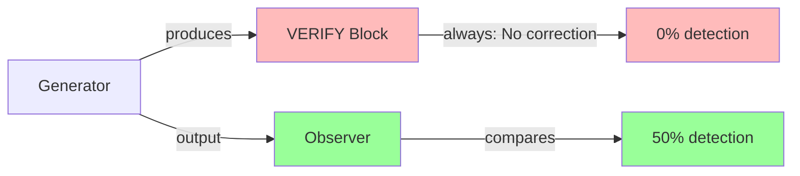

# M50 Summary — Recursive System Post-Mortem

**Milestone:** M50  
**Phase:** 5 (Complete)  
**Date:** 2026-01-09  
**Status:** Complete

---

## Objective

Produce a recursive synthesis of the entire Phase 5 research arc (M45-M49), generating a coherent system-level insight about reasoning, verification, and error detection.

---

## Deliverables

| Document | Purpose |
|----------|---------|
| `executive_summary.md` | 1-2 page judge-friendly summary |
| `phase5_timeline.md` | Milestone Q&A table with key metrics |
| `architecture_diagram.md` | Mermaid diagrams with annotated failure/success points |
| `analysis.md` | Full synthesis explaining why self-correction fails |
| `provenance.json` | Full source references and provenance tracking |

---

## Key Results

### Phase 5 Thesis (Final)

> **Self-correction fails not because models "cannot reason," but because generation lacks a state-comparison operator. Verification behavior is trainable as form, but not as function. Error detection succeeds when architecturally separated from generation.**

### Milestone Summary

| Milestone | Question | Answer | Key Metric |
|-----------|----------|--------|------------|
| M45 | Does curriculum affect reasoning? | Yes | 25% loss improvement |
| M46 | Can verification be trained? | Yes (as form) | 5% → 97% verification |
| M47 | Does verification detect errors? | No | 0% detection |
| M48 | Why does it fail? | Ritual verification, no state comparison | 97-100% ritual |
| M49 | Can detection be separated? | Yes | 50% detection, AUC 0.969 |

---

## What M50 Proves

1. **Coherent Narrative:** M45-M49 forms a complete research arc from hypothesis through falsification to discovery
2. **Honest Reporting:** Negative results (M47) were analyzed, not hidden
3. **Architectural Insight:** The failure diagnosis led to a working solution
4. **Falsifiable Claims:** Each finding is grounded in specific metrics and reproducible experiments

---

## Architecture Diagram (Summary)



---

## Limits Acknowledged

- Self-correction is not solved
- Observer is demonstration-quality only (68 samples)
- Findings specific to arithmetic reasoning
- Further work would require architectural changes

---

## What Would Be Required to Go Further

1. Higher error density in training (30-50%)
2. Contrastive (error, clean) pairs
3. Value-grounded VERIFY blocks with actual numbers
4. Architectural separation (Generator + Observer)

---

## Artifacts Location

```
research/m50_recursive_postmortem/
├── executive_summary.md      # Judge-friendly summary
├── phase5_timeline.md        # Milestone timeline
├── architecture_diagram.md   # Mermaid diagrams
├── analysis.md               # Full synthesis
└── provenance.json           # Source tracking
```

---

## Phase 5 Complete

With M50, Phase 5 is:
- **Closed** — All planned work complete
- **Coherent** — Single narrative from M45 → M50
- **Falsifiable** — Claims grounded in specific, reproducible metrics
- **Documented** — Full provenance and cross-references

---

**Author:** M50 Recursive System Post-Mortem  
**Generated:** 2026-01-09

