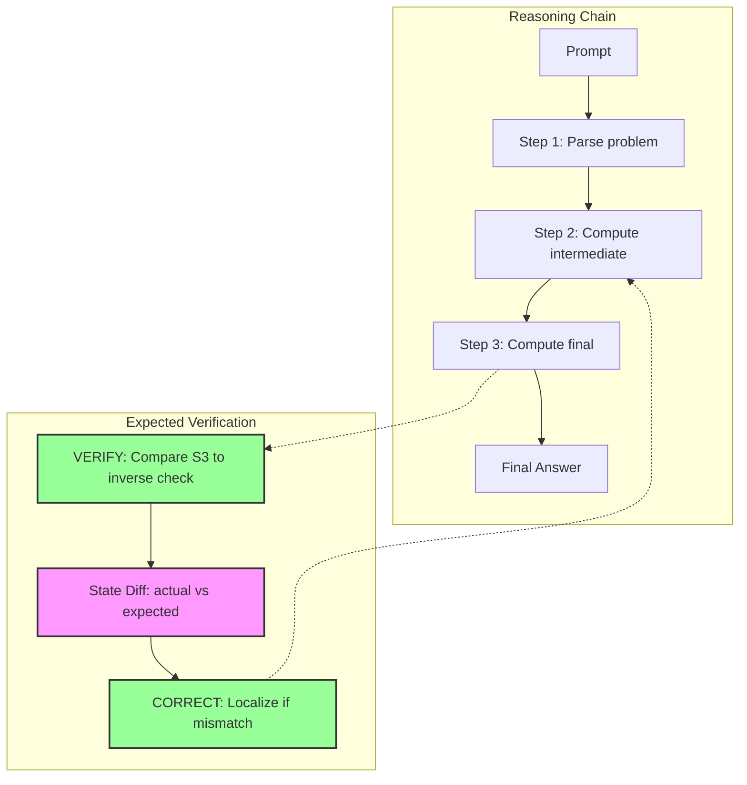
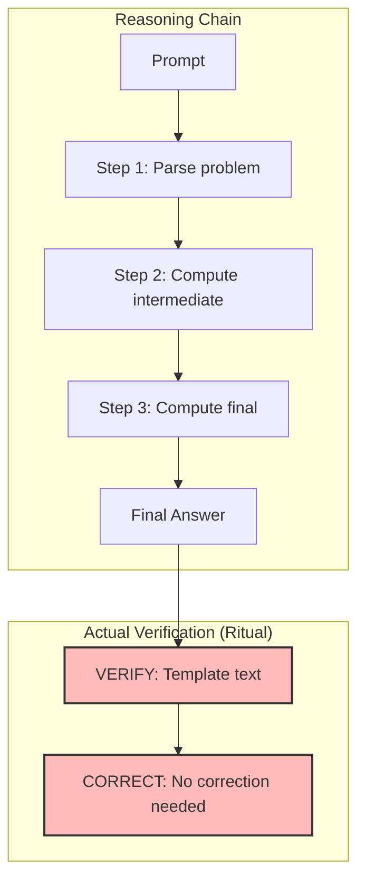
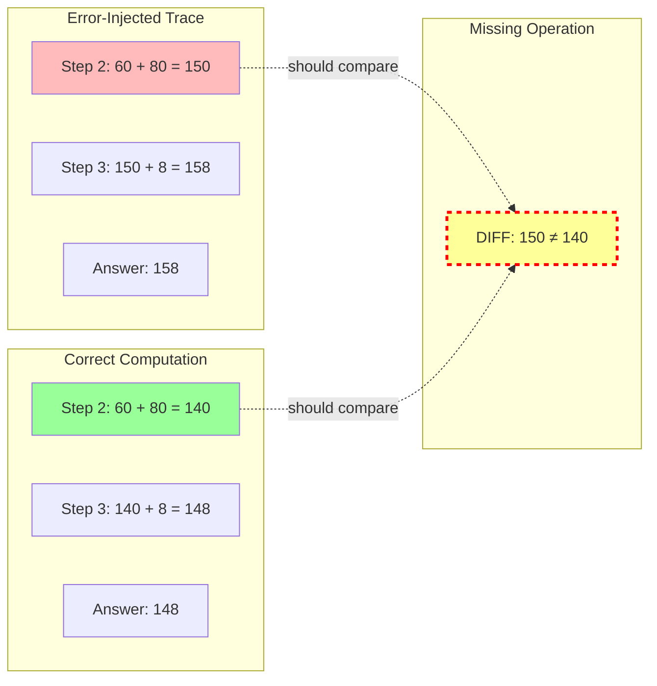
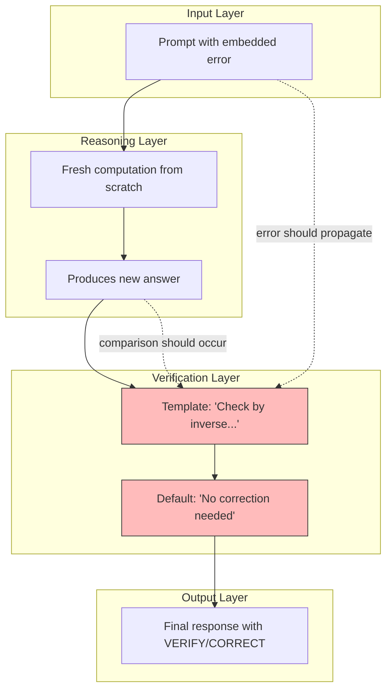

# M48 Reasoning Graph — Structural Disconnection

**Purpose:** Visualize where verification *should* attach to reasoning but doesn't.

---

## The Expected vs. Actual Verification Model

### Expected: Verification with State Comparison

**Key Element:** The `State Diff` node compares computed values to expected values.

---

### Actual: Verification as Post-Hoc Ritual

**Critical Observation:**  
- VERIFY attaches to the final answer, not to intermediate steps
- No state comparison occurs
- CORRECT defaults to "No correction needed"

---

## Where Comparison Should Occur But Doesn't

**The Gap:**  
There is no mechanism for the model to compare `150` against `140`.  
It would need to either:
1. Re-compute and compare (expensive)
2. Have an internal consistency constraint (not learned)

---

## Failure Topology Schematic

**Key Insight:**  
The error-injected prompt flows through reasoning, but verification operates independently. There is no feedback loop from verification back to reasoning.

---

## Why This Topology Produces Ritual Verification

1. **Training Signal**: Verification text appears after reasoning in 100% of training data
2. **Position Encoding**: VERIFY/CORRECT are learned as sequence completions, not inspections
3. **No Contrastive Examples**: Model never sees (error, correction) paired with (clean, no-correction)
4. **Template Dominance**: 93% of training had "No correction needed" → becomes default

The model learns:  
> "After reasoning, emit VERIFY template, then CORRECT: No correction needed"

It does NOT learn:  
> "Compare my computation to an expected value and report discrepancies"

---

## Implications for Future Work

To achieve functional verification, the model would need:

1. **State-Comparison Training**: Explicit examples of (before, after, diff)
2. **Contrastive Pairs**: Same problem with/without errors
3. **Verification Grounding**: VERIFY must reference specific values, not templates
4. **Error Localization**: CORRECT must identify which step is wrong

This is the structural gap that M47 failed to bridge and that M48 has now characterized.

