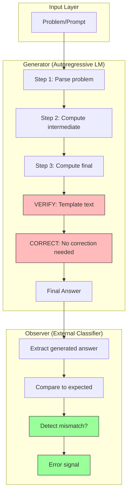
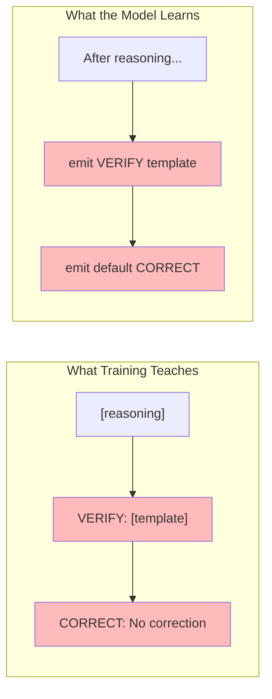
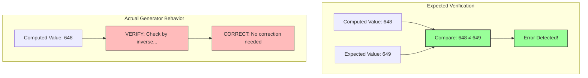
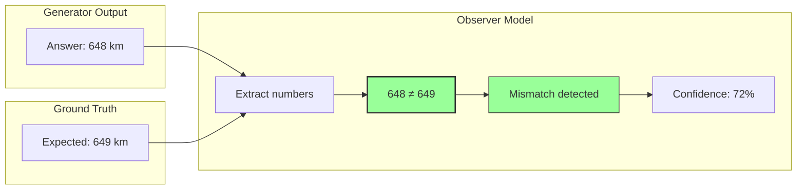
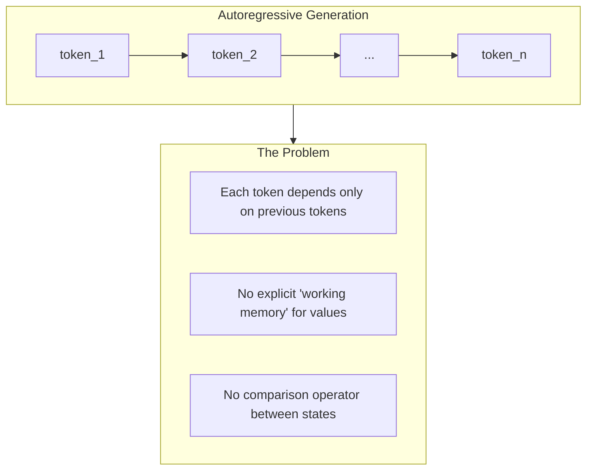
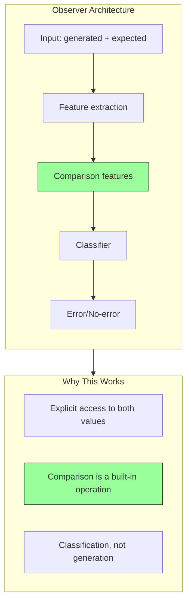
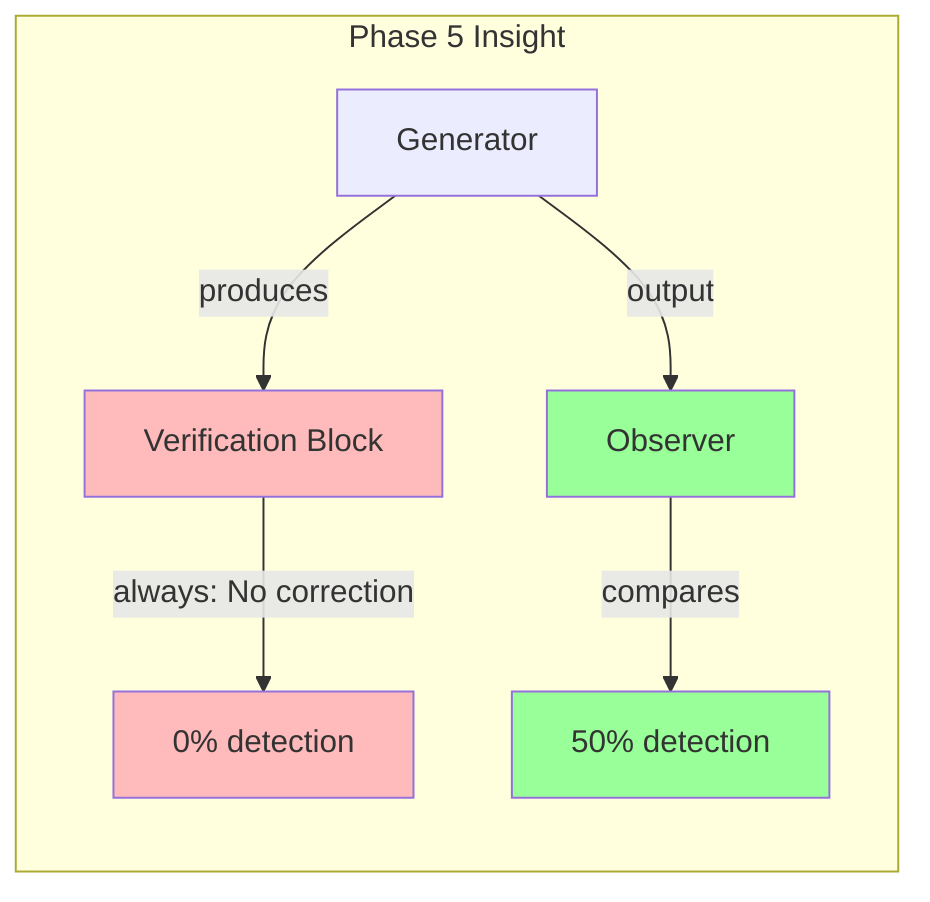

# Phase 5 Architecture Diagram — Reasoning System with Observer

This document provides a conceptual architecture diagram explaining:
1. Why self-correction fails in the generator
2. Where the observer succeeds
3. The architectural separation that enables error detection

---

## System Architecture Overview

---

## Annotated Failure Points

### Failure Point 1: Verification as Sequence Completion

**Annotation:** VERIFY and CORRECT are learned as positional tokens, not as inspection operations. The model learns "what comes next" rather than "what to check."

---

### Failure Point 2: Missing State-Comparison Operator

**Annotation:** The generator has no mechanism to compare its output to an expected value. The VERIFY block references the *type* of check ("inverse") but never *instantiates* it with actual values.

---

### Success Point: Observer as External Comparator

**Annotation:** The observer succeeds because it *explicitly compares* two values. This comparison is the state-difference operator that the generator lacks.

---

## Architectural Insight

### Why Generation Cannot Self-Inspect

**Key Insight:** Autoregressive generation is fundamentally *forward-only*. To verify, the model would need to:
1. Extract specific values from its reasoning
2. Hold them in working memory
3. Compare them to computed or expected values
4. Branch on the result

None of these operations are native to sequence-to-sequence generation.

---

### Why Observation Succeeds

**Key Insight:** The observer succeeds because comparison is its *primary function*, not a side effect of generation.

---

## Summary Diagram

**Conclusion:** Error detection is a separable function. The generator produces verification *structure* but not verification *function*. An external observer can provide the comparison capability that generation lacks.

---

**Generated:** 2026-01-09  
**Purpose:** Explain architectural separation between generation and observation

